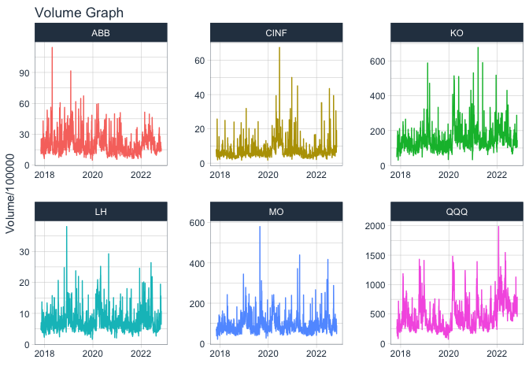

```r
library(tidyverse)
library(tidyquant)
library(lubridate)
library(timetk)
library(dygraphs)
```


```r
stock_calc <- function(tickers) {
  stocks <- tq_get(tickers, get = "stock.prices", from = today() - years(5), to = today())
  plot <- stocks %>%
    select(date, symbol, adjusted) %>%
    pivot_wider(names_from = symbol, values_from = adjusted) %>%
    tk_xts(date_var = date)
  dygraph(plot)
}

tickers_today <- c("QQQ", "MO", "KO", "ABB","LH", "CINF")
stock_calc(tickers_today)
```

```
## Warning: Non-numeric columns being dropped: date
```

```{=html}
<div id="htmlwidget-a2ea70619a8edb92f237" style="width:672px;height:480px;" class="dygraphs html-widget"></div>
<script type="application/json" data-for="htmlwidget-a2ea70619a8edb92f237">{"x":{"attrs":{"labels":["day","QQQ","MO","KO","ABB","LH","CINF"],"legend":"auto","retainDateWindow":false,"axes":{"x":{"pixelsPerLabel":60}}},"scale":"daily","annotations":[],"shadings":[],"events":[],"format":"date","data":[["2017-11-03T00:00:00.000Z","2017-11-06T00:00:00.000Z","2017-11-07T00:00:00.000Z","2017-11-08T00:00:00.000Z","2017-11-09T00:00:00.000Z","2017-11-10T00:00:00.000Z","2017-11-13T00:00:00.000Z","2017-11-14T00:00:00.000Z","2017-11-15T00:00:00.000Z","2017-11-16T00:00:00.000Z","2017-11-17T00:00:00.000Z","2017-11-20T00:00:00.000Z","2017-11-21T00:00:00.000Z","2017-11-22T00:00:00.000Z","2017-11-24T00:00:00.000Z","2017-11-27T00:00:00.000Z","2017-11-28T00:00:00.000Z","2017-11-29T00:00:00.000Z","2017-11-30T00:00:00.000Z","2017-12-01T00:00:00.000Z","2017-12-04T00:00:00.000Z","2017-12-05T00:00:00.000Z","2017-12-06T00:00:00.000Z","2017-12-07T00:00:00.000Z","2017-12-08T00:00:00.000Z","2017-12-11T00:00:00.000Z","2017-12-12T00:00:00.000Z","2017-12-13T00:00:00.000Z","2017-12-14T00:00:00.000Z","2017-12-15T00:00:00.000Z","2017-12-18T00:00:00.000Z","2017-12-19T00:00:00.000Z","2017-12-20T00:00:00.000Z","2017-12-21T00:00:00.000Z","2017-12-22T00:00:00.000Z","2017-12-26T00:00:00.000Z","2017-12-27T00:00:00.000Z","2017-12-28T00:00:00.000Z","2017-12-29T00:00:00.000Z","2018-01-02T00:00:00.000Z","2018-01-03T00:00:00.000Z","2018-01-04T00:00:00.000Z","2018-01-05T00:00:00.000Z","2018-01-08T00:00:00.000Z","2018-01-09T00:00:00.000Z","2018-01-10T00:00:00.000Z","2018-01-11T00:00:00.000Z","2018-01-12T00:00:00.000Z","2018-01-16T00:00:00.000Z","2018-01-17T00:00:00.000Z","2018-01-18T00:00:00.000Z","2018-01-19T00:00:00.000Z","2018-01-22T00:00:00.000Z","2018-01-23T00:00:00.000Z","2018-01-24T00:00:00.000Z","2018-01-25T00:00:00.000Z","2018-01-26T00:00:00.000Z","2018-01-29T00:00:00.000Z","2018-01-30T00:00:00.000Z","2018-01-31T00:00:00.000Z","2018-02-01T00:00:00.000Z","2018-02-02T00:00:00.000Z","2018-02-05T00:00:00.000Z","2018-02-06T00:00:00.000Z","2018-02-07T00:00:00.000Z","2018-02-08T00:00:00.000Z","2018-02-09T00:00:00.000Z","2018-02-12T00:00:00.000Z","2018-02-13T00:00:00.000Z","2018-02-14T00:00:00.000Z","2018-02-15T00:00:00.000Z","2018-02-16T00:00:00.000Z","2018-02-20T00:00:00.000Z","2018-02-21T00:00:00.000Z","2018-02-22T00:00:00.000Z","2018-02-23T00:00:00.000Z","2018-02-26T00:00:00.000Z","2018-02-27T00:00:00.000Z","2018-02-28T00:00:00.000Z","2018-03-01T00:00:00.000Z","2018-03-02T00:00:00.000Z","2018-03-05T00:00:00.000Z","2018-03-06T00:00:00.000Z","2018-03-07T00:00:00.000Z","2018-03-08T00:00:00.000Z","2018-03-09T00:00:00.000Z","2018-03-12T00:00:00.000Z","2018-03-13T00:00:00.000Z","2018-03-14T00:00:00.000Z","2018-03-15T00:00:00.000Z","2018-03-16T00:00:00.000Z","2018-03-19T00:00:00.000Z","2018-03-20T00:00:00.000Z","2018-03-21T00:00:00.000Z","2018-03-22T00:00:00.000Z","2018-03-23T00:00:00.000Z","2018-03-26T00:00:00.000Z","2018-03-27T00:00:00.000Z","2018-03-28T00:00:00.000Z","2018-03-29T00:00:00.000Z","2018-04-02T00:00:00.000Z","2018-04-03T00:00:00.000Z","2018-04-04T00:00:00.000Z","2018-04-05T00:00:00.000Z","2018-04-06T00:00:00.000Z","2018-04-09T00:00:00.000Z","2018-04-10T00:00:00.000Z","2018-04-11T00:00:00.000Z","2018-04-12T00:00:00.000Z","2018-04-13T00:00:00.000Z","2018-04-16T00:00:00.000Z","2018-04-17T00:00:00.000Z","2018-04-18T00:00:00.000Z","2018-04-19T00:00:00.000Z","2018-04-20T00:00:00.000Z","2018-04-23T00:00:00.000Z","2018-04-24T00:00:00.000Z","2018-04-25T00:00:00.000Z","2018-04-26T00:00:00.000Z","2018-04-27T00:00:00.000Z","2018-04-30T00:00:00.000Z","2018-05-01T00:00:00.000Z","2018-05-02T00:00:00.000Z","2018-05-03T00:00:00.000Z","2018-05-04T00:00:00.000Z","2018-05-07T00:00:00.000Z","2018-05-08T00:00:00.000Z","2018-05-09T00:00:00.000Z","2018-05-10T00:00:00.000Z","2018-05-11T00:00:00.000Z","2018-05-14T00:00:00.000Z","2018-05-15T00:00:00.000Z","2018-05-16T00:00:00.000Z","2018-05-17T00:00:00.000Z","2018-05-18T00:00:00.000Z","2018-05-21T00:00:00.000Z","2018-05-22T00:00:00.000Z","2018-05-23T00:00:00.000Z","2018-05-24T00:00:00.000Z","2018-05-25T00:00:00.000Z","2018-05-29T00:00:00.000Z","2018-05-30T00:00:00.000Z","2018-05-31T00:00:00.000Z","2018-06-01T00:00:00.000Z","2018-06-04T00:00:00.000Z","2018-06-05T00:00:00.000Z","2018-06-06T00:00:00.000Z","2018-06-07T00:00:00.000Z","2018-06-08T00:00:00.000Z","2018-06-11T00:00:00.000Z","2018-06-12T00:00:00.000Z","2018-06-13T00:00:00.000Z","2018-06-14T00:00:00.000Z","2018-06-15T00:00:00.000Z","2018-06-18T00:00:00.000Z","2018-06-19T00:00:00.000Z","2018-06-20T00:00:00.000Z","2018-06-21T00:00:00.000Z","2018-06-22T00:00:00.000Z","2018-06-25T00:00:00.000Z","2018-06-26T00:00:00.000Z","2018-06-27T00:00:00.000Z","2018-06-28T00:00:00.000Z","2018-06-29T00:00:00.000Z","2018-07-02T00:00:00.000Z","2018-07-03T00:00:00.000Z","2018-07-05T00:00:00.000Z","2018-07-06T00:00:00.000Z","2018-07-09T00:00:00.000Z","2018-07-10T00:00:00.000Z","2018-07-11T00:00:00.000Z","2018-07-12T00:00:00.000Z","2018-07-13T00:00:00.000Z","2018-07-16T00:00:00.000Z","2018-07-17T00:00:00.000Z","2018-07-18T00:00:00.000Z","2018-07-19T00:00:00.000Z","2018-07-20T00:00:00.000Z","2018-07-23T00:00:00.000Z","2018-07-24T00:00:00.000Z","2018-07-25T00:00:00.000Z","2018-07-26T00:00:00.000Z","2018-07-27T00:00:00.000Z","2018-07-30T00:00:00.000Z","2018-07-31T00:00:00.000Z","2018-08-01T00:00:00.000Z","2018-08-02T00:00:00.000Z","2018-08-03T00:00:00.000Z","2018-08-06T00:00:00.000Z","2018-08-07T00:00:00.000Z","2018-08-08T00:00:00.000Z","2018-08-09T00:00:00.000Z","2018-08-10T00:00:00.000Z","2018-08-13T00:00:00.000Z","2018-08-14T00:00:00.000Z","2018-08-15T00:00:00.000Z","2018-08-16T00:00:00.000Z","2018-08-17T00:00:00.000Z","2018-08-20T00:00:00.000Z","2018-08-21T00:00:00.000Z","2018-08-22T00:00:00.000Z","2018-08-23T00:00:00.000Z","2018-08-24T00:00:00.000Z","2018-08-27T00:00:00.000Z","2018-08-28T00:00:00.000Z","2018-08-29T00:00:00.000Z","2018-08-30T00:00:00.000Z","2018-08-31T00:00:00.000Z","2018-09-04T00:00:00.000Z","2018-09-05T00:00:00.000Z","2018-09-06T00:00:00.000Z","2018-09-07T00:00:00.000Z","2018-09-10T00:00:00.000Z","2018-09-11T00:00:00.000Z","2018-09-12T00:00:00.000Z","2018-09-13T00:00:00.000Z","2018-09-14T00:00:00.000Z","2018-09-17T00:00:00.000Z","2018-09-18T00:00:00.000Z","2018-09-19T00:00:00.000Z","2018-09-20T00:00:00.000Z","2018-09-21T00:00:00.000Z","2018-09-24T00:00:00.000Z","2018-09-25T00:00:00.000Z","2018-09-26T00:00:00.000Z","2018-09-27T00:00:00.000Z","2018-09-28T00:00:00.000Z","2018-10-01T00:00:00.000Z","2018-10-02T00:00:00.000Z","2018-10-03T00:00:00.000Z","2018-10-04T00:00:00.000Z","2018-10-05T00:00:00.000Z","2018-10-08T00:00:00.000Z","2018-10-09T00:00:00.000Z","2018-10-10T00:00:00.000Z","2018-10-11T00:00:00.000Z","2018-10-12T00:00:00.000Z","2018-10-15T00:00:00.000Z","2018-10-16T00:00:00.000Z","2018-10-17T00:00:00.000Z","2018-10-18T00:00:00.000Z","2018-10-19T00:00:00.000Z","2018-10-22T00:00:00.000Z","2018-10-23T00:00:00.000Z","2018-10-24T00:00:00.000Z","2018-10-25T00:00:00.000Z","2018-10-26T00:00:00.000Z","2018-10-29T00:00:00.000Z","2018-10-30T00:00:00.000Z","2018-10-31T00:00:00.000Z","2018-11-01T00:00:00.000Z","2018-11-02T00:00:00.000Z","2018-11-05T00:00:00.000Z","2018-11-06T00:00:00.000Z","2018-11-07T00:00:00.000Z","2018-11-08T00:00:00.000Z","2018-11-09T00:00:00.000Z","2018-11-12T00:00:00.000Z","2018-11-13T00:00:00.000Z","2018-11-14T00:00:00.000Z","2018-11-15T00:00:00.000Z","2018-11-16T00:00:00.000Z","2018-11-19T00:00:00.000Z","2018-11-20T00:00:00.000Z","2018-11-21T00:00:00.000Z","2018-11-23T00:00:00.000Z","2018-11-26T00:00:00.000Z","2018-11-27T00:00:00.000Z","2018-11-28T00:00:00.000Z","2018-11-29T00:00:00.000Z","2018-11-30T00:00:00.000Z","2018-12-03T00:00:00.000Z","2018-12-04T00:00:00.000Z","2018-12-06T00:00:00.000Z","2018-12-07T00:00:00.000Z","2018-12-10T00:00:00.000Z","2018-12-11T00:00:00.000Z","2018-12-12T00:00:00.000Z","2018-12-13T00:00:00.000Z","2018-12-14T00:00:00.000Z","2018-12-17T00:00:00.000Z","2018-12-18T00:00:00.000Z","2018-12-19T00:00:00.000Z","2018-12-20T00:00:00.000Z","2018-12-21T00:00:00.000Z","2018-12-24T00:00:00.000Z","2018-12-26T00:00:00.000Z","2018-12-27T00:00:00.000Z","2018-12-28T00:00:00.000Z","2018-12-31T00:00:00.000Z","2019-01-02T00:00:00.000Z","2019-01-03T00:00:00.000Z","2019-01-04T00:00:00.000Z","2019-01-07T00:00:00.000Z","2019-01-08T00:00:00.000Z","2019-01-09T00:00:00.000Z","2019-01-10T00:00:00.000Z","2019-01-11T00:00:00.000Z","2019-01-14T00:00:00.000Z","2019-01-15T00:00:00.000Z","2019-01-16T00:00:00.000Z","2019-01-17T00:00:00.000Z","2019-01-18T00:00:00.000Z","2019-01-22T00:00:00.000Z","2019-01-23T00:00:00.000Z","2019-01-24T00:00:00.000Z","2019-01-25T00:00:00.000Z","2019-01-28T00:00:00.000Z","2019-01-29T00:00:00.000Z","2019-01-30T00:00:00.000Z","2019-01-31T00:00:00.000Z","2019-02-01T00:00:00.000Z","2019-02-04T00:00:00.000Z","2019-02-05T00:00:00.000Z","2019-02-06T00:00:00.000Z","2019-02-07T00:00:00.000Z","2019-02-08T00:00:00.000Z","2019-02-11T00:00:00.000Z","2019-02-12T00:00:00.000Z","2019-02-13T00:00:00.000Z","2019-02-14T00:00:00.000Z","2019-02-15T00:00:00.000Z","2019-02-19T00:00:00.000Z","2019-02-20T00:00:00.000Z","2019-02-21T00:00:00.000Z","2019-02-22T00:00:00.000Z","2019-02-25T00:00:00.000Z","2019-02-26T00:00:00.000Z","2019-02-27T00:00:00.000Z","2019-02-28T00:00:00.000Z","2019-03-01T00:00:00.000Z","2019-03-04T00:00:00.000Z","2019-03-05T00:00:00.000Z","2019-03-06T00:00:00.000Z","2019-03-07T00:00:00.000Z","2019-03-08T00:00:00.000Z","2019-03-11T00:00:00.000Z","2019-03-12T00:00:00.000Z","2019-03-13T00:00:00.000Z","2019-03-14T00:00:00.000Z","2019-03-15T00:00:00.000Z","2019-03-18T00:00:00.000Z","2019-03-19T00:00:00.000Z","2019-03-20T00:00:00.000Z","2019-03-21T00:00:00.000Z","2019-03-22T00:00:00.000Z","2019-03-25T00:00:00.000Z","2019-03-26T00:00:00.000Z","2019-03-27T00:00:00.000Z","2019-03-28T00:00:00.000Z","2019-03-29T00:00:00.000Z","2019-04-01T00:00:00.000Z","2019-04-02T00:00:00.000Z","2019-04-03T00:00:00.000Z","2019-04-04T00:00:00.000Z","2019-04-05T00:00:00.000Z","2019-04-08T00:00:00.000Z","2019-04-09T00:00:00.000Z","2019-04-10T00:00:00.000Z","2019-04-11T00:00:00.000Z","2019-04-12T00:00:00.000Z","2019-04-15T00:00:00.000Z","2019-04-16T00:00:00.000Z","2019-04-17T00:00:00.000Z","2019-04-18T00:00:00.000Z","2019-04-22T00:00:00.000Z","2019-04-23T00:00:00.000Z","2019-04-24T00:00:00.000Z","2019-04-25T00:00:00.000Z","2019-04-26T00:00:00.000Z","2019-04-29T00:00:00.000Z","2019-04-30T00:00:00.000Z","2019-05-01T00:00:00.000Z","2019-05-02T00:00:00.000Z","2019-05-03T00:00:00.000Z","2019-05-06T00:00:00.000Z","2019-05-07T00:00:00.000Z","2019-05-08T00:00:00.000Z","2019-05-09T00:00:00.000Z","2019-05-10T00:00:00.000Z","2019-05-13T00:00:00.000Z","2019-05-14T00:00:00.000Z","2019-05-15T00:00:00.000Z","2019-05-16T00:00:00.000Z","2019-05-17T00:00:00.000Z","2019-05-20T00:00:00.000Z","2019-05-21T00:00:00.000Z","2019-05-22T00:00:00.000Z","2019-05-23T00:00:00.000Z","2019-05-24T00:00:00.000Z","2019-05-28T00:00:00.000Z","2019-05-29T00:00:00.000Z","2019-05-30T00:00:00.000Z","2019-05-31T00:00:00.000Z","2019-06-03T00:00:00.000Z","2019-06-04T00:00:00.000Z","2019-06-05T00:00:00.000Z","2019-06-06T00:00:00.000Z","2019-06-07T00:00:00.000Z","2019-06-10T00:00:00.000Z","2019-06-11T00:00:00.000Z","2019-06-12T00:00:00.000Z","2019-06-13T00:00:00.000Z","2019-06-14T00:00:00.000Z","2019-06-17T00:00:00.000Z","2019-06-18T00:00:00.000Z","2019-06-19T00:00:00.000Z","2019-06-20T00:00:00.000Z","2019-06-21T00:00:00.000Z","2019-06-24T00:00:00.000Z","2019-06-25T00:00:00.000Z","2019-06-26T00:00:00.000Z","2019-06-27T00:00:00.000Z","2019-06-28T00:00:00.000Z","2019-07-01T00:00:00.000Z","2019-07-02T00:00:00.000Z","2019-07-03T00:00:00.000Z","2019-07-05T00:00:00.000Z","2019-07-08T00:00:00.000Z","2019-07-09T00:00:00.000Z","2019-07-10T00:00:00.000Z","2019-07-11T00:00:00.000Z","2019-07-12T00:00:00.000Z","2019-07-15T00:00:00.000Z","2019-07-16T00:00:00.000Z","2019-07-17T00:00:00.000Z","2019-07-18T00:00:00.000Z","2019-07-19T00:00:00.000Z","2019-07-22T00:00:00.000Z","2019-07-23T00:00:00.000Z","2019-07-24T00:00:00.000Z","2019-07-25T00:00:00.000Z","2019-07-26T00:00:00.000Z","2019-07-29T00:00:00.000Z","2019-07-30T00:00:00.000Z","2019-07-31T00:00:00.000Z","2019-08-01T00:00:00.000Z","2019-08-02T00:00:00.000Z","2019-08-05T00:00:00.000Z","2019-08-06T00:00:00.000Z","2019-08-07T00:00:00.000Z","2019-08-08T00:00:00.000Z","2019-08-09T00:00:00.000Z","2019-08-12T00:00:00.000Z","2019-08-13T00:00:00.000Z","2019-08-14T00:00:00.000Z","2019-08-15T00:00:00.000Z","2019-08-16T00:00:00.000Z","2019-08-19T00:00:00.000Z","2019-08-20T00:00:00.000Z","2019-08-21T00:00:00.000Z","2019-08-22T00:00:00.000Z","2019-08-23T00:00:00.000Z","2019-08-26T00:00:00.000Z","2019-08-27T00:00:00.000Z","2019-08-28T00:00:00.000Z","2019-08-29T00:00:00.000Z","2019-08-30T00:00:00.000Z","2019-09-03T00:00:00.000Z","2019-09-04T00:00:00.000Z","2019-09-05T00:00:00.000Z","2019-09-06T00:00:00.000Z","2019-09-09T00:00:00.000Z","2019-09-10T00:00:00.000Z","2019-09-11T00:00:00.000Z","2019-09-12T00:00:00.000Z","2019-09-13T00:00:00.000Z","2019-09-16T00:00:00.000Z","2019-09-17T00:00:00.000Z","2019-09-18T00:00:00.000Z","2019-09-19T00:00:00.000Z","2019-09-20T00:00:00.000Z","2019-09-23T00:00:00.000Z","2019-09-24T00:00:00.000Z","2019-09-25T00:00:00.000Z","2019-09-26T00:00:00.000Z","2019-09-27T00:00:00.000Z","2019-09-30T00:00:00.000Z","2019-10-01T00:00:00.000Z","2019-10-02T00:00:00.000Z","2019-10-03T00:00:00.000Z","2019-10-04T00:00:00.000Z","2019-10-07T00:00:00.000Z","2019-10-08T00:00:00.000Z","2019-10-09T00:00:00.000Z","2019-10-10T00:00:00.000Z","2019-10-11T00:00:00.000Z","2019-10-14T00:00:00.000Z","2019-10-15T00:00:00.000Z","2019-10-16T00:00:00.000Z","2019-10-17T00:00:00.000Z","2019-10-18T00:00:00.000Z","2019-10-21T00:00:00.000Z","2019-10-22T00:00:00.000Z","2019-10-23T00:00:00.000Z","2019-10-24T00:00:00.000Z","2019-10-25T00:00:00.000Z","2019-10-28T00:00:00.000Z","2019-10-29T00:00:00.000Z","2019-10-30T00:00:00.000Z","2019-10-31T00:00:00.000Z","2019-11-01T00:00:00.000Z","2019-11-04T00:00:00.000Z","2019-11-05T00:00:00.000Z","2019-11-06T00:00:00.000Z","2019-11-07T00:00:00.000Z","2019-11-08T00:00:00.000Z","2019-11-11T00:00:00.000Z","2019-11-12T00:00:00.000Z","2019-11-13T00:00:00.000Z","2019-11-14T00:00:00.000Z","2019-11-15T00:00:00.000Z","2019-11-18T00:00:00.000Z","2019-11-19T00:00:00.000Z","2019-11-20T00:00:00.000Z","2019-11-21T00:00:00.000Z","2019-11-22T00:00:00.000Z","2019-11-25T00:00:00.000Z","2019-11-26T00:00:00.000Z","2019-11-27T00:00:00.000Z","2019-11-29T00:00:00.000Z","2019-12-02T00:00:00.000Z","2019-12-03T00:00:00.000Z","2019-12-04T00:00:00.000Z","2019-12-05T00:00:00.000Z","2019-12-06T00:00:00.000Z","2019-12-09T00:00:00.000Z","2019-12-10T00:00:00.000Z","2019-12-11T00:00:00.000Z","2019-12-12T00:00:00.000Z","2019-12-13T00:00:00.000Z","2019-12-16T00:00:00.000Z","2019-12-17T00:00:00.000Z","2019-12-18T00:00:00.000Z","2019-12-19T00:00:00.000Z","2019-12-20T00:00:00.000Z","2019-12-23T00:00:00.000Z","2019-12-24T00:00:00.000Z","2019-12-26T00:00:00.000Z","2019-12-27T00:00:00.000Z","2019-12-30T00:00:00.000Z","2019-12-31T00:00:00.000Z","2020-01-02T00:00:00.000Z","2020-01-03T00:00:00.000Z","2020-01-06T00:00:00.000Z","2020-01-07T00:00:00.000Z","2020-01-08T00:00:00.000Z","2020-01-09T00:00:00.000Z","2020-01-10T00:00:00.000Z","2020-01-13T00:00:00.000Z","2020-01-14T00:00:00.000Z","2020-01-15T00:00:00.000Z","2020-01-16T00:00:00.000Z","2020-01-17T00:00:00.000Z","2020-01-21T00:00:00.000Z","2020-01-22T00:00:00.000Z","2020-01-23T00:00:00.000Z","2020-01-24T00:00:00.000Z","2020-01-27T00:00:00.000Z","2020-01-28T00:00:00.000Z","2020-01-29T00:00:00.000Z","2020-01-30T00:00:00.000Z","2020-01-31T00:00:00.000Z","2020-02-03T00:00:00.000Z","2020-02-04T00:00:00.000Z","2020-02-05T00:00:00.000Z","2020-02-06T00:00:00.000Z","2020-02-07T00:00:00.000Z","2020-02-10T00:00:00.000Z","2020-02-11T00:00:00.000Z","2020-02-12T00:00:00.000Z","2020-02-13T00:00:00.000Z","2020-02-14T00:00:00.000Z","2020-02-18T00:00:00.000Z","2020-02-19T00:00:00.000Z","2020-02-20T00:00:00.000Z","2020-02-21T00:00:00.000Z","2020-02-24T00:00:00.000Z","2020-02-25T00:00:00.000Z","2020-02-26T00:00:00.000Z","2020-02-27T00:00:00.000Z","2020-02-28T00:00:00.000Z","2020-03-02T00:00:00.000Z","2020-03-03T00:00:00.000Z","2020-03-04T00:00:00.000Z","2020-03-05T00:00:00.000Z","2020-03-06T00:00:00.000Z","2020-03-09T00:00:00.000Z","2020-03-10T00:00:00.000Z","2020-03-11T00:00:00.000Z","2020-03-12T00:00:00.000Z","2020-03-13T00:00:00.000Z","2020-03-16T00:00:00.000Z","2020-03-17T00:00:00.000Z","2020-03-18T00:00:00.000Z","2020-03-19T00:00:00.000Z","2020-03-20T00:00:00.000Z","2020-03-23T00:00:00.000Z","2020-03-24T00:00:00.000Z","2020-03-25T00:00:00.000Z","2020-03-26T00:00:00.000Z","2020-03-27T00:00:00.000Z","2020-03-30T00:00:00.000Z","2020-03-31T00:00:00.000Z","2020-04-01T00:00:00.000Z","2020-04-02T00:00:00.000Z","2020-04-03T00:00:00.000Z","2020-04-06T00:00:00.000Z","2020-04-07T00:00:00.000Z","2020-04-08T00:00:00.000Z","2020-04-09T00:00:00.000Z","2020-04-13T00:00:00.000Z","2020-04-14T00:00:00.000Z","2020-04-15T00:00:00.000Z","2020-04-16T00:00:00.000Z","2020-04-17T00:00:00.000Z","2020-04-20T00:00:00.000Z","2020-04-21T00:00:00.000Z","2020-04-22T00:00:00.000Z","2020-04-23T00:00:00.000Z","2020-04-24T00:00:00.000Z","2020-04-27T00:00:00.000Z","2020-04-28T00:00:00.000Z","2020-04-29T00:00:00.000Z","2020-04-30T00:00:00.000Z","2020-05-01T00:00:00.000Z","2020-05-04T00:00:00.000Z","2020-05-05T00:00:00.000Z","2020-05-06T00:00:00.000Z","2020-05-07T00:00:00.000Z","2020-05-08T00:00:00.000Z","2020-05-11T00:00:00.000Z","2020-05-12T00:00:00.000Z","2020-05-13T00:00:00.000Z","2020-05-14T00:00:00.000Z","2020-05-15T00:00:00.000Z","2020-05-18T00:00:00.000Z","2020-05-19T00:00:00.000Z","2020-05-20T00:00:00.000Z","2020-05-21T00:00:00.000Z","2020-05-22T00:00:00.000Z","2020-05-26T00:00:00.000Z","2020-05-27T00:00:00.000Z","2020-05-28T00:00:00.000Z","2020-05-29T00:00:00.000Z","2020-06-01T00:00:00.000Z","2020-06-02T00:00:00.000Z","2020-06-03T00:00:00.000Z","2020-06-04T00:00:00.000Z","2020-06-05T00:00:00.000Z","2020-06-08T00:00:00.000Z","2020-06-09T00:00:00.000Z","2020-06-10T00:00:00.000Z","2020-06-11T00:00:00.000Z","2020-06-12T00:00:00.000Z","2020-06-15T00:00:00.000Z","2020-06-16T00:00:00.000Z","2020-06-17T00:00:00.000Z","2020-06-18T00:00:00.000Z","2020-06-19T00:00:00.000Z","2020-06-22T00:00:00.000Z","2020-06-23T00:00:00.000Z","2020-06-24T00:00:00.000Z","2020-06-25T00:00:00.000Z","2020-06-26T00:00:00.000Z","2020-06-29T00:00:00.000Z","2020-06-30T00:00:00.000Z","2020-07-01T00:00:00.000Z","2020-07-02T00:00:00.000Z","2020-07-06T00:00:00.000Z","2020-07-07T00:00:00.000Z","2020-07-08T00:00:00.000Z","2020-07-09T00:00:00.000Z","2020-07-10T00:00:00.000Z","2020-07-13T00:00:00.000Z","2020-07-14T00:00:00.000Z","2020-07-15T00:00:00.000Z","2020-07-16T00:00:00.000Z","2020-07-17T00:00:00.000Z","2020-07-20T00:00:00.000Z","2020-07-21T00:00:00.000Z","2020-07-22T00:00:00.000Z","2020-07-23T00:00:00.000Z","2020-07-24T00:00:00.000Z","2020-07-27T00:00:00.000Z","2020-07-28T00:00:00.000Z","2020-07-29T00:00:00.000Z","2020-07-30T00:00:00.000Z","2020-07-31T00:00:00.000Z","2020-08-03T00:00:00.000Z","2020-08-04T00:00:00.000Z","2020-08-05T00:00:00.000Z","2020-08-06T00:00:00.000Z","2020-08-07T00:00:00.000Z","2020-08-10T00:00:00.000Z","2020-08-11T00:00:00.000Z","2020-08-12T00:00:00.000Z","2020-08-13T00:00:00.000Z","2020-08-14T00:00:00.000Z","2020-08-17T00:00:00.000Z","2020-08-18T00:00:00.000Z","2020-08-19T00:00:00.000Z","2020-08-20T00:00:00.000Z","2020-08-21T00:00:00.000Z","2020-08-24T00:00:00.000Z","2020-08-25T00:00:00.000Z","2020-08-26T00:00:00.000Z","2020-08-27T00:00:00.000Z","2020-08-28T00:00:00.000Z","2020-08-31T00:00:00.000Z","2020-09-01T00:00:00.000Z","2020-09-02T00:00:00.000Z","2020-09-03T00:00:00.000Z","2020-09-04T00:00:00.000Z","2020-09-08T00:00:00.000Z","2020-09-09T00:00:00.000Z","2020-09-10T00:00:00.000Z","2020-09-11T00:00:00.000Z","2020-09-14T00:00:00.000Z","2020-09-15T00:00:00.000Z","2020-09-16T00:00:00.000Z","2020-09-17T00:00:00.000Z","2020-09-18T00:00:00.000Z","2020-09-21T00:00:00.000Z","2020-09-22T00:00:00.000Z","2020-09-23T00:00:00.000Z","2020-09-24T00:00:00.000Z","2020-09-25T00:00:00.000Z","2020-09-28T00:00:00.000Z","2020-09-29T00:00:00.000Z","2020-09-30T00:00:00.000Z","2020-10-01T00:00:00.000Z","2020-10-02T00:00:00.000Z","2020-10-05T00:00:00.000Z","2020-10-06T00:00:00.000Z","2020-10-07T00:00:00.000Z","2020-10-08T00:00:00.000Z","2020-10-09T00:00:00.000Z","2020-10-12T00:00:00.000Z","2020-10-13T00:00:00.000Z","2020-10-14T00:00:00.000Z","2020-10-15T00:00:00.000Z","2020-10-16T00:00:00.000Z","2020-10-19T00:00:00.000Z","2020-10-20T00:00:00.000Z","2020-10-21T00:00:00.000Z","2020-10-22T00:00:00.000Z","2020-10-23T00:00:00.000Z","2020-10-26T00:00:00.000Z","2020-10-27T00:00:00.000Z","2020-10-28T00:00:00.000Z","2020-10-29T00:00:00.000Z","2020-10-30T00:00:00.000Z","2020-11-02T00:00:00.000Z","2020-11-03T00:00:00.000Z","2020-11-04T00:00:00.000Z","2020-11-05T00:00:00.000Z","2020-11-06T00:00:00.000Z","2020-11-09T00:00:00.000Z","2020-11-10T00:00:00.000Z","2020-11-11T00:00:00.000Z","2020-11-12T00:00:00.000Z","2020-11-13T00:00:00.000Z","2020-11-16T00:00:00.000Z","2020-11-17T00:00:00.000Z","2020-11-18T00:00:00.000Z","2020-11-19T00:00:00.000Z","2020-11-20T00:00:00.000Z","2020-11-23T00:00:00.000Z","2020-11-24T00:00:00.000Z","2020-11-25T00:00:00.000Z","2020-11-27T00:00:00.000Z","2020-11-30T00:00:00.000Z","2020-12-01T00:00:00.000Z","2020-12-02T00:00:00.000Z","2020-12-03T00:00:00.000Z","2020-12-04T00:00:00.000Z","2020-12-07T00:00:00.000Z","2020-12-08T00:00:00.000Z","2020-12-09T00:00:00.000Z","2020-12-10T00:00:00.000Z","2020-12-11T00:00:00.000Z","2020-12-14T00:00:00.000Z","2020-12-15T00:00:00.000Z","2020-12-16T00:00:00.000Z","2020-12-17T00:00:00.000Z","2020-12-18T00:00:00.000Z","2020-12-21T00:00:00.000Z","2020-12-22T00:00:00.000Z","2020-12-23T00:00:00.000Z","2020-12-24T00:00:00.000Z","2020-12-28T00:00:00.000Z","2020-12-29T00:00:00.000Z","2020-12-30T00:00:00.000Z","2020-12-31T00:00:00.000Z","2021-01-04T00:00:00.000Z","2021-01-05T00:00:00.000Z","2021-01-06T00:00:00.000Z","2021-01-07T00:00:00.000Z","2021-01-08T00:00:00.000Z","2021-01-11T00:00:00.000Z","2021-01-12T00:00:00.000Z","2021-01-13T00:00:00.000Z","2021-01-14T00:00:00.000Z","2021-01-15T00:00:00.000Z","2021-01-19T00:00:00.000Z","2021-01-20T00:00:00.000Z","2021-01-21T00:00:00.000Z","2021-01-22T00:00:00.000Z","2021-01-25T00:00:00.000Z","2021-01-26T00:00:00.000Z","2021-01-27T00:00:00.000Z","2021-01-28T00:00:00.000Z","2021-01-29T00:00:00.000Z","2021-02-01T00:00:00.000Z","2021-02-02T00:00:00.000Z","2021-02-03T00:00:00.000Z","2021-02-04T00:00:00.000Z","2021-02-05T00:00:00.000Z","2021-02-08T00:00:00.000Z","2021-02-09T00:00:00.000Z","2021-02-10T00:00:00.000Z","2021-02-11T00:00:00.000Z","2021-02-12T00:00:00.000Z","2021-02-16T00:00:00.000Z","2021-02-17T00:00:00.000Z","2021-02-18T00:00:00.000Z","2021-02-19T00:00:00.000Z","2021-02-22T00:00:00.000Z","2021-02-23T00:00:00.000Z","2021-02-24T00:00:00.000Z","2021-02-25T00:00:00.000Z","2021-02-26T00:00:00.000Z","2021-03-01T00:00:00.000Z","2021-03-02T00:00:00.000Z","2021-03-03T00:00:00.000Z","2021-03-04T00:00:00.000Z","2021-03-05T00:00:00.000Z","2021-03-08T00:00:00.000Z","2021-03-09T00:00:00.000Z","2021-03-10T00:00:00.000Z","2021-03-11T00:00:00.000Z","2021-03-12T00:00:00.000Z","2021-03-15T00:00:00.000Z","2021-03-16T00:00:00.000Z","2021-03-17T00:00:00.000Z","2021-03-18T00:00:00.000Z","2021-03-19T00:00:00.000Z","2021-03-22T00:00:00.000Z","2021-03-23T00:00:00.000Z","2021-03-24T00:00:00.000Z","2021-03-25T00:00:00.000Z","2021-03-26T00:00:00.000Z","2021-03-29T00:00:00.000Z","2021-03-30T00:00:00.000Z","2021-03-31T00:00:00.000Z","2021-04-01T00:00:00.000Z","2021-04-05T00:00:00.000Z","2021-04-06T00:00:00.000Z","2021-04-07T00:00:00.000Z","2021-04-08T00:00:00.000Z","2021-04-09T00:00:00.000Z","2021-04-12T00:00:00.000Z","2021-04-13T00:00:00.000Z","2021-04-14T00:00:00.000Z","2021-04-15T00:00:00.000Z","2021-04-16T00:00:00.000Z","2021-04-19T00:00:00.000Z","2021-04-20T00:00:00.000Z","2021-04-21T00:00:00.000Z","2021-04-22T00:00:00.000Z","2021-04-23T00:00:00.000Z","2021-04-26T00:00:00.000Z","2021-04-27T00:00:00.000Z","2021-04-28T00:00:00.000Z","2021-04-29T00:00:00.000Z","2021-04-30T00:00:00.000Z","2021-05-03T00:00:00.000Z","2021-05-04T00:00:00.000Z","2021-05-05T00:00:00.000Z","2021-05-06T00:00:00.000Z","2021-05-07T00:00:00.000Z","2021-05-10T00:00:00.000Z","2021-05-11T00:00:00.000Z","2021-05-12T00:00:00.000Z","2021-05-13T00:00:00.000Z","2021-05-14T00:00:00.000Z","2021-05-17T00:00:00.000Z","2021-05-18T00:00:00.000Z","2021-05-19T00:00:00.000Z","2021-05-20T00:00:00.000Z","2021-05-21T00:00:00.000Z","2021-05-24T00:00:00.000Z","2021-05-25T00:00:00.000Z","2021-05-26T00:00:00.000Z","2021-05-27T00:00:00.000Z","2021-05-28T00:00:00.000Z","2021-06-01T00:00:00.000Z","2021-06-02T00:00:00.000Z","2021-06-03T00:00:00.000Z","2021-06-04T00:00:00.000Z","2021-06-07T00:00:00.000Z","2021-06-08T00:00:00.000Z","2021-06-09T00:00:00.000Z","2021-06-10T00:00:00.000Z","2021-06-11T00:00:00.000Z","2021-06-14T00:00:00.000Z","2021-06-15T00:00:00.000Z","2021-06-16T00:00:00.000Z","2021-06-17T00:00:00.000Z","2021-06-18T00:00:00.000Z","2021-06-21T00:00:00.000Z","2021-06-22T00:00:00.000Z","2021-06-23T00:00:00.000Z","2021-06-24T00:00:00.000Z","2021-06-25T00:00:00.000Z","2021-06-28T00:00:00.000Z","2021-06-29T00:00:00.000Z","2021-06-30T00:00:00.000Z","2021-07-01T00:00:00.000Z","2021-07-02T00:00:00.000Z","2021-07-06T00:00:00.000Z","2021-07-07T00:00:00.000Z","2021-07-08T00:00:00.000Z","2021-07-09T00:00:00.000Z","2021-07-12T00:00:00.000Z","2021-07-13T00:00:00.000Z","2021-07-14T00:00:00.000Z","2021-07-15T00:00:00.000Z","2021-07-16T00:00:00.000Z","2021-07-19T00:00:00.000Z","2021-07-20T00:00:00.000Z","2021-07-21T00:00:00.000Z","2021-07-22T00:00:00.000Z","2021-07-23T00:00:00.000Z","2021-07-26T00:00:00.000Z","2021-07-27T00:00:00.000Z","2021-07-28T00:00:00.000Z","2021-07-29T00:00:00.000Z","2021-07-30T00:00:00.000Z","2021-08-02T00:00:00.000Z","2021-08-03T00:00:00.000Z","2021-08-04T00:00:00.000Z","2021-08-05T00:00:00.000Z","2021-08-06T00:00:00.000Z","2021-08-09T00:00:00.000Z","2021-08-10T00:00:00.000Z","2021-08-11T00:00:00.000Z","2021-08-12T00:00:00.000Z","2021-08-13T00:00:00.000Z","2021-08-16T00:00:00.000Z","2021-08-17T00:00:00.000Z","2021-08-18T00:00:00.000Z","2021-08-19T00:00:00.000Z","2021-08-20T00:00:00.000Z","2021-08-23T00:00:00.000Z","2021-08-24T00:00:00.000Z","2021-08-25T00:00:00.000Z","2021-08-26T00:00:00.000Z","2021-08-27T00:00:00.000Z","2021-08-30T00:00:00.000Z","2021-08-31T00:00:00.000Z","2021-09-01T00:00:00.000Z","2021-09-02T00:00:00.000Z","2021-09-03T00:00:00.000Z","2021-09-07T00:00:00.000Z","2021-09-08T00:00:00.000Z","2021-09-09T00:00:00.000Z","2021-09-10T00:00:00.000Z","2021-09-13T00:00:00.000Z","2021-09-14T00:00:00.000Z","2021-09-15T00:00:00.000Z","2021-09-16T00:00:00.000Z","2021-09-17T00:00:00.000Z","2021-09-20T00:00:00.000Z","2021-09-21T00:00:00.000Z","2021-09-22T00:00:00.000Z","2021-09-23T00:00:00.000Z","2021-09-24T00:00:00.000Z","2021-09-27T00:00:00.000Z","2021-09-28T00:00:00.000Z","2021-09-29T00:00:00.000Z","2021-09-30T00:00:00.000Z","2021-10-01T00:00:00.000Z","2021-10-04T00:00:00.000Z","2021-10-05T00:00:00.000Z","2021-10-06T00:00:00.000Z","2021-10-07T00:00:00.000Z","2021-10-08T00:00:00.000Z","2021-10-11T00:00:00.000Z","2021-10-12T00:00:00.000Z","2021-10-13T00:00:00.000Z","2021-10-14T00:00:00.000Z","2021-10-15T00:00:00.000Z","2021-10-18T00:00:00.000Z","2021-10-19T00:00:00.000Z","2021-10-20T00:00:00.000Z","2021-10-21T00:00:00.000Z","2021-10-22T00:00:00.000Z","2021-10-25T00:00:00.000Z","2021-10-26T00:00:00.000Z","2021-10-27T00:00:00.000Z","2021-10-28T00:00:00.000Z","2021-10-29T00:00:00.000Z","2021-11-01T00:00:00.000Z","2021-11-02T00:00:00.000Z","2021-11-03T00:00:00.000Z","2021-11-04T00:00:00.000Z","2021-11-05T00:00:00.000Z","2021-11-08T00:00:00.000Z","2021-11-09T00:00:00.000Z","2021-11-10T00:00:00.000Z","2021-11-11T00:00:00.000Z","2021-11-12T00:00:00.000Z","2021-11-15T00:00:00.000Z","2021-11-16T00:00:00.000Z","2021-11-17T00:00:00.000Z","2021-11-18T00:00:00.000Z","2021-11-19T00:00:00.000Z","2021-11-22T00:00:00.000Z","2021-11-23T00:00:00.000Z","2021-11-24T00:00:00.000Z","2021-11-26T00:00:00.000Z","2021-11-29T00:00:00.000Z","2021-11-30T00:00:00.000Z","2021-12-01T00:00:00.000Z","2021-12-02T00:00:00.000Z","2021-12-03T00:00:00.000Z","2021-12-06T00:00:00.000Z","2021-12-07T00:00:00.000Z","2021-12-08T00:00:00.000Z","2021-12-09T00:00:00.000Z","2021-12-10T00:00:00.000Z","2021-12-13T00:00:00.000Z","2021-12-14T00:00:00.000Z","2021-12-15T00:00:00.000Z","2021-12-16T00:00:00.000Z","2021-12-17T00:00:00.000Z","2021-12-20T00:00:00.000Z","2021-12-21T00:00:00.000Z","2021-12-22T00:00:00.000Z","2021-12-23T00:00:00.000Z","2021-12-27T00:00:00.000Z","2021-12-28T00:00:00.000Z","2021-12-29T00:00:00.000Z","2021-12-30T00:00:00.000Z","2021-12-31T00:00:00.000Z","2022-01-03T00:00:00.000Z","2022-01-04T00:00:00.000Z","2022-01-05T00:00:00.000Z","2022-01-06T00:00:00.000Z","2022-01-07T00:00:00.000Z","2022-01-10T00:00:00.000Z","2022-01-11T00:00:00.000Z","2022-01-12T00:00:00.000Z","2022-01-13T00:00:00.000Z","2022-01-14T00:00:00.000Z","2022-01-18T00:00:00.000Z","2022-01-19T00:00:00.000Z","2022-01-20T00:00:00.000Z","2022-01-21T00:00:00.000Z","2022-01-24T00:00:00.000Z","2022-01-25T00:00:00.000Z","2022-01-26T00:00:00.000Z","2022-01-27T00:00:00.000Z","2022-01-28T00:00:00.000Z","2022-01-31T00:00:00.000Z","2022-02-01T00:00:00.000Z","2022-02-02T00:00:00.000Z","2022-02-03T00:00:00.000Z","2022-02-04T00:00:00.000Z","2022-02-07T00:00:00.000Z","2022-02-08T00:00:00.000Z","2022-02-09T00:00:00.000Z","2022-02-10T00:00:00.000Z","2022-02-11T00:00:00.000Z","2022-02-14T00:00:00.000Z","2022-02-15T00:00:00.000Z","2022-02-16T00:00:00.000Z","2022-02-17T00:00:00.000Z","2022-02-18T00:00:00.000Z","2022-02-22T00:00:00.000Z","2022-02-23T00:00:00.000Z","2022-02-24T00:00:00.000Z","2022-02-25T00:00:00.000Z","2022-02-28T00:00:00.000Z","2022-03-01T00:00:00.000Z","2022-03-02T00:00:00.000Z","2022-03-03T00:00:00.000Z","2022-03-04T00:00:00.000Z","2022-03-07T00:00:00.000Z","2022-03-08T00:00:00.000Z","2022-03-09T00:00:00.000Z","2022-03-10T00:00:00.000Z","2022-03-11T00:00:00.000Z","2022-03-14T00:00:00.000Z","2022-03-15T00:00:00.000Z","2022-03-16T00:00:00.000Z","2022-03-17T00:00:00.000Z","2022-03-18T00:00:00.000Z","2022-03-21T00:00:00.000Z","2022-03-22T00:00:00.000Z","2022-03-23T00:00:00.000Z","2022-03-24T00:00:00.000Z","2022-03-25T00:00:00.000Z","2022-03-28T00:00:00.000Z","2022-03-29T00:00:00.000Z","2022-03-30T00:00:00.000Z","2022-03-31T00:00:00.000Z","2022-04-01T00:00:00.000Z","2022-04-04T00:00:00.000Z","2022-04-05T00:00:00.000Z","2022-04-06T00:00:00.000Z","2022-04-07T00:00:00.000Z","2022-04-08T00:00:00.000Z","2022-04-11T00:00:00.000Z","2022-04-12T00:00:00.000Z","2022-04-13T00:00:00.000Z","2022-04-14T00:00:00.000Z","2022-04-18T00:00:00.000Z","2022-04-19T00:00:00.000Z","2022-04-20T00:00:00.000Z","2022-04-21T00:00:00.000Z","2022-04-22T00:00:00.000Z","2022-04-25T00:00:00.000Z","2022-04-26T00:00:00.000Z","2022-04-27T00:00:00.000Z","2022-04-28T00:00:00.000Z","2022-04-29T00:00:00.000Z","2022-05-02T00:00:00.000Z","2022-05-03T00:00:00.000Z","2022-05-04T00:00:00.000Z","2022-05-05T00:00:00.000Z","2022-05-06T00:00:00.000Z","2022-05-09T00:00:00.000Z","2022-05-10T00:00:00.000Z","2022-05-11T00:00:00.000Z","2022-05-12T00:00:00.000Z","2022-05-13T00:00:00.000Z","2022-05-16T00:00:00.000Z","2022-05-17T00:00:00.000Z","2022-05-18T00:00:00.000Z","2022-05-19T00:00:00.000Z","2022-05-20T00:00:00.000Z","2022-05-23T00:00:00.000Z","2022-05-24T00:00:00.000Z","2022-05-25T00:00:00.000Z","2022-05-26T00:00:00.000Z","2022-05-27T00:00:00.000Z","2022-05-31T00:00:00.000Z","2022-06-01T00:00:00.000Z","2022-06-02T00:00:00.000Z","2022-06-03T00:00:00.000Z","2022-06-06T00:00:00.000Z","2022-06-07T00:00:00.000Z","2022-06-08T00:00:00.000Z","2022-06-09T00:00:00.000Z","2022-06-10T00:00:00.000Z","2022-06-13T00:00:00.000Z","2022-06-14T00:00:00.000Z","2022-06-15T00:00:00.000Z","2022-06-16T00:00:00.000Z","2022-06-17T00:00:00.000Z","2022-06-21T00:00:00.000Z","2022-06-22T00:00:00.000Z","2022-06-23T00:00:00.000Z","2022-06-24T00:00:00.000Z","2022-06-27T00:00:00.000Z","2022-06-28T00:00:00.000Z","2022-06-29T00:00:00.000Z","2022-06-30T00:00:00.000Z","2022-07-01T00:00:00.000Z","2022-07-05T00:00:00.000Z","2022-07-06T00:00:00.000Z","2022-07-07T00:00:00.000Z","2022-07-08T00:00:00.000Z","2022-07-11T00:00:00.000Z","2022-07-12T00:00:00.000Z","2022-07-13T00:00:00.000Z","2022-07-14T00:00:00.000Z","2022-07-15T00:00:00.000Z","2022-07-18T00:00:00.000Z","2022-07-19T00:00:00.000Z","2022-07-20T00:00:00.000Z","2022-07-21T00:00:00.000Z","2022-07-22T00:00:00.000Z","2022-07-25T00:00:00.000Z","2022-07-26T00:00:00.000Z","2022-07-27T00:00:00.000Z","2022-07-28T00:00:00.000Z","2022-07-29T00:00:00.000Z","2022-08-01T00:00:00.000Z","2022-08-02T00:00:00.000Z","2022-08-03T00:00:00.000Z","2022-08-04T00:00:00.000Z","2022-08-05T00:00:00.000Z","2022-08-08T00:00:00.000Z","2022-08-09T00:00:00.000Z","2022-08-10T00:00:00.000Z","2022-08-11T00:00:00.000Z","2022-08-12T00:00:00.000Z","2022-08-15T00:00:00.000Z","2022-08-16T00:00:00.000Z","2022-08-17T00:00:00.000Z","2022-08-18T00:00:00.000Z","2022-08-19T00:00:00.000Z","2022-08-22T00:00:00.000Z","2022-08-23T00:00:00.000Z","2022-08-24T00:00:00.000Z","2022-08-25T00:00:00.000Z","2022-08-26T00:00:00.000Z","2022-08-29T00:00:00.000Z","2022-08-30T00:00:00.000Z","2022-08-31T00:00:00.000Z","2022-09-01T00:00:00.000Z","2022-09-02T00:00:00.000Z","2022-09-06T00:00:00.000Z","2022-09-07T00:00:00.000Z","2022-09-08T00:00:00.000Z","2022-09-09T00:00:00.000Z","2022-09-12T00:00:00.000Z","2022-09-13T00:00:00.000Z","2022-09-14T00:00:00.000Z","2022-09-15T00:00:00.000Z","2022-09-16T00:00:00.000Z","2022-09-19T00:00:00.000Z","2022-09-20T00:00:00.000Z","2022-09-21T00:00:00.000Z","2022-09-22T00:00:00.000Z","2022-09-23T00:00:00.000Z","2022-09-26T00:00:00.000Z","2022-09-27T00:00:00.000Z","2022-09-28T00:00:00.000Z","2022-09-29T00:00:00.000Z","2022-09-30T00:00:00.000Z","2022-10-03T00:00:00.000Z","2022-10-04T00:00:00.000Z","2022-10-05T00:00:00.000Z","2022-10-06T00:00:00.000Z","2022-10-07T00:00:00.000Z","2022-10-10T00:00:00.000Z","2022-10-11T00:00:00.000Z","2022-10-12T00:00:00.000Z","2022-10-13T00:00:00.000Z","2022-10-14T00:00:00.000Z","2022-10-17T00:00:00.000Z","2022-10-18T00:00:00.000Z","2022-10-19T00:00:00.000Z","2022-10-20T00:00:00.000Z","2022-10-21T00:00:00.000Z","2022-10-24T00:00:00.000Z","2022-10-25T00:00:00.000Z","2022-10-26T00:00:00.000Z","2022-10-27T00:00:00.000Z","2022-10-28T00:00:00.000Z","2022-10-31T00:00:00.000Z","2022-11-01T00:00:00.000Z","2022-11-02T00:00:00.000Z"],[148.124985,148.627487,148.714523,149.313705,148.530884,148.521194,148.704819,148.163635,147.467773,149.352341,148.78215,148.666183,150.28009,150.463745,151.014603,150.946945,151.333542,148.695175,149.941895,149.304047,147.583755,147.680374,148.34726,148.849838,149.506958,150.666718,150.463745,150.753647,150.647324,152.357925,153.635345,152.72496,152.560318,152.579742,152.40538,151.582245,151.601578,151.785583,150.846176,153.490067,154.981491,155.25264,156.811874,157.421967,157.431686,157.063675,158.138611,159.300781,158.845627,160.559738,160.588821,161.092438,162.816269,164.162415,163.097107,163.038986,165.537598,164.733795,163.37796,164.055862,162.661316,159.416992,153.131729,157.18956,155.155807,148.609039,151.175491,153.858093,154.652222,157.547897,160.47261,159.755936,160.075546,159.620377,159.600998,162.864685,165.024338,162.980896,161.934967,159.291107,160.753448,162.5354,163.223007,163.600677,164.501373,167.697235,168.588257,166.29303,166.263931,166.118683,165.624771,162.090988,162.624496,161.916367,157.919861,153.758499,159.471924,154.311386,152.53624,155.329926,150.848404,152.545929,154.95163,155.83432,151.934814,153.001892,156.377548,155.475418,157.34758,156.532715,157.725891,161.120972,161.45076,159.966629,157.434875,157.03717,153.709976,153.894287,157.134171,157.231155,156.115631,157.900467,156.969269,156.949875,159.927811,161.25676,161.091858,162.847595,164.535416,164.380264,164.66153,162.83786,163.914581,163.284103,162.440201,163.351974,163.138611,164.516052,164.467545,164.632431,163.904922,165.078674,164.971954,167.561905,169.07515,169.598953,170.588379,169.201248,169.210953,169.666885,170.55928,170.549606,172.27623,171.674835,171.575668,171.089615,172.304718,170.807693,170.428604,166.588776,167.269302,164.994522,166.413818,166.860962,167.978851,166.034698,168.095551,170.710495,172.246429,172.372818,171.497879,174.453033,174.598877,174.180878,175.240463,174.909943,174.03508,173.996185,174.550308,175.269623,177.719345,175.026611,172.664398,170.224426,171.527039,172.17836,174.521088,175.055725,176.086166,176.727768,176.94165,176.834717,175.483505,175.289093,176.387558,174.229507,174.803055,174.841919,174.686371,175.327942,176.008453,175.755707,177.388794,179.19693,179.459381,181.529953,181.209183,181.442459,180.66478,178.331757,176.737534,176.057053,176.650024,178.010925,177.486023,179.381592,178.856659,176.280624,177.738785,177.602692,179.56633,178.584503,179.081177,179.324615,179.451218,180.970459,180.931473,181.301544,180.892532,181.087296,177.610641,175.43895,174.367737,174.932556,167.239136,165.164856,169.761429,167.706589,172.585587,172.653778,168.651245,168.495422,169.362152,168.738846,161.016251,166.586655,162.301743,158.961426,161.58107,165.37912,167.560501,164.950623,164.54158,165.788147,170.98848,169.897797,167.034637,161.980377,162.116714,160.879913,163.694321,163.119766,157.822021,154.997833,156.176239,155.046585,158.63031,159.165939,164.288376,163.752777,164.940857,167.823471,161.386337,162.525711,157.159821,158.805618,159.331482,160.733887,160.782532,156.867645,153.313065,154.277206,150.488968,148.307526,143.710968,140.147217,148.897873,149.474091,149.39595,150.655777,151.261307,146.31955,152.579773,154.396332,155.792923,157.062515,157.511795,156.935562,155.548752,158.58606,158.556808,159.8069,161.389008,158.156372,158.361465,159.386917,161.291382,159.299026,157.795029,161.80899,164.231033,163.537643,165.569046,167.034012,166.535889,164.299393,164.621704,164.465424,166.897263,167.014465,167.219528,167.922714,168.254745,168.225494,167.610184,168.850525,169.465851,169.641586,169.534164,169.143509,170.315491,170.344757,170.471741,169.504868,167.424622,167.170731,170.647522,171.585144,172.874222,172.581268,174.182938,174.597794,175.184845,175.879501,178.62886,174.705414,174.372757,175.184845,174.059662,174.460815,175.781708,178.110275,178.785385,179.812759,179.744263,180.673752,181.133591,180.497604,181.466263,181.035751,181.818512,181.847824,182.474014,183.109985,183.344803,183.863358,186.201752,185.614731,186.368103,186.534439,186.896454,185.448395,184.851563,184.04924,186.984512,185.839783,182.219666,181.759781,180.781372,181.006409,174.724991,176.64267,179.13765,180.937881,179.088699,176.065414,177.904816,177.112335,174.402115,174.314056,173.658524,172.230042,172.954071,170.194946,166.447617,171.134216,172.406158,173.775925,177.131851,179.19632,179.440933,178.403824,179.460541,178.697342,179.773621,182.385986,183.070877,184.773315,184.499374,184.505219,181.337967,182.181244,182.877441,183.112808,185.583832,186.31929,187.721512,187.339081,186.025131,186.956665,188.819733,188.682465,189.770889,190.37886,189.3983,188.466751,188.682465,187.299866,188.790359,190.025848,191.359436,189.545395,191.496719,190.839752,190.016052,187.388123,186.456543,183.710953,177.219543,179.700394,180.671143,184.603271,182.867676,180.769211,184.730759,179.210114,179.004166,181.877243,184.769974,183.338333,184.966125,184.367966,178.533554,181.230103,180.847656,181.494843,184.269867,183.828629,182.043961,184.671921,188.054916,187.868622,187.476395,186.937042,188.692276,189.476761,188.800156,187.956833,188.858963,188.780518,189.094299,187.093948,187.176483,184.690613,186.763779,186.076004,183.767014,185.515961,184.002838,180.839005,182.823761,185.515961,184.955872,182.185104,183.963486,185.388214,187.775818,187.75618,190.143814,189.672165,190.173264,188.345718,190.016052,188.502945,188.86647,190.703812,192.226776,194.123138,192.619827,193.553253,193.641663,195.400421,196.608994,196.717072,196.274902,196.933212,197.719269,197.453995,198.02388,198.073013,197.915787,199.369965,199.527191,199.82193,198.623215,198.181076,198.308823,200.65712,201.040314,202.445343,201.521759,199.458389,197.896118,198.898346,199.291367,201.423492,200.50972,200.342667,201.403854,202.90715,203.575302,205.619003,205.736908,205.894104,207.181259,208.016449,208.565903,208.674225,210.515579,210.338333,208.959763,209.353653,212.849274,210.899551,212.258453,212.228912,213.824081,215.635956,215.084503,217.565933,216.709244,216.797836,218.875534,219.958679,219.860214,220.441177,221.150162,219.289093,214.759552,218.058228,218.41272,219.190628,215.714691,218.974014,223.986053,224.724548,226.664368,225.689529,228.417114,228.456497,230.6819,230.386475,231.046204,231.134842,233.350388,231.184082,226.743164,217.999176,212.071365,213.164352,202.490387,202.647949,213.105286,206.271576,214.877716,208.349243,204.833954,190.605255,200.98381,192.229996,174.604141,189.394104,166.707001,179.350342,173.895203,174.93895,168.085526,168.206894,181.232422,179.890396,189.363525,182.850769,189.501663,187.883316,179.900284,183.551376,180.946259,193.88298,193.804031,197.91893,198.205093,200.346405,209.059692,206.661804,210.431351,212.444336,209.928085,202.181824,208.181473,207.737411,211.013535,212.7108,208.704468,216.105316,216.01651,209.928085,212.37529,214.783035,216.105316,218.888077,221.887863,223.871277,219.184067,216.440826,218.897919,220.318863,224.423889,223.861404,228.331573,225.844849,226.624405,226.012604,227.246078,226.950058,230.275513,230.966232,232.515503,233.561493,231.923447,236.521835,238.357269,240.084122,242.96553,230.926788,232.762207,235.594269,239.640091,240.399902,241.051178,241.011734,243.902069,245.977921,240.906921,243.200241,237.457047,240.046921,244.752197,247.608932,249.289398,255.41806,253.658539,256.999634,259.16449,260.933868,255.566391,257.375336,257.8992,256.139648,256.436279,263.711609,260.963562,261.882874,255.042465,252.620605,257.128174,253.856262,256.782196,258.126556,262.732971,266.281708,267.270142,267.932434,271.481171,268.347626,267.200989,262.139893,268.733093,269.346069,269.029755,272.153381,274.772888,272.924377,276.710327,278.62796,280.367737,282.572083,288.601959,287.702393,289.165405,291.488373,296.470428,299.27774,284.104279,280.318298,266.845093,274.683929,269.207642,267.339355,271.995178,275.850311,271.451508,267.210876,263.800537,264.433136,269.346069,261.121704,262.337555,268.436584,274.011749,272.776154,274.644318,279.003632,271.155029,276.937683,271.995178,276.700439,278.173279,282.423859,291.142426,291.132507,288.700775,286.763336,285.19165,280.535797,281.138794,280.921295,280.911469,281.464996,277.24408,279.408966,268.515656,273.211029,266.281708,266.874786,271.491058,283.610016,291.004028,291.221497,285.270752,280.160187,286.427307,285.082855,287.583771,289.827698,288.908386,286.773224,289.017151,287.040131,287.050018,291.083099,292.872284,295.570892,296.173828,299.969696,300.355225,300.780243,302.005981,303.716095,304.744141,297.844421,299.040466,298.378174,300.54306,303.755676,305.426178,307.423004,306.493805,305.920441,306.752258,305.207428,306.554169,309.643829,309.921173,309.931061,310.693573,306.30661,308.831818,304.553833,311.92157,315.93222,311.367035,310.871857,312.971222,311.297668,308.831818,313.337677,320.62619,323.19104,322.260193,324.924011,325.399384,316.328308,318.199982,311.505585,319.289307,324.49823,323.210846,327.033386,328.142517,330.340942,330.271606,329.519012,331.331207,333.183105,332.281921,330.687531,329.24173,327.805817,319.309113,318.35849,320.982697,309.792419,311.089752,320.447968,315.30835,306.158051,301.147156,305.682709,297.027588,308.742706,307.861328,314.951874,312.396881,315.734161,317.467163,318.774353,309.010071,310.099396,315.914795,314.53656,309.231812,308.696381,313.326904,313.237671,311.661102,316.430359,321.824402,328.249542,328.021545,328.814758,332.245483,334.258331,333.822021,337.718811,333.663391,338.720215,339.116852,336.013306,333.564209,336.41983,332.364471,336.548798,338.740112,337.272583,336.132294,337.34201,335.130829,333.3461,327.347321,326.246674,328.705719,331.372925,323.004303,322.558105,314.209351,316.638611,323.628998,321.665741,319.494263,319.861115,326.04834,324.243744,329.697266,330.15329,331.303528,330.064117,331.105194,330.004608,330.649109,327.208496,332.761078,333.752594,333.911285,333.99054,337.470886,338.353333,341.595734,339.364777,338.125336,342.418671,339.731598,341.843048,345.029572,345.198364,347.332672,346.905762,351.124695,352.395355,351.839447,351.978424,356.018677,357.557373,358.311768,356.147736,358.371368,359.771057,359.771057,360.416321,357.884918,354.986298,352.077698,356.167572,358.917328,361.289886,365.508789,365.796692,361.766357,363.156128,363.801422,361.905365,361.93512,364.128967,364.655121,366.968079,365.359863,366.034943,364.158752,363.533356,364.843689,366.124268,366.283142,363.056885,359.562592,361.299774,365.042236,370.502075,371.633698,372.060547,369.697968,373.291504,377.480682,377.172943,377.79834,377.619659,378.781097,379.317139,377.996857,376.696442,373.837494,373.579346,372.517242,375.286804,375.544891,371.097626,363.429565,363.87677,367.275543,370.664398,371.012177,368.05072,357.635773,357.049408,355.73761,357.943817,350.430756,355.161255,357.437042,360.716522,358.917755,356.164948,354.92276,357.764954,364.35379,366.649445,370.336426,373.138916,372.651947,374.927734,371.777405,375.583618,376.766235,377.640778,381.834595,383.712799,385.024628,386.634583,390.738953,395.747681,396.125305,395.588654,392.865662,387.091736,388.165039,392.249542,392.160065,394.952606,395.161316,399.255768,401.481812,396.820953,395.012299,396.284302,388.77124,397.208557,391.375,384.716583,387.489227,380.751373,383.802307,395.360077,397.129028,391.285522,395.539001,389.824646,385.789886,394.58493,384.438324,382.520325,378.809692,387.287598,392.004211,394.959564,401.487152,399.626373,399.566681,398.37262,395.884949,399.696045,394.511749,382.391937,382.12326,377.983795,378.232574,383.914368,385.436829,375.794708,378.133087,368.719788,364.669891,359.933441,349.952942,351.554993,343.405426,342.868134,339.415253,350.062378,361.256836,363.71463,366.669952,351.803711,356.24173,353.375977,357.346252,364.918671,356.659637,345.345825,345.773651,354.371002,354.281464,343.743805,339.823242,336.410156,327.792938,338.808258,344.062164,345.087097,339.803314,345.505005,340.569519,335.634033,323.255432,321.75293,333.335419,329.633789,322.797729,316.598511,326.529205,338.63913,342.738739,349.753937,348.781525,355.636047,350.525055,358.316071,358.017181,363.556549,369.813263,365.728455,361.195343,360.507935,367.930267,359.760712,351.949799,352.786652,347.855011,339.625671,338.19101,345.065399,337.174774,337.433838,344.975739,339.944458,332.910645,324.193085,328.357574,315.963745,315.585144,326.793427,312.088165,317.298767,317.637512,328.377533,311.839111,308.102997,296.047882,299.644501,290.757568,290.070129,300.820129,297.333099,305.034424,290.060181,288.505951,287.609314,292.39151,286.174622,290.179718,298.219788,307.953583,307.136597,304.865051,313.213989,305.064331,306.080536,308.720673,306.498993,298.289551,287.768677,274.388519,274.886658,281.751099,270.383423,273.671173,280.575775,280.166534,284.33902,294.081482,291.925385,283.031372,283.290894,279.777222,281.623901,286.445221,288.281921,294.450867,294.82019,288.521515,285.726501,285.137573,286.155762,291.346436,288.880859,297.764893,302.48642,306.828613,301.448273,299.731354,293.841949,306.259613,309.254242,314.894104,314.704437,313.766113,322.310791,323.818054,321.172821,320.134674,316.5112,325.345306,323.498627,329.797333,332.462524,331.683929,327.900726,328.689331,322.280823,313.796082,313.53656,314.444916,320.004913,306.888489,303.863922,300.480011,298.733154,298.862915,294.640533,292.524292,298.433685,299.980896,306.539124,310.182556,293.173157,295.498962,290.57782,288.800995,291.049988,288.730011,283.559998,280.070007,275.51001,274.369995,274.480011,279.940002,271.869995,267.26001,273.529999,282.130005,281.980011,279.76001,269.100006,266.410004,262.75,262.660004,268.820007,260.73999,269.350006,271.480011,270.48999,269.109985,275.420013,278.450012,284.209991,277.929993,272.869995,281.220001,277.950012,275.109985,265.679993],[45.243206,44.917553,45.526367,45.724586,45.667965,46.028988,46.609489,46.53162,46.198902,46.637814,47.020088,46.602417,46.474983,46.361721,46.354645,46.064392,47.005928,47.692608,48.018253,48.549202,49.611073,49.68187,50.729595,50.616322,50.644638,50.722515,50.772064,51.196819,50.821617,50.736679,51.430447,52.315331,51.858177,51.386738,51.529602,51.486744,51.736744,50.908157,51.008167,50.529583,50.343868,50.143848,50.28672,50.222435,49.693844,50.208149,50.208149,49.72242,49.229565,50.10815,50.022423,50.801029,50.91531,51.036739,51.115307,49.936718,50.729584,49.87957,49.872437,50.243862,49.950996,49.572418,47.172371,47.522377,47.708107,45.750919,45.736622,46.679497,46.886662,46.558075,46.658073,46.75808,45.850922,45.665195,45.243759,46.136631,46.736652,45.715206,44.965179,44.593746,44.679466,45.808064,46.265213,45.765202,46.736652,46.893791,46.9795,47.236652,46.074329,46.067116,45.619499,45.106934,44.413868,43.316513,43.598076,42.789494,43.027733,43.836319,45.085274,44.991421,43.6847,45.236881,45.735027,46.594135,46.095989,45.662823,46.36311,46.088772,45.771118,46.168182,46.384762,46.189838,44.399418,41.713806,41.31673,40.840256,39.923386,40.31324,39.540764,40.522591,40.50816,40.450401,40.204945,40.688648,40.616451,40.219379,39.90173,40.370987,40.457626,39.843975,39.721245,39.360271,39.612953,39.916176,40.096653,40.168854,39.85841,40.34211,40.349335,40.161629,40.233818,40.854694,40.241043,40.226601,40.443188,40.666992,40.65255,40.926884,41.663269,42.053116,41.785992,41.461124,41.439198,42.235817,41.366112,41.504971,41.475742,41.431889,41.673073,41.709606,41.000694,40.9203,41.870399,41.504971,40.832592,41.26379,42.118889,42.601242,42.403919,42.944752,42.893585,42.39661,42.75473,41.760769,41.914246,41.972717,41.614605,42.126198,42.089653,42.381985,42.279678,41.000694,42.316212,42.718185,42.88628,42.447765,42.995907,43.65366,44.004478,43.52943,42.835117,43.280933,43.156696,43.105541,43.273632,43.982559,44.457603,44.581856,44.574543,43.799843,43.354019,43.719448,42.959362,43.127457,42.718185,42.696251,42.88628,42.769348,43.200546,44.326057,44.428371,44.530693,44.274891,43.463646,46.357815,45.491798,45.94331,46.217182,45.995129,45.773075,46.08395,46.298603,45.195732,44.936661,45.010677,44.981075,44.640583,44.655392,45.365959,45.047691,45.728661,45.94331,46.757511,46.7057,46.565071,45.240135,44.455547,45.476997,44.981075,44.870041,45.099503,45.8545,45.380775,45.780472,46.120968,46.750111,46.698307,47.808575,48.756023,48.141659,47.127609,47.127609,47.838184,48.015831,48.385929,48.385929,46.942566,45.299355,44.411129,43.744965,42.39782,42.027729,41.213531,41.176517,40.258682,39.762772,39.385273,39.814575,40.673195,41.405972,40.58437,41.250534,40.266094,40.266094,40.103249,39.4963,39.933006,39.474091,39.910801,39.029984,38.748707,37.668037,38.04554,37.334957,36.335705,35.786427,36.441055,36.644218,36.787174,37.163403,37.103207,36.900043,37.848133,36.704403,36.915096,37.366562,36.764603,36.794697,36.313133,36.049774,35.515541,35.410198,36.350754,33.837578,33.634418,32.603569,33.288292,34.085888,34.544884,35.967014,37.133297,37.020439,36.952721,36.900043,37.073105,36.659256,36.74955,36.787174,37.366562,36.869949,36.975288,36.674313,36.862419,38.006142,37.900791,38.751064,39.006897,39.202534,39.368073,39.435799,39.691628,39.473412,39.789448,41.136318,41.188999,41.66304,42.144604,41.948978,42.234894,42.438061,42.701416,43.115265,42.144604,41.926399,42.836861,42.676586,43.157391,43.523716,42.966599,43.271862,43.828979,44.05793,43.264229,41.196041,41.669201,41.798935,42.188156,42.058414,42.295006,42.722378,43.165016,43.455021,43.035278,42.875011,41.493675,41.676838,41.837093,41.753155,39.23468,40.287861,40.837345,41.46315,40.745762,40.570232,41.028133,40.852604,40.402336,39.654427,39.677322,39.768909,39.257584,39.601009,39.784168,39.707848,39.952065,39.936798,39.585743,40.31839,40.303127,39.990227,38.059399,38.303612,38.318871,37.441235,38.234924,38.479145,37.922024,38.730991,39.211784,39.08205,39.799435,39.372055,39.697632,39.426315,39.426315,38.852673,38.682133,38.961197,37.209263,37.589115,37.813911,37.16275,37.131748,36.705387,36.968952,37.674377,38.131741,37.813911,38.046471,37.480579,37.984463,38.186005,38.372059,38.403057,38.302288,38.333298,39.170498,39.170498,38.503838,38.790661,38.589111,38.441818,38.651119,38.999962,37.596859,36.488331,37.116245,37.154995,36.162762,35.782902,35.837177,36.046482,35.782902,35.643375,36.263531,35.558105,35.263527,36.030972,36.201511,35.682125,35.852676,36.116241,35.976704,36.527092,35.077484,35.542606,34.302288,33.906948,34.139503,34.341049,33.992207,33.992207,34.139503,34.294537,34.666637,34.46508,33.192989,32.718914,32.6399,32.268543,31.69965,32.244839,32.300152,32.181633,32.04731,32.12632,31.70756,32.315956,32.521381,31.770763,32.244839,32.908543,33.319397,33.185085,33.548538,33.959408,33.635448,33.753975,34.31496,34.378166,34.986561,35.026066,35.997917,36.614204,36.93816,37.104084,36.977665,36.337669,36.645813,36.313965,35.38953,35.602852,36.029514,36.543095,36.274448,36.329765,36.669514,36.669514,37.135689,37.001366,36.843346,37.902111,38.19445,37.080383,38.281364,38.573708,38.715939,38.921364,38.889763,39.308525,39.26902,39.980125,39.585064,39.592968,39.640377,39.830002,39.924816,39.545555,39.743095,39.450745,39.632473,39.980125,40.161861,40.58062,40.130249,40.398888,40.730743,40.385361,40.48175,40.48175,40.072105,40.088173,39.558056,39.863285,40.023922,39.815079,40.22472,40.618286,40.337166,40.770901,40.859245,41.164471,41.035957,40.979736,41.035957,40.987766,40.610256,40.361267,39.975723,40.297005,40.248814,38.554039,38.176537,37.15646,37.365299,37.172523,37.477741,37.124332,37.108273,36.602249,36.465702,36.666504,36.28096,36.321125,36.256866,36.594212,36.859272,35.180565,34.128361,33.831173,32.369328,32.42556,33.791019,33.654465,35.284985,34.666512,33.85527,32.401459,33.85527,32.513908,29.252876,32.184597,30.698654,32.007889,30.778982,29.799057,27.534014,25.204704,26.723259,28.365608,30.239044,30.239044,30.791994,31.914404,31.039593,29.892422,30.874523,30.767235,31.757595,33.119347,33.763084,33.375187,34.761692,33.763084,33.342178,33.713562,32.244526,31.163383,31.204645,31.732838,32.533382,32.805729,33.598019,33.399944,32.393082,31.287172,31.369705,30.371086,29.488016,28.968077,30.321575,30.057474,29.776878,29.999708,29.917177,30.197781,31.031332,30.635187,31.171633,30.981817,31.138622,31.592537,32.228012,32.029945,32.228012,32.335308,32.731457,33.185364,33.614529,34.588383,35.347664,34.811214,34.514111,32.426094,32.999557,33.994694,34.652485,34.458519,34.972958,34.315147,33.775421,34.019993,33.252556,33.446522,32.206825,33.083889,33.100754,33.092327,33.227261,33.39592,33.682655,33.623619,32.552589,33.96096,33.910355,34.627186,34.576588,34.981384,35.03199,34.466953,34.762119,34.863319,35.065727,35.293419,35.529556,35.858448,35.107887,35.065727,34.703087,34.585018,35.082588,35.133183,35.040421,35.563286,36.448784,36.769245,36.229515,35.900616,35.875317,36.288548,36.448784,36.811417,36.684917,36.651184,37.140316,36.701782,36.431915,36.895748,37.047554,36.887314,36.364449,36.904175,36.507816,36.676483,36.322281,36.929478,36.558414,36.760818,36.993095,36.803829,35.926315,35.152046,34.274536,33.397022,33.164745,32.631348,32.975479,32.923851,33.508862,33.001282,33.242172,33.483055,33.526077,33.982037,34.068058,34.868145,34.739098,35.005791,34.799324,33.878796,34.025043,34.154099,34.007839,33.706738,33.293789,33.130325,33.543282,33.620712,33.18195,31.977522,31.590391,31.719429,31.039791,31.383915,32.166794,32.760406,32.097969,32.063549,32.83783,34.05946,34.205708,33.982037,34.696087,35.68544,35.435944,34.558437,34.463806,34.360561,34.584248,35.272491,34.739098,34.730492,34.265934,34.833733,34.429394,34.773514,35.590805,35.866096,36.330666,36.975895,36.950085,36.993095,36.90707,36.287643,37.079128,36.993095,37.664135,36.941479,36.605961,36.88126,36.626659,36.415962,35.757523,35.766312,35.99456,35.854099,35.783867,36.363293,36.67934,36.512535,36.301834,35.933113,36.073578,36.091133,36.170151,36.196487,36.96027,36.819805,36.723236,36.837364,37.074402,36.714458,37.44313,36.064804,35.792645,36.494976,36.872478,37.337776,37.285099,37.724064,38.066448,38.233246,38.022552,38.101566,38.110344,38.277142,38.303486,38.452728,38.997036,38.882904,39.506229,39.181396,38.277142,39.10239,39.260414,39.550125,38.856567,39.611576,41.174271,41.859043,42.315556,41.96439,42.710621,43.755341,43.404175,43.702667,44.396221,44.378662,45.33559,44.343548,44.21851,44.825829,46.888947,46.71032,45.781467,45.692158,45.549263,45.83506,45.888649,45.665367,45.977959,45.986893,46.219101,45.701088,45.861851,46.094067,46.719254,43.834465,42.146461,42.494781,41.530209,42.325085,42.17326,42.119671,42.137531,41.619522,42.64661,43.200348,42.735924,43.182487,44.200645,44.611488,45.263466,45.04018,44.075603,44.763313,44.906212,44.843693,44.647205,44.155991,44.68293,44.656136,44.941936,44.307823,44.138126,43.941643,43.959507,44.084538,44.21851,44.459652,44.450718,45.093769,44.548962,44.566826,44.781178,44.441788,43.696552,43.532959,43.051281,42.596863,42.087921,42.978573,42.933136,42.733189,43.105808,43.278484,42.878601,42.515068,43.333015,43.469345,43.19669,42.415096,42.524158,42.196976,43.078545,43.160339,42.569603,43.223961,43.160339,42.996754,42.524158,42.905861,43.014923,42.705929,43.160339,43.269394,43.432991,43.278484,44.169136,43.660198,43.37846,43.432991,42.742279,43.042194,43.0331,43.151249,43.723816,43.778343,43.732903,44.169136,43.978287,44.132786,43.823784,43.841961,44.050995,44.060078,43.814693,44.214584,44.305466,45.014355,45.16885,45.650536,45.514206,46.386688,46.323067,46.159473,46.241268,45.977711,45.986797,45.514206,44.76458,45.560482,45.153278,44.986694,44.551731,44.449928,44.644272,45.171791,44.847874,45.107006,44.672039,45.107006,42.127022,42.441673,43.03397,42.728569,42.987698,43.015461,43.246822,43.228317,43.635521,44.348122,45.042217,45.069988,44.542473,44.329613,44.820114,44.635021,44.625763,44.375889,44.523968,43.959431,41.25708,40.822117,40.76659,40.859138,41.608757,41.284843,41.830872,41.71056,41.451435,41.414413,41.553234,41.571735,41.830872,41.136772,41.109009,40.729568,40.165039,40.711063,40.942429,40.794357,40.479698,40.239075,39.461689,39.785599,39.989201,40.646275,41.118263,41.17379,41.201557,41.266338,41.729073,41.978947,42.015965,42.534222,43.82061,44.653526,44.523968,44.209309,44.218739,44.048958,44.133846,44.690353,44.709221,44.567734,44.699787,45.246864,46.246685,45.878822,46.41647,46.944679,47.670967,46.671143,46.680576,47.454025,47.92564,47.595509,47.246513,47.472893,47.463459,47.114464,47.189919,46.661709,47.482323,47.614372,47.991669,47.765289,47.63324,47.557777,47.340836,47.52948,47.557777,47.727562,47.331406,47.510612,47.246513,47.463459,47.736996,48.45385,48.802849,48.368958,49.000927,46.756031,48.557606,48.378395,48.642494,49.812107,50.151669,50.453506,49.849834,48.001099,48.104858,48.3218,47.614372,47.670967,48.614201,48.368958,48.755684,48.746254,49.283894,50.283722,50.198833,50.371532,51.446125,49.920586,49.584778,49.939777,50.131668,50.573017,50.582615,50.505856,51.647614,51.551662,51.91626,52.242474,52.683826,52.578285,52.750988,52.386395,52.981258,53.125175,54.238148,53.278687,52.990852,52.655041,52.69342,52.962067,53.317066,53.134773,53.192337,54.113419,53.681664,54.276524,53.019634,49.479237,49.594372,50.054913,50.889641,51.56126,52.040993,51.043156,49.0187,49.0187,50.006939,50.7841,51.705177,52.290447,52.223286,51.897068,51.887478,51.954639,51.638016,51.417343,51.820309,47.483566,46.687214,46.95586,45.248028,45.277374,44.670933,44.38728,44.318813,44.700279,40.592155,41.580059,42.450596,42.245186,42.245186,40.846466,40.856251,41.325748,40.807346,40.259594,40.895378,40.611721,41.032314,41.384438,41.042091,40.719315,41.071438,41.345314,42.020218,41.394218,41.834373,42.147373,42.871189,43.174404,43.105934,43.037468,42.900532,43.086372,42.871189,43.262436,43.281998,43.135277,43.252655,43.252655,43.76128,44.14275,44.162312,44.289467,44.739407,44.45575,44.612247,44.475311,44.38728,44.533997,44.798092,45.375183,44.876343,44.71006,44.132965,44.132965,44.377495,44.015591,43.594997,43.966686,44.162312,44.573124,44.162312,42.029999,41.759998,42.009998,42.290001,42.91,42.919998,43.009998,43.27,41.68,41.470001,40.790001,41.41,41.169998,40.380001,41.369999,42.5,42.900002,42.990002,42.82,43.459999,44.349998,44.75,45.889999,45.23,44.59,44.77,44.669998,43.560001,44.48,45.41,45.740002,46.310001,45.419998,46.310001,46.27,46.139999,44.84],[39.167633,38.741611,39.142075,39.346561,39.38916,39.65329,39.806648,40.411594,39.883339,39.661808,38.94611,38.733097,39.005756,39.056877,39.090961,39.107994,39.048347,38.767189,39.316948,39.48875,39.712093,39.737858,39.901077,39.325546,38.921799,38.938984,38.904629,39.428623,39.540283,39.677731,39.454384,39.626186,39.583248,39.170914,39.162319,39.351311,39.454384,39.274002,39.411449,39.119373,39.033478,39.583248,39.574657,39.514523,39.712093,39.574657,39.548885,39.643383,39.969795,40.218906,40.270454,40.510975,40.699955,40.760094,41.08651,41.095104,41.68782,40.974846,40.725727,40.880348,40.760094,40.141605,38.561024,38.372028,38.277554,37.02338,37.04916,37.770729,37.959709,37.882397,38.466526,38.638321,37.787903,37.229549,37.384174,37.83086,37.822262,37.470078,37.12648,37.306858,37.555973,37.702003,37.73637,37.641872,38.183056,38.500885,38.251766,38.28614,37.939499,37.844173,37.662186,37.488876,37.402214,37.263546,37.055573,36.682938,36.994907,37.168221,37.540867,37.636192,36.97757,37.592857,38.338139,38.476788,38.060818,37.98283,38.121479,38.121479,38.156143,38.572105,38.719433,38.892746,38.572105,38.398788,37.904831,38.11282,37.324211,36.769592,37.046906,37.532196,37.445534,36.908249,36.448952,36.301636,36.708931,36.518291,36.232311,36.206306,36.552944,36.518291,36.431629,36.154324,36.006996,36.656937,36.552944,36.752258,36.613602,36.743599,36.674267,36.743599,36.986244,37.376213,37.263546,37.367542,37.688187,37.358879,37.662186,37.644859,38.086811,38.242798,38.485451,38.286133,38.102531,38.574654,38.076302,38.12001,37.82275,37.67411,37.814003,38.102531,37.883949,37.656628,38.006348,38.34734,38.25116,38.460991,39.046787,39.029305,38.819462,39.317822,39.160442,39.055511,39.116726,39.10799,39.562634,39.448971,39.440224,39.588867,39.300339,39.571373,40.297047,40.428204,40.401966,40.41946,40.769184,40.559338,40.375732,40.760437,40.786671,40.655525,40.349518,40.524368,40.288311,40.069733,40.122189,40.288311,40.410717,40.74295,40.856613,40.410717,40.157158,39.95607,39.894863,39.947327,39.667545,39.632568,39.300339,38.968098,39.134209,39.676289,40.017269,39.973557,40.270832,40.235847,40.428204,40.410564,40.551643,40.842625,40.498734,40.525196,41.124771,41.07188,40.622181,40.278297,40.4282,40.569275,40.727997,40.763264,41.010155,40.445831,40.4282,40.454655,40.9837,40.904339,40.278297,39.361286,39.396553,39.59935,40.110764,40.437016,40.216576,40.851444,40.534008,40.877888,41.20414,41.010155,40.489929,40.966064,41.997715,42.218147,42.094707,42.323959,42.932362,43.302704,43.531956,43.496693,43.805298,43.972832,43.964012,43.875839,43.8582,44.23735,44.537148,43.540779,42.967644,43.223343,43.09108,43.531956,43.831749,43.529591,44.791576,44.160576,44.062817,43.885075,43.627342,43.760651,44.027275,43.742886,43.965065,43.849525,42.951923,42.943027,42.569771,42.249821,42.276493,40.845646,41.716587,42.24094,41.947659,42.080971,41.707706,41.449974,42.276493,41.725479,42.19651,41.38776,41.832119,42.072083,41.903221,42.276493,41.698814,41.823235,42.312046,42.409794,42.898598,42.383129,42.098747,41.920998,42.125408,42.534218,42.774178,43.280746,43.769547,43.778431,43.778431,43.92062,43.991726,44.089481,44.133911,44.249454,40.516815,40.205772,39.841385,40.081345,40.756771,40.241306,39.939144,39.716965,39.939144,40.294643,40.330185,40.570141,40.525707,40.392395,40.241306,39.850273,41.041161,40.925629,41.07671,40.969131,40.610538,40.709152,40.843632,40.816734,40.798809,41.175327,41.264973,41.811825,41.784924,41.758034,42.009052,41.883553,41.749073,41.399445,41.668388,41.659424,41.731144,41.838715,41.811825,41.874584,41.901474,42.134563,42.089733,42.385574,42.564877,42.493153,43.219296,43.013107,42.887604,43.264122,43.407555,43.981308,43.559967,43.380661,43.676506,43.452377,43.03104,42.896564,42.493153,43.201374,43.075863,43.649609,44.088886,44.447475,44.106812,43.793053,43.568924,44.510223,44.689522,44.474373,44.017166,43.577888,44.151642,44.04406,44.806065,44.824001,45.523251,46.079071,46.159756,46.061142,46.016312,46.294224,46.194847,46.357468,45.959942,45.752136,46.185802,46.673683,46.574299,46.908588,46.764034,46.185802,46.149666,46.005108,46.61948,46.962807,47.071217,47.080254,46.980869,46.610439,46.818241,47.017006,47.089287,47.098324,47.107361,47.143501,47.007965,46.429745,46.276157,49.085976,48.589062,47.947594,48.941406,48.778793,48.534851,47.550056,47.007965,47.279022,46.664654,47.224804,48.04697,48.507748,48.263805,48.065044,48.336086,47.875317,48.670368,49.158249,49.411224,48.679405,48.878174,49.230534,48.552925,49.2757,49.438328,49.790691,49.736477,49.72744,49.962349,50.386982,49.799717,49.899105,49.257633,49.14922,49.483498,49.790691,49.381149,49.108128,49.362949,49.353844,49.617771,49.062622,49.271938,49.417545,49.299236,49.499458,49.426659,49.544964,49.736084,48.307255,48.998909,49.635967,49.026215,48.762295,48.989811,48.835102,48.507473,48.507473,48.698589,48.680386,48.953411,49.854397,49.353844,49.008018,49.726978,49.69968,48.917004,48.753189,48.607582,49.089924,49.535862,49.053524,48.361855,47.706596,48.052425,47.588291,47.515476,47.178741,47.06044,47.697495,47.897713,47.934113,48.261749,48.307255,48.434662,48.198036,48.261749,48.434662,49.053524,49.099014,48.961491,49.282398,49.328239,49.777515,49.685822,49.896709,49.575806,49.300739,49.465767,49.639984,49.896709,49.896709,49.896709,49.429104,49.805023,50.401001,50.345985,50.162613,50.446838,50.749405,50.676064,50.749405,50.419334,50.144268,50.125931,49.740841,49.832531,50.740246,50.914452,51.464577,51.345383,51.987202,52.097221,52.207249,52.418133,52.821568,53.023277,52.885746,52.70237,52.271431,52.271431,53.967667,53.545902,53.710938,53.949326,53.958496,54.086864,54.270237,54.783688,54.63699,54.471951,54.655327,54.967068,54.581974,54.802029,54.756191,55.132103,53.775124,53.014111,52.812393,50.364315,49.04401,51.27203,51.400398,54.022675,52.023876,50.666882,47.549496,49.199883,47.870399,43.240143,44.831017,41.862015,43.637867,41.482792,38.689533,35.424545,34.740108,36.488209,38.486042,40.96484,39.595955,41.621536,40.927841,38.957756,40.650364,40.539371,43.166161,43.018166,44.229816,45.321224,43.406631,45.247231,44.035587,43.563869,44.451805,43.036674,41.973011,42.250484,41.686275,42.019249,43.267902,43.230904,43.582375,42.44471,42.176491,41.751026,41.991505,41.390305,41.251564,42.648201,42.120998,41.455044,40.641117,40.419144,40.012169,41.593788,41.196072,42.44471,41.778767,41.649281,42.629696,43.221649,43.554623,43.175404,43.462132,43.378887,44.303814,44.322308,45.404472,46.107407,45.321224,44.969757,42.120998,42.559658,43.212982,43.651649,43.474312,43.856979,42.95166,42.690319,42.596989,41.672997,41.93433,40.665005,41.40234,41.701,41.831661,41.887665,42.214325,42.195656,42.064995,40.982334,42.139656,42.232994,42.811661,43.306313,43.072983,43.698318,43.044991,44.052979,45.247635,45.060966,45.256973,45.247635,44.96764,44.818306,44.510303,44.090317,43.212982,43.576981,44.071644,44.314308,44.612976,44.538311,44.734303,45.200974,45.154305,45.219635,44.995636,45.191631,44.211639,44.192974,44.12764,44.771641,44.715637,44.948975,45.014301,46.507626,46.227631,45.844967,47.776951,47.114285,47.636951,46.48896,46.843616,46.666286,47.655617,47.712074,48.031967,47.787342,47.561527,47.467442,46.187843,46.72414,45.359863,45.8209,45.839718,46.366608,46.027885,46.451294,46.272522,46.441875,46.460697,46.046707,46.630058,47.476849,47.80616,48.069595,47.251038,47.156948,47.03463,47.072273,46.686508,47.279263,47.03463,47.683842,47.533306,46.855865,46.949951,45.124645,45.181099,45.218731,45.745625,46.432468,46.263111,46.517155,46.526558,49.462101,50.78875,50.412399,49.876091,50.290085,50.666428,50.506485,49.499744,49.989002,49.556194,49.565598,50.073677,49.800819,49.584423,48.930122,49.347355,49.413734,50.049061,51.063702,50.248207,50.428368,50.570618,50.305096,50.589581,50.513718,51.054218,50.314579,50.513718,50.9594,50.077515,50.030098,50.333549,50.674915,51.357662,51.329216,51.623173,52.00248,50.030098,49.480114,47.906002,47.374973,48.437031,47.602558,47.51722,47.564632,46.682751,46.180176,46.000011,46.161209,46.417236,45.981041,46.256039,46.739647,46.018967,46.606892,45.658627,45.971554,46.426723,46.246555,46.474133,47.08102,47.337048,47.128437,47.0336,47.697392,48.067207,47.668938,47.536182,48.143074,47.51722,48.010315,47.924965,48.086178,47.574112,46.455173,47.318085,47.507736,47.393944,47.35601,48.162033,48.968048,48.228413,48.7784,48.247379,48.151764,48.792377,48.974052,48.993179,48.352554,48.582027,48.763699,49.136597,49.260895,49.738972,50.714245,51.488724,50.81942,50.398716,50.207481,50.494331,50.85767,50.943722,50.790737,50.848106,51.010658,50.762054,50.752499,50.991535,51.326187,51.632156,51.794693,52.215401,52.052853,52.081543,51.307064,51.230568,51.240131,51.880753,51.613033,52.091106,51.76601,51.632156,52.148472,52.119789,52.502251,51.938122,51.670399,52.119789,52.330143,52.244095,51.957245,51.794693,52.253651,52.224964,52.397072,52.387508,52.616982,53.05682,52.865589,52.856026,53.06638,53.200237,53.773933,53.582695,53.209801,53.047253,53.458401,53.697433,53.5144,53.379532,52.666649,52.936386,51.799629,52.368008,52.56068,52.136803,52.396908,52.329472,52.271671,51.88633,52.127167,51.982662,52.194607,51.905598,52.329472,52.146439,52.46434,52.483612,53.003822,54.19838,54.371788,54.333252,53.687805,53.784142,54.477753,54.400688,54.920898,54.96907,55.161739,54.660793,54.959431,54.940163,54.795666,54.834194,54.044247,54.429588,54.564453,54.574093,54.718594,54.651157,54.757133,55.132835,55.373676,55.181007,54.429588,54.776398,54.564453,54.371788,53.957539,54.015343,53.504768,53.610737,54.121315,54.246548,54.612625,54.689697,54.651157,53.630005,54.352516,53.813042,53.572205,54.015343,54.054169,54.238594,53.724155,52.840885,52.472054,52.462345,52.539993,52.452641,52.307041,52.035271,51.093758,51.404366,50.928757,51.462601,51.433483,51.52084,52.132332,52.29734,52.530281,52.637054,52.637054,52.646767,53.005898,52.879711,52.355576,52.559406,53.025307,52.753532,52.850597,52.637054,52.870007,53.889164,54.39389,54.714195,54.520065,54.452126,54.636547,54.937443,55.170391,54.675373,54.830673,55.053913,55.07333,54.947147,54.956848,54.568604,54.267704,53.782398,53.51062,53.840637,54.238594,53.801811,52.151745,52.976776,51.304138,51.15741,51.910591,52.370323,53.710392,54.003838,53.798428,53.661484,55.050461,56.498127,56.537254,56.791576,57.368683,56.468781,56.282932,56.507912,56.908955,56.948078,57.368683,57.593662,57.662128,57.495842,57.916447,58.004482,58.972855,59.461933,59.148926,59.011986,59.109795,59.12936,59.217392,59.56953,60.048824,59.56953,59.667343,59.422802,59.12936,58.650066,58.513123,58.297932,58.34684,59.510841,59.677124,59.236958,59.84341,60.264015,59.628216,60.254234,60.6455,59.70647,60.039047,58.972855,59.354336,59.579308,59.56953,60.762875,61.173698,60.919376,60.244457,59.188049,61.476921,60.880257,60.616154,61.066105,61.105228,61.203045,59.745602,57.378468,57.671909,56.615509,56.654633,57.699413,58.763901,58.606197,59.227154,59.237011,59.710121,59.926956,59.532703,60.104374,60.646477,61.030872,61.267429,61.316711,61.10973,61.967236,61.641972,61.572979,62.193928,62.529049,62.913452,62.893738,63.632965,63.800529,64.086365,63.514694,64.135643,65.012863,65.259277,64.313057,64.993156,64.115936,64.618607,65.239563,63.682251,62.529049,62.174221,64.096214,63.583687,63.810383,63.682251,63.090866,63.386555,63.583687,64.776306,65.012863,64.835449,60.321217,59.138447,60.104374,61.957382,63.100716,63.150002,63.376705,63.751244,62.469913,62.164364,62.814888,62.0658,61.967236,62.341778,61.986946,60.912598,60.528198,60.459206,58.801292,59.238106,58.642448,58.999844,60.260651,60.707397,61.43211,62.583717,62.454655,61.829216,62.275959,62.454655,63.914013,62.821976,62.951035,62.454655,62.682991,62.484436,62.216393,61.928493,61.729939,62.047623,61.203777,62.077404,61.054863,60.915874,61.144211,61.739864,62.752483,62.553928,63.596329,63.705532,64.053001,63.179371,63.457344,63.209152,62.921253,62.514221,62.593643,63.189301,62.762413,63.238937,64.03315,64.559311,64.410393,64.74794,64.698296,63.735317,63.80481,63.894161,64.201912,62.65321,62.275959,61.700157,61.26334,61.551243,60.707397,60.737179,61.859001,61.670372,61.868927,62.047623,60.032318,60.350002,59.529999,59.540001,59.990002,59.900002,59.400002,59.259998,58.599998,57.869999,56.380001,56.98,56.57,56.02,56.650002,56.779999,56.240002,55.029999,54.509998,54.389999,54.48,55.139999,55.869999,54.98,55.689999,56.439999,55.959999,55.080002,55.959999,57.57,58.950001,59.389999,59.529999,60.759998,59.849998,59.639999,58.810001],[22.030756,22.098026,22.081209,22.047573,21.643957,21.324425,21.425329,21.282383,21.097391,21.257156,21.215113,21.341242,21.48419,21.358059,21.551458,21.551458,21.719633,21.442148,21.643957,21.576685,21.635546,21.374878,21.568275,21.702816,22.030756,21.862581,21.88781,21.946669,21.946669,21.862581,22.224157,22.358692,22.333467,22.375513,22.367104,22.417555,22.484825,22.543686,22.552094,22.720266,22.888441,23.081842,23.233198,23.20797,23.107067,23.15752,23.308876,23.619999,23.60318,23.460232,23.5275,23.552727,23.577955,23.678856,23.872255,23.779762,24.04884,23.59477,23.510683,23.435005,23.59477,23.065023,21.971893,22.190519,21.980303,20.424698,20.433105,20.685368,20.483557,20.912401,21.41692,21.374878,21.23193,20.962854,21.021711,21.063757,21.038532,20.853539,20.424698,20.197664,20.189255,20.340612,20.45833,20.340612,20.483557,20.693775,20.567644,20.374245,20.365833,20.290157,20.391062,20.147209,20.113577,20.063122,19.482924,19.365202,19.735186,19.550194,19.810862,19.962219,19.718369,19.600643,19.422806,19.78023,19.457678,19.727922,20.024321,19.841251,19.910992,19.928427,20.059193,20.303284,20.451483,21.15761,21.096586,21.061714,20.713011,20.338154,20.390457,20.294567,20.285849,20.338154,20.381742,20.320717,20.43405,20.643269,20.852493,20.800186,20.957104,20.913515,20.835056,20.765316,20.843775,21.000692,21.183762,21.358112,21.410419,20.843775,20.713011,20.512506,19.980734,20.146366,19.823814,20.250978,20.111496,20.146366,20.198673,20.13765,20.163801,20.355589,20.355589,20.259695,20.460201,20.076626,19.745358,19.58844,19.58844,19.257174,19.58844,18.917187,18.952055,18.725399,18.699245,18.978209,18.812576,18.768988,18.725399,18.786421,19.091537,19.108971,18.742834,18.777704,18.856161,19.030514,19.004362,19.178713,19.701769,19.457678,19.466394,19.58844,19.78023,19.910992,19.963299,19.910992,20.067907,19.893557,19.675615,19.797661,20.006886,20.13765,20.189955,19.963299,19.693052,19.640747,19.623312,19.283325,19.440241,19.649466,19.823814,20.033037,20.059193,20.320717,20.43405,20.747881,20.678139,20.817621,20.582247,20.495071,20.416613,20.320717,20.399178,20.18124,20.320717,20.294567,20.582247,20.948387,20.887362,20.930952,20.930952,21.009411,21.201195,21.192478,20.913515,20.774035,20.704294,20.669422,20.599682,20.416613,20.20739,20.224825,19.972015,19.736639,19.597157,19.457678,18.777704,18.429001,18.533613,18.38541,18.716681,18.629505,18.490025,18.289518,18.289518,18.115168,17.3393,17.269562,17.00803,16.816244,17.269562,17.487501,17.757748,17.801334,17.714157,17.792616,17.9844,17.775181,17.565958,17.069056,17.173666,17.173666,17.391605,17.557241,17.330582,17.164949,17.400324,17.278278,17.548523,17.452629,17.818768,17.740311,17.679289,17.705441,17.138794,16.75522,16.432671,16.511129,16.450106,17.217255,17.269562,16.912138,16.65061,16.920855,16.61574,16.301908,16.075251,15.857307,16.284472,16.240883,16.502411,16.572151,16.563435,16.232166,16.816244,16.75522,16.999315,17.208536,17.269562,16.912138,16.920855,16.790092,16.711636,16.694199,16.955729,16.711636,16.676764,16.519848,16.990597,16.746504,16.58087,16.87727,16.694199,16.772657,16.929573,17.095207,17.086489,16.87727,16.737787,16.633175,16.737787,16.824961,16.868551,17.278278,17.313148,17.66185,17.62698,17.722876,17.73159,17.853638,17.810051,17.182384,17.060337,16.885984,16.894703,16.868551,16.502411,16.476259,16.598305,16.502411,16.75522,16.720352,16.798813,17.095207,17.042902,16.981878,16.824961,16.197294,16.197294,16.275755,16.240883,16.275755,16.450106,16.685478,16.790092,17.095207,17.130077,17.069056,17.217255,16.981878,16.94701,17.00803,17.191101,17.260841,17.391605,18.211061,18.272083,18.080296,17.993122,17.966969,17.844921,17.88851,17.932096,18.010557,17.862356,17.679289,17.801334,17.771397,17.2906,17.263384,17.236168,17.426672,16.973089,16.954947,17.109165,17.462961,17.218025,17.145451,17.12731,17.199883,16.954947,17.081949,16.773512,16.619295,16.646511,16.492292,16.719084,17.109165,17.145451,17.308743,17.444815,17.544605,17.626251,17.472033,17.490177,17.081949,16.991234,17.372244,17.544605,17.952831,18.043549,18.079834,17.907473,17.94376,18.107048,18.170551,18.333839,18.270338,18.152407,17.635323,17.417603,16.954947,16.991234,16.973089,17.154524,17.218025,17.190811,17.000305,17.027521,17.199883,17.227097,17.571821,17.526461,16.809801,16.945877,16.809801,17.036594,17.054733,16.764442,16.900517,16.374361,16.274574,16.301786,16.465076,16.383432,16.782585,17.027521,16.58301,16.555794,16.755369,16.900517,16.773512,16.900517,16.909588,16.710012,16.746298,16.719084,16.764442,17.072878,17.254313,16.973089,17.199883,17.544605,17.653465,17.871185,18.179623,18.397345,18.351982,18.469917,18.388271,18.469917,18.342911,18.306627,18.206837,18.052618,17.762325,17.644396,17.635323,17.753254,17.843971,17.417603,16.827944,16.601151,16.58301,16.428789,16.229212,16.338072,16.465076,16.764442,16.827944,17.036594,17.109165,17.208954,17.381315,17.753254,17.671608,18.569704,18.859999,19.077719,19.159363,19.150291,19.186577,19.04143,19.20472,19.57666,19.57666,19.64016,19.658304,19.749022,19.703661,19.794378,19.894167,19.857882,20.148172,20.039314,19.876024,19.749022,19.676449,19.830667,19.95767,19.975811,20.021172,19.80345,19.767166,19.821594,20.084671,20.338678,20.374964,20.574541,20.574541,20.810406,21.427282,21.327492,21.581497,21.663141,21.808289,21.844576,21.626856,21.735714,21.681286,21.826431,21.871792,21.790148,21.853649,22.107656,21.935293,22.053225,22.016939,22.080439,21.92622,21.744785,21.762932,21.663141,21.635927,21.753859,21.690359,21.54521,21.654072,21.617785,21.690359,21.082554,21.173273,21.354706,21.409136,21.019054,21.091627,21.86272,22.824316,22.443306,22.016939,22.134869,22.352589,22.443306,22.062296,21.944366,21.917149,22.162085,22.044153,21.762932,20.683403,20.247961,20.338678,19.912312,19.631088,19.966742,19.622015,20.202604,19.377083,19.068645,17.254313,18.107048,17.081949,15.267617,15.98428,14.03387,14.723316,14.169945,14.523741,14.478382,13.471427,15.267617,16.011492,17.199883,16.528578,16.437626,16.35236,15.717591,15.992342,15.603902,16.655531,16.797644,16.892384,17.148188,16.873438,17.280825,16.390255,16.200773,16.740799,16.579739,16.020765,16.162876,16.162876,16.494471,16.977652,17.650314,18.161919,17.773479,17.422935,17.157661,17.015549,16.740799,16.920807,17.366093,17.328196,17.110289,16.920807,16.589212,16.731323,17.697687,17.640842,17.944014,17.56505,17.782953,18.398773,18.53141,18.6451,18.62615,18.796686,19.336712,20.340971,20.322023,20.483084,20.786255,20.587297,20.502031,19.317764,19.772524,19.980955,20.123066,20.246229,20.198858,20.198858,20.719936,20.824152,20.606247,20.937841,20.568348,20.994686,21.373652,22.036842,22.197903,22.908463,22.737928,23.315849,22.965305,23.20216,22.908463,23.524281,23.306376,23.543228,23.457962,23.581125,23.543228,24.822239,24.519064,24.386427,24.680124,24.490643,24.746445,24.225367,23.675865,24.395901,24.291685,24.585384,24.661179,24.62328,24.689598,24.604332,25.134884,25.049616,24.765392,25.14436,25.078037,24.888556,24.632755,24.481169,24.680124,24.556961,24.793816,24.282211,24.462219,24.159048,24.433798,24.490643,23.941143,24.386427,24.424324,25.002245,24.585384,24.774866,24.774866,24.793816,24.746445,24.699072,24.500118,23.89377,23.865349,23.495857,23.742186,23.770609,24.054831,24.263264,24.111677,24.291685,24.528538,24.983299,24.547487,24.916977,25.14436,25.438055,25.599115,25.362265,25.352789,25.248571,25.333841,25.115936,25.324366,25.021194,25.343315,24.755917,24.642229,24.23484,23.164263,22.955832,23.012678,23.619022,24.111677,24.339058,24.935926,25.343315,25.324366,25.646486,25.608591,25.409632,25.580168,25.83597,26.224411,26.082296,25.504375,25.248571,25.210676,25.419107,25.153831,25.201204,24.954876,25.267521,25.153831,25.494902,25.665436,25.494902,25.655962,25.513849,25.447531,25.343315,25.258047,25.845446,25.627539,25.902288,25.873867,25.959133,25.655962,26.110718,26.195988,26.394945,26.423365,26.461262,26.489683,26.783382,27.399202,28.109762,28.460306,28.668737,28.460306,28.74453,28.678209,29.123495,27.806589,27.948702,28.185555,28.573996,28.829798,28.507675,28.915064,28.251875,28.56452,27.958178,28.555046,28.867691,28.952961,27.493944,27.304461,27.550789,27.797117,27.645529,27.721323,27.967651,28.176081,27.825539,28.119238,28.555046,28.213978,27.749746,28.157131,27.740273,27.266565,27.740273,28.204504,27.87291,27.636055,28.138186,28.422409,28.839272,29.104546,29.265606,29.170868,29.464565,29.294029,29.388771,29.227711,29.710892,29.900373,29.398245,29.227711,29.445616,29.928797,29.542946,29.445507,29.6891,29.874231,30.517317,30.361418,30.410135,30.770653,31.257841,30.955784,30.887579,30.780397,32.086056,32.524525,32.388111,31.754768,31.900927,31.491688,31.930157,31.910667,32.212727,32.436829,32.388111,31.598869,32.047081,31.822975,32.651188,32.90453,33.235813,32.651188,32.524525,31.735281,32.407597,33.342995,32.96299,32.972733,32.095798,32.475807,32.787605,32.88504,32.807087,32.90453,33.284531,33.265045,33.820435,33.888641,33.742489,34.200439,34.268646,34.132233,33.839924,33.742489,33.664536,33.742489,33.927616,33.187096,32.592728,31.969131,32.875298,32.972733,32.836323,33.420944,33.606075,33.576843,33.625561,33.118889,33.089657,33.635307,33.674282,34.200439,34.268646,35.057888,35.038399,34.794807,34.833782,34.716858,34.346596,33.537868,34.219929,34.921478,35.096863,35.759438,36.003029,35.886105,35.895847,36.061489,35.681484,35.496357,36.149181,36.207645,36.334316,36.032261,35.76918,36.207645,36.460983,36.558422,36.850731,37.00663,36.665604,36.558422,36.509705,36.655857,36.840988,36.977402,36.344059,36.412266,36.685089,36.499958,36.042004,36.227135,36.548676,36.704575,36.012772,35.56456,35.56456,35.671741,35.798412,35.866619,35.691231,35.671741,34.726601,33.791206,34.054287,34.297878,34.765575,34.04454,33.567101,32.768116,32.777859,32.505035,32.397854,32.095798,32.115284,31.959387,32.358879,32.20298,31.764511,32.183491,32.943504,33.625561,33.606075,33.362484,33.654793,34.141979,32.017849,32.358879,31.715794,32.105545,32.20298,32.349136,32.193237,32.495289,32.943504,33.84967,33.84967,33.64505,33.98608,34.112747,33.742489,33.869152,34.161469,33.98608,34.200439,34.736347,34.775318,34.824039,34.707115,34.648655,34.268646,33.313763,33.84967,33.664536,33.274792,34.395313,34.512238,35.194298,35.340458,35.856873,35.778923,35.788666,35.749691,35.252762,35.84713,36.431751,35.817898,35.623024,36.051746,36.061489,36.802013,37.2892,37.396381,37.659462,37.162529,37.191761,37.484074,38.000492,37.445099,37.2892,37.123554,35.837383,36.460983,37.620487,36.977402,36.392776,35.681484,36.080978,36.022518,35.457378,34.794807,34.375828,34.346596,33.654793,33.089657,33.878899,34.278393,34.648655,33.411201,33.177349,33.800949,34.04454,34.892246,34.288132,33.44043,33.079914,34.054287,34.424549,33.576843,33.459919,32.914268,32.251698,32.241955,32.875298,32.816833,32.066566,32.514778,32.232212,30.868092,29.718332,31.111685,32.456318,32.105545,31.667076,32.446571,32.456318,33.800949,34.385574,34.551216,34.161469,34.40506,33.937363,33.888641,33.723,33.540001,33.970001,32.630001,32.34,32.869999,32.93,32.209999,31.690001,31.790001,31.889999,31.209999,30.709999,31.110001,30.83,30.85,31.530001,31.799999,32.700001,31.370001,30.99,29.809999,29.66,30.23,29.870001,29.6,29.709999,30.530001,29.559999,29,27.959999,28.51,28.059999,28.15,28.809999,28.440001,29.32,28.809999,29.41,29.5,30.040001,30.1,29.780001,30.370001,30.860001,30.969999,30.66,31.969999,31.57,31.549999,31.6,30.65,29.93,29.219999,27.870001,27.540001,28.15,27.379999,26.65,26.75,26.370001,26.18,26.77,27.1,26.870001,26.879999,26.73,26.610001,26.389999,26.370001,27.030001,26.9,26.440001,26.42,26.59,26.33,26.93,27.049999,28.110001,28.09,28.709999,28.540001,28.540001,28.35,28.870001,29.549999,30.370001,30.129999,29.639999,29.75,30.120001,29.690001,29.709999,29.280001,30.49,30.51,30.75,30.59,30.610001,30.030001,30.299999,29.719999,28.440001,28.540001,28.49,29.07,28.17,28.33,27.969999,27.57,27.25,27.33,27.32,27.76,27.93,28.52,29.09,28.15,27.969999,27.879999,27.129999,27.389999,26.83,26.540001,26.120001,25.76,25.379999,25.469999,26.299999,25.950001,25.66,24.299999,26.379999,26.059999,25.620001,25.01,24.99,24.77,24.860001,25.780001,25.15,26.09,26.870001,26.66,26.42,27.41,27.48,28,28.27,27.91,28.02,27.84,28.09,27.41],[152.867325,150.878677,151.524979,150.928391,151.226669,149.605942,149.019272,149.059067,148.52211,150.16275,149.5065,149.864456,151.972427,151.047714,150.232361,150.689743,150.361618,156.128693,157.371597,155.6017,157.013657,154.338913,154.627258,154.378693,155.373001,154.90567,155.134384,155.373001,154.955383,158.15712,160.543503,163.019363,162.104584,160.463959,159.807693,160.12587,159.837524,159.936966,158.604553,161.378738,162.124466,161.537827,165.535004,164.998077,169.571945,169.50235,169.313431,170.66571,170.029343,171.669983,172.127365,173.400101,175.259476,174.782196,173.847534,173.718292,175.40863,177.098984,176.462631,173.509476,172.057755,168.696945,162.293518,167.71257,168.696945,164.520798,167.125916,167.5336,170.039276,171.709747,172.972549,176.780792,173.419983,172.773666,170.238159,171.391556,173.847534,174.344696,171.719681,169.373093,171.252365,173.002365,171.739578,170.476776,171.819122,174.75238,174.613174,173.658615,173.360336,172.843277,172.843277,169.611725,169.532181,168.607468,164.759415,161.567657,163.804886,161.80629,160.613083,160.831848,159.419907,162.542084,162.909988,164.123062,160.732422,161.716797,164.202606,163.238113,163.963974,163.88443,165.554886,165.833298,166.648636,167.304901,164.232437,165.674194,165.137268,171.729645,171.500931,173.529358,169.780762,169.910034,169.969681,168.677063,170.327652,170.138718,169.035019,170.88446,173.012299,174.941299,176.134476,174.831924,175.866013,175.299255,175.209778,176.671417,175.66716,174.573395,174.404358,181.10611,179.087631,182.040771,179.564896,181.384521,182.010941,181.314926,183.562088,182.915787,185.898758,187.877441,187.907272,186.684265,186.813538,188.334854,184.854706,186.24675,186.107544,186.515228,188.056442,186.445618,182.189926,178.371719,178.481094,178.510925,179.75383,178.888779,179.763763,180.310654,181.096161,183.452713,183.412933,184.944199,186.147339,185.381699,183.800735,184.854706,185.928574,185.87886,187.201324,183.432816,178.640182,173.54924,172.992416,171.610306,174.344696,173.867432,175.488174,177.89444,178.331955,179.097565,178.809219,178.918594,178.570587,178.749573,179.564896,178.192749,177.864624,181.155838,178.003815,176.572006,175.577667,174.921417,173.708328,173.191284,173.250961,172.952652,171.878784,171.888733,168.189835,167.941254,168.746674,166.718246,167.93132,169.820526,171.003769,171.550644,171.998108,170.337585,170.347534,170.039276,171.192703,171.10321,168.547806,169.571945,169.880188,169.79071,172.694122,172.435608,172.356049,170.824799,169.50235,168.140137,169.233871,171.302078,169.492416,167.294952,168.895813,168.567688,172.71402,173.101791,171.421387,171.62027,168.388718,167.642975,154.418457,155.750854,153.652832,157.212509,157.520752,159.638657,163.44693,161.557709,162.074768,163.794922,170.019409,170.48674,169.184158,166.54921,163.506577,162.939819,163.367386,163.367386,160.782135,160.086105,159.777863,160.782135,161.309113,159.618774,164.152878,160.89151,144.813293,147.229507,142.516418,142.774918,141.15419,138.757874,140.1698,140.050491,138.916962,136.630005,133.040512,129.739334,127.671143,124.877106,123.415451,120.134186,123.833069,123.892723,123.803238,125.642738,125.712341,122.997833,127.23365,126.259224,127.631386,128.953842,130.156952,131.171173,130.405548,131.887085,131.280548,134.492218,136.918365,134.929718,135.228012,135.585968,136.620056,135.725189,135.844498,137.584549,138.559006,140.189682,140.1698,141.104462,140.438278,146.622971,144.007889,143.470947,145.757904,146.354507,145.926941,149.317581,148.939728,148.899963,147.478088,147.915588,146.255066,146.086029,146.284897,147.398544,147.885742,146.185471,146.533463,144.385742,144.982315,145.678345,148.164154,150.550552,154.050552,151.952545,153.483795,154.010788,155.074722,153.235214,155.412796,153.444031,152.051971,150.282074,150.053375,149.765015,152.111633,153.911346,156.685532,155.790619,156.556259,158.07756,157.868759,156.745178,158.703995,156.973877,156.556259,158.167068,151.743729,143.341705,144.395676,143.431198,150.431213,153.086075,153.841751,153.742325,154.597443,159.012238,160.245209,164.689835,164.013672,164.500916,161.299179,162.571915,164.978165,165.395782,161.100311,162.402893,164.421356,164.053452,163.476761,164.65004,165.425629,166.509445,165.296356,165.853195,164.311981,162.770767,162.442642,161.686966,162.750885,165.485275,165.892944,166.280746,166.03215,166.489548,165.664261,165.52507,167.056305,165.445511,165.186981,165.147217,168.537857,167.036438,169.830475,168.358887,168.44838,167.215408,169.999527,171.918549,174.036453,175.179932,175.219711,176.770859,174.881638,173.708328,173.320541,173.956924,174.454071,173.608917,174.056351,172.883041,173.976807,172.256622,171.172806,174.97113,177.08905,170.794968,165.584717,166.350357,169.651489,166.569107,165.057724,163.834702,158.863098,160.732422,161.010818,163.506577,164.003738,162.989517,165.256592,162.701187,162.701187,165.206879,167.662842,166.061996,167.623077,166.986725,164.918518,164.28215,162.999466,163.287827,166.897232,166.608871,166.638687,167.235291,169.522247,171.94838,171.500931,173.131638,173.171402,171.819122,171.341843,171.769409,170.407181,170.277924,170.138718,171.709747,171.10321,169.46257,166.996658,166.052048,164.490952,167.046371,167.006607,163.506577,163.496628,166.201187,166.03215,162.552017,164.421356,163.566238,164.819077,164.510849,166.827621,169.015121,169.532181,166.509445,167.086151,166.668533,168.090408,163.327606,164.749481,162.890106,164.152878,165.336136,163.834702,165.584717,165.097504,164.202606,164.331863,164.858856,167.454041,164.888702,165.177032,166.231018,168.438431,170.576218,167.473923,170.26799,169.900085,168.73671,168.796371,171.79924,172.485321,172.624527,171.312012,171.62027,169.323364,170.844696,169.999527,170.705475,168.120255,166.588974,166.469666,168.199783,165.644379,166.360291,166.54921,166.936996,168.140137,166.847504,168.140137,168.030762,167.185577,168.378754,167.394394,168.209717,166.529312,166.280746,168.458313,168.199783,172.853226,173.917145,176.572006,178.202682,179.366028,177.218307,176.731079,175.995285,178.610352,178.540756,178.749573,176.174255,176.482513,179.554962,178.958374,178.023697,174.404358,177.566315,181.473999,183.273743,182.836243,181.295029,182.528,185.063507,186.445618,193.624634,194.171524,189.856155,188.822052,187.738251,188.483994,186.485397,183.462646,182.557831,181.553543,174.692734,186.893082,180.012344,190.144501,185.968353,178.689911,175.090439,169.740997,158.087524,136.112961,150.16275,121.218002,123.723694,107.148323,113.860008,106.631264,103.727844,117.101494,122.122826,136.272064,127.979401,131.201004,125.672562,115.510574,115.351486,112.666809,125.692459,132.69249,140.358734,145.966721,139.65274,143.858734,140.676895,137.743652,147.676941,144.783478,147.338867,153.255112,158.763657,162.790665,177.476822,174.961197,172.49527,163.51651,158.127289,156.755112,161.826172,158.196899,159.270752,166.310562,167.911438,162.402893,157.789215,162.820496,166.479599,166.141541,166.061996,169.552063,171.341843,169.194122,167.613144,173.867432,174.662888,174.324829,176.015167,178.799286,178.172852,179.614624,178.719727,181.404404,177.924286,174.106079,162.621643,166.777908,169.542114,172.733902,169.253769,167.473923,161.428452,164.162842,161.348907,156.198288,160.404297,161.040665,161.11026,165.167099,166.081879,169.303497,171.610306,172.137299,173.469711,172.137299,171.699799,177.248123,186.773758,187.678589,189.368927,192.550766,194.370377,195.692825,198.934326,197.63176,197.611893,200.157349,195.424362,193.505325,193.734009,191.824921,194.907333,193.664429,192.421524,188.692795,192.01384,186.31636,185.073456,187.032288,189.508148,188.762405,186.694199,185.461243,181.672882,180.648712,179.594742,178.053543,178.550705,178.272278,173.270828,176.402954,174.75238,173.121704,175.915726,173.728226,174.722549,172.743835,174.722549,180.559235,180.439911,182.0905,184.864639,184.258102,182.020889,182.358948,183.283676,183.850433,177.665741,176.840469,179.962631,183.025162,185.41153,187.201324,185.849045,186.922913,191.964111,190.025192,191.417236,193.157303,194.648788,192.550766,193.147369,191.775208,191.645935,197.959885,198.775253,204.045151,202.006805,204.094864,206.31221,200.813599,205.317902,202.842026,198.387451,198.636032,206.053696,209.295197,210.508255,213.202866,212.715652,197.422958,200.018158,202.344864,200.395981,198.457062,203.339188,203.607651,197.900223,197.641724,201.579239,197.243973,197.63176,195.344833,198.864731,198.705627,200.316452,197.711319,195.523804,197.721268,196.209885,200.95282,201.221268,206.411636,203.001114,202.951401,204.60199,200.823547,201.539459,203.945709,203.756805,202.235489,202.901672,202.712769,201.370438,201.052246,200.36615,202.394577,203.717026,207.594879,215.917374,217.050903,212.337814,215.768234,218.950058,218.810852,218.950058,222.440155,224.458618,228.60495,227.153229,227.600662,224.160324,220.710022,213.590652,218.542374,227.610626,233.079407,232.065186,226.695862,222.50975,225.264023,224.687302,225.492706,227.898972,235.863525,236.907547,235.028275,241.570923,241.441666,244.981461,242.475754,245.747086,243.112122,235.187363,238.548187,240.129166,242.266953,238.558136,233.56662,236.450165,239.204453,237.862106,231.299561,235.943039,237.354996,238.568069,237.374878,237.404694,238.568069,238.856415,241.720078,237.424606,248.998535,247.069534,251.414734,250.151947,252.100815,253.582367,251.265594,251.235748,250.440292,250.867859,250.589447,253.30394,254.208786,252.60791,251.683197,257.9375,260.71167,259.03125,258.52417,259.876404,263.346619,262.451721,263.147766,262.660522,261.218781,265.484406,264.36084,265.812531,272.027039,274.64212,276.501495,276.561188,275.507172,274.532745,270.366547,275.000092,272.941833,265.812531,265.514221,265.5242,268.079559,267.483032,269.730164,272.892151,273.588135,273.856628,272.921967,262.242889,262.024139,263.674713,264.838104,262.561096,258.931824,257.71875,259.528412,257.082367,258.355103,258.951721,257.619293,258.703094,258.713043,263.823883,265.802612,262.352295,263.485809,265.723022,268.527039,274.433319,274.28418,276.412018,276.372253,276.988739,279.673401,275.556915,279.434784,279.872284,278.122253,275.66629,275.37793,274.880768,273.26001,275.208893,275.914856,279.504364,282.15921,279.504364,281.522858,281.58252,292.987396,294.468933,295.920654,298.376617,298.376617,297.213287,296.557037,299.440552,299.937714,298.28714,298.814117,300.3255,304.581238,303.726074,298.734619,301.051361,304.521545,301.986023,300.395111,302.532928,299.917847,298.814117,301.459045,301.657928,303.238892,306.589752,304.909332,301.737457,305.326965,301.439178,299.241699,295.771484,295.115234,297.99881,295.14505,294.250183,292.241638,292.490265,289.805573,295.055603,294.687683,289.079712,281.403534,285.281403,279.842438,277.893585,273.47876,274.532745,273.84668,277.7146,276.76004,272.663422,272.424805,271.917694,274.144989,270.058319,272.733032,274.483032,277.05838,278.22168,280.548401,279.474548,281.950409,278.897827,283.610931,285.390778,287.140778,284.615204,285.858093,282.626526,273.279907,279.017151,274.980194,282.228821,285.251587,295.542816,283.69046,286.733093,288.085388,285.858093,281.711792,282.149292,284.287079,282.119476,287.657806,290.26297,283.710327,283.829681,289.616638,288.672028,287.618073,294.429169,295.14505,280.369415,286.753021,290.779999,292.987396,305.416473,308.369598,306.17215,307.653656,300.872406,302.493164,300.196259,305.06842,305.257355,306.917908,311.561371,312.426422,296.487427,288.562653,284.943329,286.912079,283.650696,289.96463,290.282837,281.184784,276.233063,274.512848,270.237274,270.475922,269.332428,270.028473,270.605194,266.528442,265.285522,264.221619,268.546936,269.819641,271.410553,271.629303,276.451813,275.904938,273.001495,276.61087,280.051239,280.588165,274.691864,271.132172,263.11792,268.089508,260.433258,262.968781,265.007141,266.956024,270.167664,275.059753,269.720245,267.522766,268.904877,268.914825,267.612274,265.23584,258.345184,264.122192,264.708832,263.982971,264.152039,269.988708,272.464539,272.772797,273.667694,275.089569,275.865173,270.147766,269.8992,272.404877,274.850952,275.179077,267.473083,262.163361,261.676178,261.835205,262.750031,263.376465,270.346649,275.179077,270.873657,267.13501,267.403442,267.512848,265.603729,269.600922,276.292694,274.731598,266.995758,262.600861,248.690292,251.603653,239.29393,238.916077,241.630585,243.917526,252.259903,250.519836,250.062454,239.890503,239.274033,237.235672,243.251343,243.23143,241.004166,246.343674,241.776398,245.745331,247.859451,248.806824,248.457779,246.712646,249.455002,257.153564,246.034546,245.097153,248.098785,242.973068,241.307709,244.807968,236.700546,229.151566,223.946091,215.868591,213.265839,218.351669,217.533936,225.591492,228.902267,232.611923,238.954254,241.886093,240.639572,235.304443,239.333206,233.708878,240.270599,239.323242,243.202438,243.711014,243.262268,241.955902,239.243469,239.622391,239.702179,243.830673,240.21077,245.256714,244.598541,248.397949,245.655594,246.204071,246.233978,248.776901,251.678818,261.461548,257.223358,251.788513,252.077698,251.688782,253.962448,255.099289,252.147522,258.390106,258.021149,258.69928,259.427216,258.429993,253.300003,250.419998,249.309998,243.490005,238.850006,232.800003,237.059998,229.160004,229.669998,228.009995,225.270004,227.089996,225.740005,226.100006,231.940002,238.270004,238.320007,241.270004,228.429993,222.960007,224.119995,223.990005,223.550003,220.210007,213.399994,213.029999,211.660004,210.429993,206.639999,212.020004,208,204.809998,211.800003,216.009995,215.029999,210.270004,205.610001,205.710007,204.300003,204.830002,209.289993,208.660004,212.429993,212.990005,208.820007,211.160004,211.710007,214.710007,228.210007,229.949997,216.300003,224.289993,221.860001,222.559998,224.580002],[63.290138,63.900616,63.551769,63.403511,63.752369,64.014,63.926777,64.5896,64.633217,64.179695,64.066315,64.040169,64.066315,63.368622,63.237816,64.02272,64.755318,65.296021,65.612129,65.427719,66.174026,65.304794,65.375046,65.111664,65.322388,65.462837,65.427719,64.690239,63.785881,65.217018,65.480408,65.011917,64.923538,65.109154,65.400848,65.648338,65.895844,66.364304,66.26709,64.596497,64.340149,65.073799,65.409698,65.117989,64.711395,63.809792,64.322464,65.436203,65.586456,66.346619,66.169846,66.435028,67.115662,68.070251,68.273567,68.255898,68.51223,67.699013,67.522247,67.97303,68.211708,67.51339,64.870506,64.172218,64.198715,62.174564,63.76561,65.683701,65.383163,66.797447,67.345474,68.229385,66.903511,66.770905,66.2229,67.00074,68.291252,67.071442,65.93119,64.826309,65.948875,67.080284,67.212891,66.930016,66.523422,68.096794,66.505745,66.364304,65.45388,65.674866,66.408524,66.390839,67.120789,67.254326,65.376007,63.746956,65.108963,65.100044,65.749878,66.105949,64.4235,65.420509,65.785492,66.186089,64.984329,64.779564,65.349304,65.349304,65.856728,65.456139,66.533257,66.310707,66.373024,66.800339,67.005066,67.405663,66.720222,66.604485,63.595623,63.604507,62.616405,63.364166,62.055561,61.735104,62.32262,62.1357,62.473976,63.390873,63.996201,63.987312,62.812263,63.105999,62.990295,63.105999,62.96357,63.462082,63.604507,63.097115,62.696507,62.687618,60.987354,62.402756,61.752922,62.473976,62.527367,62.313732,62.660908,62.99918,63.45319,62.785538,62.367134,62.019966,61.352325,61.414639,61.423534,61.683693,61.441463,60.795578,61.306896,61.199272,60.230408,59.503769,60.248363,59.979229,60.08688,60.427773,60.553368,61.306896,62.607689,62.688408,62.607689,62.473118,62.446201,63.280499,63.289474,63.962299,63.029327,63.42403,63.594475,63.459911,63.962299,64.859398,66.779144,67.64035,67.84668,67.505775,67.505775,67.765923,68.1427,67.326363,67.353279,67.281532,66.734291,66.106346,66.662521,66.779144,67.541656,67.954338,68.304192,68.564346,68.196526,68.313156,68.618172,68.941132,68.887299,68.815521,68.46566,68.779655,69.23716,69.479362,69.649811,69.219208,69.1026,68.896271,68.151703,68.98597,69.766434,69.829239,70.434402,70.976349,71.328613,71.38282,69.919556,69.756981,69.187935,69.115677,69.377625,68.076981,68.718262,68.510521,69.097603,69.260193,70.100212,70.479561,68.944061,65.900162,65.331131,65.177567,67.101463,68.420204,68.356949,68.925995,67.824059,66.75824,64.482071,64.807236,69.097603,69.368591,70.786674,71.03054,70.840866,70.497627,71.518295,72.403465,72.963478,73.523476,73.451225,72.5028,73.12606,71.346664,71.762154,72.484756,72.900253,72.069252,71.843452,71.184082,72.222816,72.231842,73.658951,73.595734,73.821541,74.643478,73.622833,72.75573,72.385406,71.707993,71.482162,71.996994,71.987976,71.726028,69.784081,69.629456,69.474869,68.974655,68.783653,65.618675,68.565369,69.611275,69.674934,70.411613,68.774559,67.665016,69.020126,68.710899,68.647224,69.338448,70.302475,70.075096,70.575302,70.611687,70.88456,71.102814,73.07637,72.303322,72.44886,71.957718,72.166901,71.839478,72.2033,72.930855,73.776665,74.176849,75.004486,75.104507,74.440582,76.668823,76.414146,76.450546,77.050804,76.850723,76.386871,77.742004,77.860207,78.169449,77.79657,78.324051,78.087578,77.860207,78.205818,78.960693,79.115295,78.033012,77.814751,77.087166,76.932549,76.841606,77.714706,77.932991,77.341812,77.596474,77.869316,78.142166,77.428108,76.924606,77.730232,77.48304,77.501358,77.84922,78.151306,78.215393,78.636497,79.011833,78.288635,78.242867,78.407631,78.929443,78.416801,77.885834,78.773804,79.524483,80.092056,79.762497,80.302605,79.158287,79.277321,78.700584,79.606857,80.275139,85.657928,86.225525,86.957878,88.047241,87.168427,87.8367,87.946541,88.019775,86.976189,87.11351,87.049416,88.257797,87.168427,87.644447,88.26696,88.935234,89.466171,89.795753,90.839348,91.214668,90.830177,91.260429,90.491478,90.161911,90.070374,89.933052,91.150589,91.315361,93.008942,93.109634,93.961014,93.90609,93.375114,94.272263,93.970161,94.784904,95.07785,95.630096,96.49527,97.507706,96.265167,96.66095,96.679352,94.111443,94.654442,95.418396,96.762184,97.019905,99.0448,99.247284,98.833099,98.94355,98.547775,98.308464,99.109222,99.238091,100.020416,98.529373,98.89753,98.244034,97.958717,98.023148,98.722664,98.658226,99.247284,97.802238,97.443298,98.787071,97.829865,97.793053,95.538055,98.474129,98.814697,101.005257,101.216949,100.011215,101.898048,98.428131,99.937584,100.96843,101.750801,100.719917,101.686356,102.192581,99.615448,101.548286,101.603523,102.257011,103.711235,103.536362,103.711235,104.613258,104.861755,105.791374,104.373947,102.882874,102.60675,104.226662,103.959747,103.803276,105.496033,105.958534,105.727287,105.274033,105.708786,105.773529,106.467293,107.84552,107.077789,107.919533,105.634773,104.543289,105.625534,108.604042,107.281281,105.283287,106.217537,107.512535,107.420021,107.447777,107.373779,106.606033,106.485786,107.040764,107.336784,104.876282,105.412781,106.624527,103.276039,102.425049,103.026276,104.321274,104.71904,103.692291,101.91629,101.777534,102.573044,100.852547,100.547287,100.954277,100.427032,100.24205,99.899803,99.067299,99.770294,99.807289,99.835052,98.133049,97.818542,97.994301,99.233803,99.344795,99.021049,97.707535,96.560555,96.708557,96.847298,97.467049,98.290291,97.781555,97.420799,98.216293,97.541061,97.772285,97.661308,96.536079,96.052513,96.833664,95.773529,96.033928,96.294304,96.619781,97.121941,97.782188,98.535446,99.03759,98.275047,96.4245,95.875824,97.586906,97.363716,97.726387,97.512512,98.014664,98.135567,99.790833,98.879501,99.632751,98.554031,98.591232,97.41021,97.96817,97.679893,99.316582,97.596207,98.860924,98.609833,100.441795,104.93335,104.924057,106.086472,106.867599,105.770302,106.802521,107.137276,105.872566,105.100746,104.263817,103.519852,99.948929,97.382324,95.90374,90.817009,86.706711,94.257751,92.77916,97.112633,94.053177,91.328468,84.344696,89.264015,83.693741,74.915192,84.233101,73.018143,79.634003,79.999474,76.775879,70.309959,62.578949,73.111847,69.560287,73.767815,71.172066,74.723648,70.703537,68.94178,68.332687,66.561584,72.540237,74.854836,75.979355,78.322083,77.441216,81.620644,77.722351,77.281906,80.40242,77.291283,75.126587,74.676788,73.467949,73.589783,76.869583,67.292519,65.989967,61.660599,57.115711,56.366032,55.288376,49.778286,51.549377,52.224087,50.462357,48.213341,45.486401,47.304359,46.151741,49.825134,48.81308,50.190598,53.835884,53.714066,55.513275,57.537399,56.759617,55.241528,55.888115,56.965771,59.852005,60.564201,64.453133,66.936424,64.481239,61.126461,54.969772,57.190674,58.043419,59.822392,58.724731,59.737221,59.775074,59.424957,60.361755,58.677418,60.314449,58.66795,60.32391,60.588856,60.65509,61.383717,64.402283,64.629372,65.424232,63.739891,66.692215,66.323174,68.802361,69.568848,71.735764,72.540092,72.918594,73.95002,75.90876,78.227089,78.756996,78.018913,78.917854,78.955711,75.520798,73.741837,74.186584,73.297081,75.284233,75.180138,77.280846,78.936783,78.652908,76.656311,75.303162,75.80468,74.025726,74.735397,74.00679,73.789154,73.183548,75.246391,75.085526,74.281204,76.135872,76.069626,75.142296,75.700584,77.280846,76.258873,76.722557,74.896263,74.602921,73.07946,72.78611,73.495804,72.456352,73.619774,73.848648,74.392212,71.941399,72.360992,71.474113,72.771042,73.305092,75.355377,74.277771,74.354065,72.942703,74.17289,78.225777,76.213631,75.755905,76.900246,75.994293,77.453346,75.47934,75.116966,75.164642,74.935768,74.067986,76.118271,80.380981,73.181114,73.810509,73.247856,70.425125,67.869423,68.327164,67.459358,68.870728,70.272575,68.937492,71.092682,70.80658,81.754196,82.621986,80.600296,79.141266,75.126503,76.137344,76.013374,75.813118,74.716446,73.810509,74.029846,75.870331,74.888092,74.2015,72.809196,76.289932,76.223167,77.911087,79.112656,76.461586,77.491486,77.558235,77.214943,76.452026,75.918015,77.762886,78.829445,80.991394,79.790298,80.76078,80.674301,82.35582,81.894608,83.950867,82.855476,83.076462,83.950867,81.193161,80.424461,84.210289,84.248711,84.34481,85.199974,88.851273,88.217102,89.831352,90.033134,90.100395,88.860886,84.825249,83.902817,85.017426,83.383926,80.952957,82.278954,80.799217,83.989288,83.701035,82.749771,83.92202,83.316681,84.229507,83.768288,85.555504,87.794319,88.803223,87.265831,90.129219,90.974777,92.492966,93.184776,94.558823,96.941765,94.904724,94.039955,97.201187,96.067383,97.133934,95.961685,100.179871,102.831871,101.332916,102.092003,100.641083,103.398781,104.66713,102.840523,102.734215,104.174232,103.410728,102.308975,101.129898,101.110573,102.521599,102.241333,100.550026,101.555138,99.631889,100.646675,102.048027,102.39595,101.719429,101.013916,101.564812,102.898506,101.912727,102.444275,102.927498,102.840523,103.623367,103.381737,106.155464,105.189003,105.691574,105.362976,104.792763,103.178787,107.759789,108.9002,111.045738,112.398766,113.732483,115.704048,116.31292,116.651169,114.186707,113.036621,116.013313,116.902451,116.167938,115.240143,115.617065,117.1054,116.245255,116.873459,115.249809,114.901878,116.747818,117.627289,117.762589,118.091187,119.221947,120.053093,118.642075,119.270264,117.076416,117.472664,117.714287,116.438553,117.61763,116.850151,113.411095,110.574364,113.527679,113.925972,113.459671,114.392296,115.68438,114.032852,113.041939,113.294525,114.557442,114.479736,113.061356,113.857986,110.516083,115.480362,116.393555,115.324928,114.635178,115.111206,115.150055,110.875534,113.828827,114.285431,111.740143,111.953873,113.440247,112.740776,110.457787,114.353439,114.518585,115.713516,115.54837,112.595062,113.071083,115.88839,116.218674,116.966743,117.802208,118.365669,117.928497,118.579391,119.220581,117.675919,118.219955,119.793747,119.745178,119.628593,121.299553,119.084572,120.852669,119.444008,119.881187,118.695984,118.637688,117.627342,116.024391,116.811302,115.849525,114.032852,115.111206,114.091141,115.536697,115.145988,113.739517,111.610252,111.102348,111.79583,113.407425,113.905563,115.722275,113.026505,113.641838,111.561424,112.118156,110.682365,112.81163,113.759048,116.103188,117.294777,115.99575,115.331581,114.266945,115.761337,116.171562,114.237648,115.077621,116.992012,116.992012,119.345917,120.566818,120.185898,118.369194,123.243042,118.613365,117.685471,120.693787,121.777954,121.289597,123.155136,121.514236,121.270058,120.674263,119.922173,119.2873,118.652443,117.831993,115.985985,115.937141,116.044579,117.079918,118.125008,117.031075,114.540421,115.702728,111.248871,110.223305,114.97995,113.182785,113.583244,115.019028,114.481834,112.460007,113.671135,111.707932,113.192551,113.732681,115.176315,110.973091,108.036728,109.539276,110.423141,110.324921,112.073006,112.770256,112.956848,111.631073,111.886406,111.081116,113.663933,112.063171,114.135338,116.511917,116.128914,117.336861,116.747612,118.819763,117.395782,115.264702,112.907761,113.703224,112.406898,115.068283,113.025589,112.91758,111.434654,115.323624,115.716454,116.197655,118.770668,118.328735,119.507217,119.143852,120.950851,120.931198,120.341972,118.967072,117.336861,118.525154,125.841515,123.98542,123.327438,121.71685,120.243759,117.277931,122.698921,120.587479,117.896629,121.17672,122.129318,120.990128,117.582367,117.179726,119.183128,119.968781,119.507217,125.743301,128.375244,128.159195,130.587891,126.312965,129.442657,130.015289,130.064636,133.105469,135.149155,134.043396,134.823349,136.393112,134.230988,136.314148,133.41153,133.559616,135.623032,135.247879,136.136429,134.74437,135.099777,136.087051,136.432617,136.82753,137.074341,139.453705,138.496033,134.922073,134.349442,132.325516,133.293045,134.270462,121.100121,119.214401,120.616348,125.720596,124.24955,124.851784,123.430092,123.410355,123.558449,123.232643,124.624718,124.506233,125.355309,123.222771,121.109985,120.428764,123.746025,123.499199,122.857483,125.444153,126.786858,126.233986,124.506233,125.730469,124.733307,126.490677,126.70787,124.901154,121.850449,118.375214,114.850616,114.939468,116.025475,111.92392,113.185173,114.754295,114.923126,112.797859,115.697754,116.37307,116.829903,117.088112,118.160675,119.531174,118.24012,118.984955,118.339439,117.823013,116.949081,116.025482,115.012505,110.354805,111.606125,108.209671,110.940735,110.116447,109.947624,110.066803,111.774956,112.837585,112.678688,97.007355,96.669693,94.236565,93.958496,96.034096,94.842361,96.590248,97.662804,98.159363,99.351105,102.052368,103.611557,103.780388,104.604675,105.716957,105.438889,103.164658,100.920219,100.463394,100.602425,102.211266,100.135658,99.529861,97.861427,96.292313,97.047081,96.153275,96.550522,98.348053,98.993576,99.996628,101.913338,98.695641,99.509995,99.800003,97.410004,99.160004,97.029999,94.5,92.989998,92,90.260002,90.739998,92.480003,91.849998,89.57,93.260002,96.190002,96.639999,95.57,93.940002,95.75,96.559998,97.099998,101.400002,99.050003,100.290001,101.589996,101.040001,97.75,99.239998,99.660004,98.949997,98.099998,98.809998,102.489998,103.32,99.220001,99.050003]]},"evals":[],"jsHooks":[]}</script>
```


```r
volume_calc <- function(ticker2) {
  tq_get(ticker2, get = "stock.prices", from = today() - years(5), to = today()) %>%
    ggplot(aes(x = date, y = volume/100000, color = symbol)) +
    geom_line() +
    facet_wrap(~symbol, scales = "free") + 
    labs(title = "Volume Graph", 
         x = " ",
         y = "Volume/100000") +
    theme_tq() +
    theme(legend.position = "none")
}

volume_calc(tickers_today) 
```

<!-- -->
