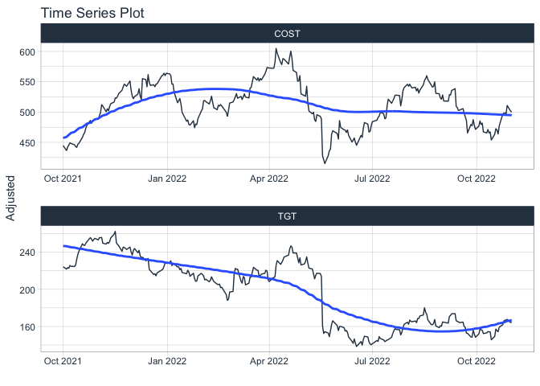

```r
library(tidyverse)
library(tidyquant)
library(lubridate)
library(timetk)
library(dygraphs)
```


```r
stocks <- tq_get(c("AAPL", "NKE", "AMZN", 
                   "COST", "TGT", "DIS"), get = "stock.prices", from = "2021-10-01", to = today())

plot1 <- stocks %>%  
  select(symbol, date, adjusted) %>%
  pivot_wider(names_from = symbol, values_from = adjusted) %>%
  tk_xts(date_var = date)
```

```
## Warning: Non-numeric columns being dropped: date
```

```r
dygraph(plot1)
```

```{=html}
<div id="htmlwidget-92f0645c1497575775ef" style="width:672px;height:480px;" class="dygraphs html-widget"></div>
<script type="application/json" data-for="htmlwidget-92f0645c1497575775ef">{"x":{"attrs":{"labels":["day","AAPL","NKE","AMZN","COST","TGT","DIS"],"legend":"auto","retainDateWindow":false,"axes":{"x":{"pixelsPerLabel":60}}},"scale":"daily","annotations":[],"shadings":[],"events":[],"format":"date","data":[["2021-10-01T00:00:00.000Z","2021-10-04T00:00:00.000Z","2021-10-05T00:00:00.000Z","2021-10-06T00:00:00.000Z","2021-10-07T00:00:00.000Z","2021-10-08T00:00:00.000Z","2021-10-11T00:00:00.000Z","2021-10-12T00:00:00.000Z","2021-10-13T00:00:00.000Z","2021-10-14T00:00:00.000Z","2021-10-15T00:00:00.000Z","2021-10-18T00:00:00.000Z","2021-10-19T00:00:00.000Z","2021-10-20T00:00:00.000Z","2021-10-21T00:00:00.000Z","2021-10-22T00:00:00.000Z","2021-10-25T00:00:00.000Z","2021-10-26T00:00:00.000Z","2021-10-27T00:00:00.000Z","2021-10-28T00:00:00.000Z","2021-10-29T00:00:00.000Z","2021-11-01T00:00:00.000Z","2021-11-02T00:00:00.000Z","2021-11-03T00:00:00.000Z","2021-11-04T00:00:00.000Z","2021-11-05T00:00:00.000Z","2021-11-08T00:00:00.000Z","2021-11-09T00:00:00.000Z","2021-11-10T00:00:00.000Z","2021-11-11T00:00:00.000Z","2021-11-12T00:00:00.000Z","2021-11-15T00:00:00.000Z","2021-11-16T00:00:00.000Z","2021-11-17T00:00:00.000Z","2021-11-18T00:00:00.000Z","2021-11-19T00:00:00.000Z","2021-11-22T00:00:00.000Z","2021-11-23T00:00:00.000Z","2021-11-24T00:00:00.000Z","2021-11-26T00:00:00.000Z","2021-11-29T00:00:00.000Z","2021-11-30T00:00:00.000Z","2021-12-01T00:00:00.000Z","2021-12-02T00:00:00.000Z","2021-12-03T00:00:00.000Z","2021-12-06T00:00:00.000Z","2021-12-07T00:00:00.000Z","2021-12-08T00:00:00.000Z","2021-12-09T00:00:00.000Z","2021-12-10T00:00:00.000Z","2021-12-13T00:00:00.000Z","2021-12-14T00:00:00.000Z","2021-12-15T00:00:00.000Z","2021-12-16T00:00:00.000Z","2021-12-17T00:00:00.000Z","2021-12-20T00:00:00.000Z","2021-12-21T00:00:00.000Z","2021-12-22T00:00:00.000Z","2021-12-23T00:00:00.000Z","2021-12-27T00:00:00.000Z","2021-12-28T00:00:00.000Z","2021-12-29T00:00:00.000Z","2021-12-30T00:00:00.000Z","2021-12-31T00:00:00.000Z","2022-01-03T00:00:00.000Z","2022-01-04T00:00:00.000Z","2022-01-05T00:00:00.000Z","2022-01-06T00:00:00.000Z","2022-01-07T00:00:00.000Z","2022-01-10T00:00:00.000Z","2022-01-11T00:00:00.000Z","2022-01-12T00:00:00.000Z","2022-01-13T00:00:00.000Z","2022-01-14T00:00:00.000Z","2022-01-18T00:00:00.000Z","2022-01-19T00:00:00.000Z","2022-01-20T00:00:00.000Z","2022-01-21T00:00:00.000Z","2022-01-24T00:00:00.000Z","2022-01-25T00:00:00.000Z","2022-01-26T00:00:00.000Z","2022-01-27T00:00:00.000Z","2022-01-28T00:00:00.000Z","2022-01-31T00:00:00.000Z","2022-02-01T00:00:00.000Z","2022-02-02T00:00:00.000Z","2022-02-03T00:00:00.000Z","2022-02-04T00:00:00.000Z","2022-02-07T00:00:00.000Z","2022-02-08T00:00:00.000Z","2022-02-09T00:00:00.000Z","2022-02-10T00:00:00.000Z","2022-02-11T00:00:00.000Z","2022-02-14T00:00:00.000Z","2022-02-15T00:00:00.000Z","2022-02-16T00:00:00.000Z","2022-02-17T00:00:00.000Z","2022-02-18T00:00:00.000Z","2022-02-22T00:00:00.000Z","2022-02-23T00:00:00.000Z","2022-02-24T00:00:00.000Z","2022-02-25T00:00:00.000Z","2022-02-28T00:00:00.000Z","2022-03-01T00:00:00.000Z","2022-03-02T00:00:00.000Z","2022-03-03T00:00:00.000Z","2022-03-04T00:00:00.000Z","2022-03-07T00:00:00.000Z","2022-03-08T00:00:00.000Z","2022-03-09T00:00:00.000Z","2022-03-10T00:00:00.000Z","2022-03-11T00:00:00.000Z","2022-03-14T00:00:00.000Z","2022-03-15T00:00:00.000Z","2022-03-16T00:00:00.000Z","2022-03-17T00:00:00.000Z","2022-03-18T00:00:00.000Z","2022-03-21T00:00:00.000Z","2022-03-22T00:00:00.000Z","2022-03-23T00:00:00.000Z","2022-03-24T00:00:00.000Z","2022-03-25T00:00:00.000Z","2022-03-28T00:00:00.000Z","2022-03-29T00:00:00.000Z","2022-03-30T00:00:00.000Z","2022-03-31T00:00:00.000Z","2022-04-01T00:00:00.000Z","2022-04-04T00:00:00.000Z","2022-04-05T00:00:00.000Z","2022-04-06T00:00:00.000Z","2022-04-07T00:00:00.000Z","2022-04-08T00:00:00.000Z","2022-04-11T00:00:00.000Z","2022-04-12T00:00:00.000Z","2022-04-13T00:00:00.000Z","2022-04-14T00:00:00.000Z","2022-04-18T00:00:00.000Z","2022-04-19T00:00:00.000Z","2022-04-20T00:00:00.000Z","2022-04-21T00:00:00.000Z","2022-04-22T00:00:00.000Z","2022-04-25T00:00:00.000Z","2022-04-26T00:00:00.000Z","2022-04-27T00:00:00.000Z","2022-04-28T00:00:00.000Z","2022-04-29T00:00:00.000Z","2022-05-02T00:00:00.000Z","2022-05-03T00:00:00.000Z","2022-05-04T00:00:00.000Z","2022-05-05T00:00:00.000Z","2022-05-06T00:00:00.000Z","2022-05-09T00:00:00.000Z","2022-05-10T00:00:00.000Z","2022-05-11T00:00:00.000Z","2022-05-12T00:00:00.000Z","2022-05-13T00:00:00.000Z","2022-05-16T00:00:00.000Z","2022-05-17T00:00:00.000Z","2022-05-18T00:00:00.000Z","2022-05-19T00:00:00.000Z","2022-05-20T00:00:00.000Z","2022-05-23T00:00:00.000Z","2022-05-24T00:00:00.000Z","2022-05-25T00:00:00.000Z","2022-05-26T00:00:00.000Z","2022-05-27T00:00:00.000Z","2022-05-31T00:00:00.000Z","2022-06-01T00:00:00.000Z","2022-06-02T00:00:00.000Z","2022-06-03T00:00:00.000Z","2022-06-06T00:00:00.000Z","2022-06-07T00:00:00.000Z","2022-06-08T00:00:00.000Z","2022-06-09T00:00:00.000Z","2022-06-10T00:00:00.000Z","2022-06-13T00:00:00.000Z","2022-06-14T00:00:00.000Z","2022-06-15T00:00:00.000Z","2022-06-16T00:00:00.000Z","2022-06-17T00:00:00.000Z","2022-06-21T00:00:00.000Z","2022-06-22T00:00:00.000Z","2022-06-23T00:00:00.000Z","2022-06-24T00:00:00.000Z","2022-06-27T00:00:00.000Z","2022-06-28T00:00:00.000Z","2022-06-29T00:00:00.000Z","2022-06-30T00:00:00.000Z","2022-07-01T00:00:00.000Z","2022-07-05T00:00:00.000Z","2022-07-06T00:00:00.000Z","2022-07-07T00:00:00.000Z","2022-07-08T00:00:00.000Z","2022-07-11T00:00:00.000Z","2022-07-12T00:00:00.000Z","2022-07-13T00:00:00.000Z","2022-07-14T00:00:00.000Z","2022-07-15T00:00:00.000Z","2022-07-18T00:00:00.000Z","2022-07-19T00:00:00.000Z","2022-07-20T00:00:00.000Z","2022-07-21T00:00:00.000Z","2022-07-22T00:00:00.000Z","2022-07-25T00:00:00.000Z","2022-07-26T00:00:00.000Z","2022-07-27T00:00:00.000Z","2022-07-28T00:00:00.000Z","2022-07-29T00:00:00.000Z","2022-08-01T00:00:00.000Z","2022-08-02T00:00:00.000Z","2022-08-03T00:00:00.000Z","2022-08-04T00:00:00.000Z","2022-08-05T00:00:00.000Z","2022-08-08T00:00:00.000Z","2022-08-09T00:00:00.000Z","2022-08-10T00:00:00.000Z","2022-08-11T00:00:00.000Z","2022-08-12T00:00:00.000Z","2022-08-15T00:00:00.000Z","2022-08-16T00:00:00.000Z","2022-08-17T00:00:00.000Z","2022-08-18T00:00:00.000Z","2022-08-19T00:00:00.000Z","2022-08-22T00:00:00.000Z","2022-08-23T00:00:00.000Z","2022-08-24T00:00:00.000Z","2022-08-25T00:00:00.000Z","2022-08-26T00:00:00.000Z","2022-08-29T00:00:00.000Z","2022-08-30T00:00:00.000Z","2022-08-31T00:00:00.000Z","2022-09-01T00:00:00.000Z","2022-09-02T00:00:00.000Z","2022-09-06T00:00:00.000Z","2022-09-07T00:00:00.000Z","2022-09-08T00:00:00.000Z","2022-09-09T00:00:00.000Z","2022-09-12T00:00:00.000Z","2022-09-13T00:00:00.000Z","2022-09-14T00:00:00.000Z","2022-09-15T00:00:00.000Z","2022-09-16T00:00:00.000Z","2022-09-19T00:00:00.000Z","2022-09-20T00:00:00.000Z","2022-09-21T00:00:00.000Z","2022-09-22T00:00:00.000Z","2022-09-23T00:00:00.000Z","2022-09-26T00:00:00.000Z","2022-09-27T00:00:00.000Z","2022-09-28T00:00:00.000Z","2022-09-29T00:00:00.000Z","2022-09-30T00:00:00.000Z","2022-10-03T00:00:00.000Z","2022-10-04T00:00:00.000Z","2022-10-05T00:00:00.000Z","2022-10-06T00:00:00.000Z","2022-10-07T00:00:00.000Z","2022-10-10T00:00:00.000Z","2022-10-11T00:00:00.000Z","2022-10-12T00:00:00.000Z","2022-10-13T00:00:00.000Z","2022-10-14T00:00:00.000Z","2022-10-17T00:00:00.000Z","2022-10-18T00:00:00.000Z","2022-10-19T00:00:00.000Z","2022-10-20T00:00:00.000Z","2022-10-21T00:00:00.000Z","2022-10-24T00:00:00.000Z","2022-10-25T00:00:00.000Z","2022-10-26T00:00:00.000Z","2022-10-27T00:00:00.000Z","2022-10-28T00:00:00.000Z","2022-10-31T00:00:00.000Z","2022-11-01T00:00:00.000Z"],[141.855103,138.36467,140.323685,141.20874,142.491531,142.103699,142.014221,140.721451,140.124817,142.958923,144.032913,145.733383,147.931046,148.428268,148.647034,147.861465,147.811722,148.487961,148.020569,151.719849,148.965271,148.129959,149.184052,150.645859,150.118805,150.656586,149.820023,150.188522,147.310425,147.26062,149.371902,149.381851,150.377731,152.857468,157.219421,159.888367,160.356445,160.744827,161.272644,156.163788,159.579666,164.618805,164.090988,163.085144,161.17305,164.638718,170.474548,174.35849,173.840637,178.71048,175.015793,173.611588,178.561111,171.550095,170.434723,169.050461,172.2771,174.916183,175.553558,179.586868,178.551147,178.640778,177.465622,176.838242,181.259918,178.959442,174.199158,171.291183,171.460495,171.480408,174.35849,174.806641,171.480408,172.356796,169.100266,165.544968,163.832062,161.740723,160.953949,159.121536,159.031906,158.563843,169.628082,174.059738,173.890442,175.115341,172.187469,171.898315,171.170395,174.331345,175.777222,171.629074,168.159012,168.398315,172.297165,172.057861,168.398315,166.82283,163.851334,159.613464,162.275848,164.379822,164.649048,162.734528,166.084946,165.755875,162.704605,158.845657,156.990952,162.485245,158.067886,154.288681,150.190399,154.647644,159.134827,160.16188,163.512299,164.90831,168.338501,169.724548,173.573517,174.221664,175.099152,178.44957,177.26297,174.111984,173.81282,177.931046,174.560684,171.339905,171.649017,169.604858,165.277237,167.181808,169.913971,164.818558,164.599197,166.922546,166.753021,165.945343,161.328537,162.415436,156.352783,156.123444,163.173264,157.200348,157.509476,159.025131,165.546478,156.322876,157.061829,151.849075,154.29567,146.296783,142.362244,146.905945,145.33812,149.03299,140.62468,137.159485,137.399139,142.911484,140.165298,140.325089,143.580551,149.432434,148.633545,148.503723,151.000259,145.178345,145.937286,148.503723,147.754776,142.442139,136.939789,131.697067,132.575836,135.242142,129.879593,131.377502,135.681534,135.162262,138.078201,141.463501,141.463501,137.249359,139.036865,136.53035,138.737274,141.363632,142.721756,146.147003,146.836029,144.669037,145.657669,145.288193,148.264053,149.9617,146.865997,150.790543,152.827713,155.134521,153.876251,152.737839,151.389725,156.57251,157.131744,162.284576,161.285965,159.78804,165.899567,165.580002,165.350006,164.869995,164.919998,169.240005,168.490005,172.100006,173.190002,173.029999,174.550003,174.149994,171.520004,167.570007,167.229996,167.529999,170.029999,163.619995,161.380005,158.910004,157.220001,157.960007,155.809998,154.529999,155.960007,154.460007,157.369995,163.429993,153.839996,155.309998,152.369995,150.699997,154.479996,156.899994,153.720001,152.740005,150.429993,150.770004,151.759995,149.839996,142.479996,138.199997,142.449997,146.100006,146.399994,145.429993,140.089996,140.419998,138.979996,138.339996,142.990005,138.380005,142.410004,143.75,143.860001,143.389999,147.270004,149.449997,152.339996,149.350006,144.800003,155.740005,153.339996,150.649994],[145.681534,145.760773,148.059052,147.405228,150.42662,151.050735,148.871353,151.912582,154.834915,155.667038,156.528885,157.935577,156.340683,156.964752,160.659805,161.947617,162.680679,162.254715,160.828201,162.918427,165.721893,164.770905,166.256851,170.883072,173.795517,175.846115,170.239166,172.190704,166.682816,165.404907,167.505035,167.267288,170.219345,170.130203,169.743851,173.240768,172.606766,170.536346,170.417465,166.445068,168.277725,167.653625,165.137436,168.406494,168.947357,167.627457,169.98938,168.957291,166.823624,167.776321,165.573181,164.144104,162.655502,161.484467,160.134796,155.78804,165.364777,164.183807,164.412048,166.307571,165.156372,167.498444,166.218262,165.40448,163.419662,165.126587,161.018021,159.8172,155.778122,149.297714,149.158768,151.054276,148.454147,147.054855,145.834198,144.008163,141.64624,141.864578,144.891418,144.375366,142.896698,143.541748,144.802094,146.945709,147.094559,147.580856,144.20665,144.286041,144.037964,142.44017,145.149445,143.720383,139.115616,140.514908,144.474609,145.377701,141.715729,141.864578,137.140717,135.791061,136.128464,137.746094,135.513184,131.216049,134.649765,132.952759,130.481003,123.776924,120.564133,126.273544,125.358452,121.976563,116.943527,118.763779,124.522926,126.731094,130.540695,129.496292,132.380829,132.291306,131.376205,132.987579,134.091675,138.39859,137.801788,133.843002,132.808548,133.624161,131.595047,127.676033,128.690613,127.467148,124.314049,124.373726,126.810661,132.748871,130.928619,136.319733,135.146011,134.73822,128.382263,127.258278,119.877808,120.593971,126.373024,124.035538,125.408188,122.205345,125.388283,117.997879,113.879944,110.617416,108.906586,107.344948,107.325058,112.407829,112.000008,115.282425,108.787224,105.872841,107.424522,108.051163,106.718307,107.623451,112.338203,115.371948,118.216705,118.047615,122.752411,120.603584,119.885651,121.321518,122.049431,118.260315,114.401405,110.123688,110.402885,113.115097,106.813194,107.032562,108.368729,104.619492,107.690674,112.586617,110.183517,102.485626,102.954277,101.90728,100.890205,104.021217,103.931473,107.820297,107.620872,104.808952,103.462822,104.808952,102.92437,104.400124,103.642303,108.877266,110.791771,111.300308,108.807472,108.96701,104.898689,107.551079,111.908562,114.590851,113.972633,111.449875,113.95269,114.152115,113.543861,113.673492,109.794632,112.815956,113.773201,115.737564,115.986847,117.721863,116.704781,115.677734,112.835899,110.023972,110.362999,111.090912,112.895729,107.969872,107.571014,107.551079,106.145111,106.184998,105.739998,105.150002,108.480003,108.730003,110.970001,112.379997,105.720001,107,105.5,104.120003,107.209999,102.419998,99.790001,98.550003,97.019997,96.059998,96.290001,98.699997,95.330002,83.120003,85.400002,88.639999,91.099998,90.169998,87.160004,86.690002,87.989998,88.510002,89.559998,87.550003,89.970001,89.68,88.57,86.830002,88.5,88.010002,91.720001,92.389999,90.540001,93.830002,92.68,93.769997],[164.162994,159.488998,161.050003,163.100494,165.121506,164.431,162.315002,162.366501,164.214005,164.992996,170.451004,172.337006,172.207504,170.753006,171.750504,166.777496,166.018494,168.803497,169.624496,172.328506,168.621506,165.905502,165.637497,169.199997,173.850006,175.949493,174.449005,178.811493,174.102493,173.625,176.257507,177.283997,177.035004,177.449997,184.802994,183.828506,178.628494,179.001999,179.020493,175.227997,178.078506,175.3535,172.186005,171.867996,169.489502,171.3685,176.164505,176.158005,174.171005,172.212006,169.567505,169.091507,173.315002,168.871002,170.017502,167.078995,170.417007,171.037003,171.068497,169.669495,170.660995,169.201004,168.644501,166.716995,170.404495,167.522003,164.356995,163.253998,162.554001,161.485992,165.362,165.207001,161.214005,162.138,158.917496,156.298996,151.667496,142.643005,144.544006,139.985992,138.872498,139.637497,143.977997,149.573502,151.193497,150.612503,138.845505,157.639496,157.935501,161.413498,161.189499,159.003494,153.293503,155.167007,156.510498,158.100494,154.652496,152.601501,150.197495,144.826996,151.358002,153.788498,153.563004,151.141998,152.052505,147.898499,145.641006,137.453003,136.014496,139.279007,146.817505,145.524506,141.852997,147.366501,153.104004,157.238998,161.250504,161.491501,164.889008,163.408005,163.649506,164.773499,168.990494,169.315002,166.300995,162.997498,163.559998,168.346497,164.054993,158.755997,157.7845,154.460495,151.121994,150.787506,155.541,151.706497,152.785004,158.115494,153.998001,148.296005,144.350006,146.074005,139.391006,138.167007,144.596497,124.281502,124.5,124.253502,125.928497,116.406998,114.772499,108.789001,108.859001,105.372002,106.930496,113.055,110.810501,115.3685,107.112503,107.319,107.591003,107.556999,104.099998,106.775002,111.077499,115.1465,120.209503,121.683998,125.511002,122.349998,124.790001,123,121.18,116.150002,109.650002,103.669998,102.309998,107.669998,103.660004,106.220001,108.68,108.949997,112.440002,116.459999,113.220001,107.400002,108.919998,106.209999,109.559998,113.5,114.330002,116.330002,115.540001,111.75,109.220001,110.400002,110.629997,113.550003,113.760002,118.209999,122.769997,124.629997,122.419998,121.139999,114.809998,120.970001,122.279999,134.949997,135.389999,134.160004,139.520004,142.570007,140.800003,139.410004,137.830002,142.690002,140.639999,143.550003,143.179993,144.779999,142.100006,142.300003,138.229996,133.220001,133.619995,133.800003,137.279999,130.75,129.789993,128.729996,126.769997,127.82,127.510002,126.110001,129.479996,129.820007,133.270004,136.449997,126.82,128.550003,126.279999,123.529999,124.660004,122.190002,118.540001,117.309998,113.779999,115.150002,114.410004,118.010002,114.800003,113,115.879997,121.089996,120.949997,120.300003,114.559998,113.669998,112.209999,112.900002,112.529999,106.900002,113.790001,116.360001,115.07,115.25,119.32,119.82,120.599998,115.660004,110.959999,103.410004,102.440002,96.790001],[444.631012,436.508606,442.558258,445.63269,449.133545,448.122009,445.989746,443.183075,441.626007,446.941803,448.657532,458.138672,463.226349,465.894135,473.292572,478.013336,486.056427,481.524078,485.074554,487.269897,488.273193,488.600983,493.68692,498.991455,512.193115,509.709747,500.461639,505.329041,502.15033,508.776001,513.732788,516.434692,523.219299,522.792236,525.851746,530.242371,536.063416,541.636108,546.076416,542.500366,551.192261,535.795227,526.318665,522.017395,525.414673,529.656311,538.417725,526.586853,520.845215,555.106018,553.516663,541.715576,561.721741,548.957153,543.970459,544.914185,541.804993,546.016785,546.712219,559.725098,560.887329,563.996521,560.162231,563.927002,562.943542,560.480042,546.265137,546.145996,532.616455,515.351929,518.560486,522.305481,513.444763,499.647064,484.826233,486.902344,479.611115,478.409119,485.650726,474.147675,480.256805,479.31311,489.157227,501.772858,505.031036,518.550598,519.08783,517.098145,513.238037,518.471069,526.111511,515.814758,507.050049,503.955994,511.278107,509.766022,512.36261,510.034546,499.598541,492.714111,502.981018,514.829834,516.58075,520.241882,525.285828,530.309814,522.798584,525.803101,520.669617,524.937622,529.981506,524.708801,523.246338,539.532166,540.59668,549.948364,558.464355,552.674316,556.54425,551.171997,555.241028,552.853394,562.304504,567.049988,573.506653,572.889771,572.611267,572.173523,572.362549,581.783813,604.924255,596.955505,581.66449,578.37146,588.051514,587.355103,579.127625,591.244934,600.427551,588.69812,568.761108,565.289124,550.913391,551.231812,560.020691,529.84729,527.087097,526.220093,542.512573,515.498047,501.587158,497.07312,499.693848,487.357452,484.467682,495.518616,492.7883,488.742584,427.887665,421.44043,414.963348,427.967407,436.168396,438.559937,463.352325,469.10199,464.577972,455.380493,485.892639,474.572662,470.805969,470.118408,466.341766,470.387451,461.678223,450.657196,453.198181,457.174164,450.168915,445.11676,461.478943,458.340027,473.327057,482.664032,480.053284,466.959564,468.185211,477.59198,484.049164,486.540375,490.914917,493.206818,499.773621,497.142883,488.842224,490.48642,510.136963,521.108215,514.481567,518.397766,522.353821,527.595337,527.854309,527.276428,510.126984,520.470459,535.213806,540.324585,545.824646,542.480713,546.024292,542.301086,539.69574,540.923523,534.854492,538.84729,531.241028,536.242004,544.766602,552.023499,555.317566,559.949219,553.530762,544.487061,541.093201,542.241089,549.777527,530.861694,530.103027,523.195557,521.15918,528.216431,518.174561,517.964966,528.685608,528.166565,535.613098,538.547852,509.380432,507.084595,502.592712,503.231567,505.657196,498.619873,492.181519,486.292145,465.55957,479.434509,477.43811,487.410126,478.116913,471.418976,476.869171,485.254028,479.454498,481.620544,467.306396,465.469727,471.169434,465.539612,467.146698,453.830719,463.333588,472.417175,470.580505,463.782776,477.318329,496.074463,498.160706,498.550018,496.540009,510.869995,501.5,499.959991],[224.323532,221.838913,223.478958,222.762039,225.698425,224.794922,224.618149,226.110901,232.504135,237.748383,241.303452,249.101059,247.667252,247.31369,249.651016,251.340179,255.680939,254.089966,251.93927,253.589096,254.963989,253.29451,255.592545,255.739853,255.769333,249.709946,248.786804,250.584,249.493881,251.418747,255.356812,259.589539,262.506409,250.09993,248.375458,247.045135,241.004501,245.547287,245.133408,242.975342,245.527588,240.285126,236.885422,241.920944,243.96077,239.427811,242.049057,236.106949,234.09668,234.707642,230.756119,231.849915,233.199951,221.503006,220.054413,215.994507,216.861679,214.565643,217.787964,220.832916,221.631119,224.597214,228.529068,228.065903,228.568466,230.756119,225.523514,227.977219,227.415543,224.104523,224.232635,221.197525,222.537689,218.172272,216.802536,220.576706,218.48761,214.082794,217.364243,211.550247,208.62355,209.086685,214.496658,217.216415,216.033905,214.437546,210.111526,210.919571,208.209671,209.845459,213.481674,210.722488,208.475723,205.529343,205.044373,205.667877,201.897156,202.283127,194.326019,187.94249,189.575485,197.166428,197.710754,217.168091,222.581711,221.532639,221.789963,208.864578,206.657562,213.773453,212.566025,204.836533,206.608078,213.130157,213.367676,218.355728,223.719864,220.701309,220.473679,214.486038,214.802719,216.356552,217.257172,220.632004,219.672012,210.032425,208.369736,212.19986,212.575912,213.714081,225.837799,230.934708,226.946243,228.955322,231.409775,234.754929,236.922333,243.513702,246.75,245.611832,239.188736,239.168961,234.062134,228.589142,233.953262,226.29306,227.411407,230.142944,234.982544,228.381302,222.888519,221.888931,216.851395,211.289337,215.030365,217.464996,216.989944,213.939072,160.603378,152.474319,154.392303,152.941391,149.015991,155.445694,162.183472,166.098923,160.871689,155.545074,159.90773,160.036911,158.675461,155.008438,155.723953,153.587357,148.737747,143.90802,141.811157,146.521637,141.999969,138.432343,143.798691,139.932922,145.895554,149.483063,148.678116,143.619827,141.016129,140.350311,141.493149,144.802414,143.90802,149.02594,147.068207,145.47818,143.659576,144.534088,145.378784,145.756424,148.429672,152.404755,155.525208,157.671753,156.757477,156.509033,150.86441,153.637039,158.427017,162.36235,164.518829,162.461716,166.874069,165.522537,165.09523,165.929993,164.091507,168.613174,168.54361,171.405655,172.309998,180.190002,175.339996,173.050003,167.039993,161.960007,161.970001,163.130005,167.5,160.619995,158.690002,160.779999,160.339996,164.839996,164.600006,163.580002,170.789993,171.899994,173.649994,173.850006,166.240005,165.380005,165.009995,164.089996,164.759995,160.029999,159.029999,152.960007,152.610001,148.710007,148.470001,155.869995,151.789993,148.389999,151.789993,156.960007,156.410004,155.75,152.339996,153.100006,154.5,154.160004,154.119995,145.690002,149.25,157.229996,155.389999,154.399994,159.190002,161.820007,165.800003,166.770004,166.899994,167.520004,164.25,164.589996],[176.009995,173.460007,174.610001,175.479996,177.710007,176.740005,173.520004,173.130005,172.960007,174.410004,176.460007,171.139999,171.179993,170.550003,171.339996,169.419998,172.009995,172.039993,169.550003,169.679993,169.070007,170.190002,169.830002,170.080002,170.279999,175.630005,176.869995,175.110001,174.449997,162.110001,159.630005,158.429993,158.830002,157.330002,155.580002,154,154.160004,151.029999,151.339996,148.110001,147.809998,144.899994,142.149994,147.199997,146.220001,150.369995,150.809998,153.339996,152.940002,152.710007,150.429993,149.100006,150.399994,148.75,148.759995,146.470001,151.050003,151.880005,153.630005,152.800003,155.199997,154.869995,155.929993,154.889999,156.759995,155.729996,155.190002,156.899994,157.830002,156.600006,157.889999,157.800003,155.440002,151.940002,152.270004,150.110001,147.619995,137.380005,137.460007,136.509995,133.600006,135.419998,138.630005,142.970001,144.490005,142.619995,140.029999,142.020004,142.509995,142.479996,147.229996,152.160004,149.470001,150.850006,154.720001,156.350006,152.949997,151.360001,148.089996,145.869995,149.399994,149.529999,148.460007,145.699997,147.339996,145.570007,140.720001,133.5,131.75,133.649994,133.639999,131.75,129.029999,134.199997,138.139999,139.470001,140.300003,138.619995,140.110001,137.639999,138.960007,139.139999,138.720001,142.380005,140.960007,137.160004,137,138.580002,135.619995,132.570007,131.869995,131.869995,130.649994,130.839996,132.350006,130.470001,127.769997,131.899994,124.57,121.660004,118.269997,119.949997,115.769997,115.209999,115.290001,111.629997,113.5,113.550003,116.190002,112.610001,110.290001,106.980003,107.68,105.209999,104.309998,107.330002,105.18,108.639999,104.300003,103.139999,102.419998,105.830002,101.589996,103.260002,105.610001,109.32,110.440002,109.190002,110.870003,108.669998,107.830002,107.790001,107.339996,103.300003,99.400002,95.709999,94.220001,95.879997,94.279999,94.339996,93.290001,93.5,94.300003,97.779999,96.610001,95.919998,95.650002,94.400002,96.139999,97.18,96.080002,97.43,95.860001,93.639999,93.599998,92.940002,91.839996,95.199997,95.699997,99.610001,103.349998,104.18,102.720001,102.690002,99.779999,103.5,104.900002,106.099998,106.220001,104.709999,109.019997,108.120003,106.629997,109.110001,108.129997,112.43,117.690002,121.57,124.260002,124.959999,122.809998,122.669998,120.139999,115.940002,114.860001,116.410004,117.459999,114.07,113.529999,112.43,112.080002,112.529999,111.199997,110.089996,112.690002,112.330002,115.18,116.389999,111.760002,112.5,110.769997,108.25,109.169998,107.57,104.489998,102.160004,99.5,98.120003,95.849998,99.400002,97.449997,94.330002,97.129997,101.440002,100.800003,100.040001,97.160004,95.160004,93.099998,93.410004,96.639999,94.449997,97.330002,98.480003,98.989998,98.589996,102.040001,101.720001,104.360001,104.629997,104.440002,105.949997,106.540001,106]]},"evals":[],"jsHooks":[]}</script>
```

```r
plot2 <- tq_get(c("COST", "TGT"), get = "stock.prices", from = "2021-10-01", to = today()) %>% 
    plot_time_series(date, adjusted,
                   .facet_vars = contains("symbol"),
                   .facet_scales = "free",
                   .y_lab = "Adjusted",
                   .interactive = FALSE)

plot2
```

<!-- -->
The three stocks I chose for myself were Apple, Amazon and Target, and my friends stocks were Nike, Costco and Disney. Looking at my first visualization we can clearly see that Costco is doing much better than the other 5 stocks by a good margin. We can also that Target is the clear second place until around July 2022 where it dips below Apple for a little while before rising again in September 2022. My second visualization shows the top performing stock for both my friend and I. My top stock was target and my friend's was Costco. We can see that Costco's trend should indicate that it rises steadily for awhile until it will eventually level out while Target's stock should decrease steadily for while before dipping somewhat significantly before it begins to rise again. The trend lines accurately predict the stock's price at the end of the time period.
