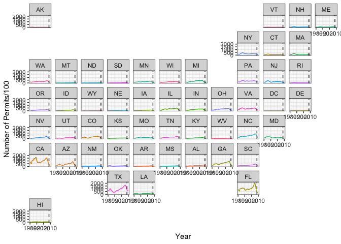
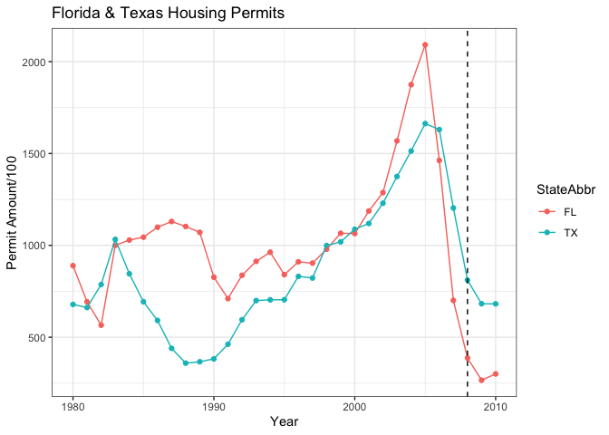

```r
library(tidyverse)
library(USAboundaries)
library(geofacet)
```


```r
dat <- tempfile()
download.file("https://github.com/WJC-Data-Science/DTS350/raw/master/permits.csv", "dat")
permit <- read_csv("dat")
```

```
## New names:
## Rows: 327422 Columns: 8
## ── Column specification
## ──────────────────────────────────────────────────────── Delimiter: "," chr
## (3): StateAbbr, countyname, variable dbl (5): ...1, state, county, year, value
## ℹ Use `spec()` to retrieve the full column specification for this data. ℹ
## Specify the column types or set `show_col_types = FALSE` to quiet this message.
## • `` -> `...1`
```

```r
counties <- us_counties() %>%
              select(-13)

FIPS_codes <- permit %>%
                mutate(state = as.character(state), stateFIPS = str_pad(state, 2, pad = "0")) %>%
                mutate(county = as.character(county), countyFIPS = str_pad(county, 3, pad = "0")) %>%
                mutate(geoid = str_c(stateFIPS, countyFIPS))

permit_merge <- left_join(FIPS_codes, counties, by = "geoid") %>%
                  filter(variable == "Single Family") %>%
                  select(state, StateAbbr, county, countyname, year, value) %>%
                  group_by(StateAbbr, year) %>%
                  summarise(permits = sum(value))
```

```
## `summarise()` has grouped output by 'StateAbbr'. You can override using the
## `.groups` argument.
```


```r
ggplot(data = permit_merge, aes(x = year, y = permits/100, color = StateAbbr)) +
  geom_line() +
  geom_vline(xintercept = 2008, linetype = "dashed") +
  facet_geo(~StateAbbr, grid = "us_state_grid2") +
  labs(x = "Year",
       y = "Number of Permits/100") +
  theme_bw() +
  theme(legend.position = 'none') 
```

<!-- -->


```r
permit_merge %>%
  filter(StateAbbr == "FL" | StateAbbr == "TX") %>%
  ggplot(aes(x = year, y = permits/100, color = StateAbbr)) +
  geom_point() +
  geom_line() +
  geom_vline(xintercept = 2008, linetype = "dashed") +
  labs(title = "Florida & Texas Housing Permits",
       x = "Year", 
       y = "Permit Amount/100") +
  theme_bw()
```

<!-- -->
I chose to show the number of permits per state on a state map so we can visually see what the permit trends were for every state over the period between 1980 and 2010. Looking at the map, we can see that the higher populated states seemed to have bigger peaks and drops offs leading up to the 2008 recession. I then chose to take Florida and Texas and display their plots to see just how bad the decline was. We can see that the declines happened around the same time just before 2008 and they were both fairly steep. 
