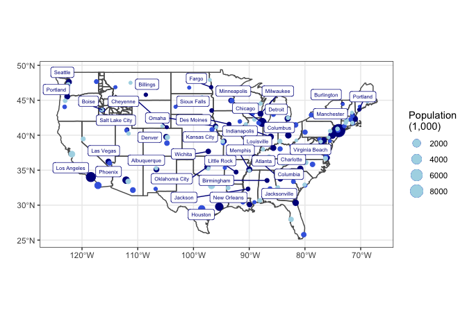

```r
library(tidyverse)
library(USAboundaries)
library(sf)
library(maps)
library(ggrepel)
library(ggsflabel)
```


```r
USmap <- sf::st_as_sf(map("state", plot = FALSE, fill = TRUE))
ID <- us_counties(states = "ID")
cities <- us_cities()
```

```
## City populations for contemporary data come from the 2010 census.
```

```r
top3 <- cities %>%
          filter(state_name != "Alaska", state_name != "Hawaii") %>%
          group_by(state_name) %>%
          arrange(desc(population)) %>%
          slice(1:3)

first <- top3 %>%
          slice(1:1)

second <- top3 %>%
            slice(2:2)

third <- top3 %>%
            slice(3:3)
```


```r
ggplot() +
  geom_sf(data = USmap, fill = NA) +
  geom_sf(data = ID, fill = NA) +
  geom_sf(data = first, aes(size = population/1000), color = "darkblue") +
  geom_sf(data = second, aes(size = population/1000), color = "royalblue") +
  geom_sf(data = third, aes(size = population/1000), color = "lightblue") +
  geom_sf_label_repel(data = first, aes(label = city), color = "darkblue", 
                size = 2, nudge_x = -1.5, nudge_y = 1) +
  labs(x = " ",
       y = " ") +
  scale_size_continuous(name = "Population\n(1,000)") +
  theme_bw()
```

```
## Warning in st_point_on_surface.sfc(data$geometry): st_point_on_surface may not
## give correct results for longitude/latitude data
```

```
## Warning: ggrepel: 10 unlabeled data points (too many overlaps). Consider
## increasing max.overlaps
```

<!-- -->

