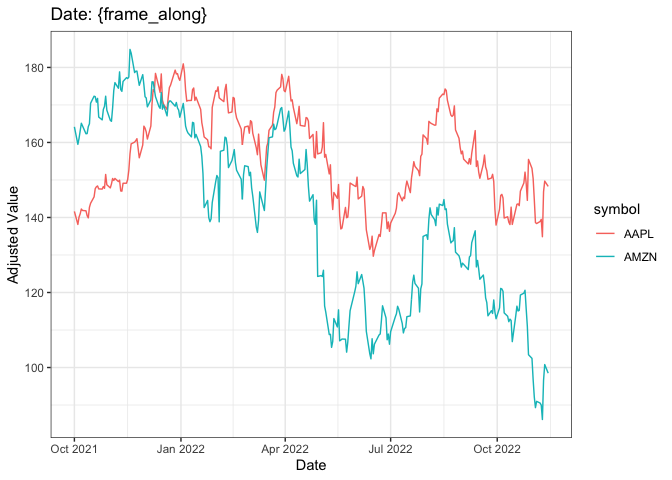
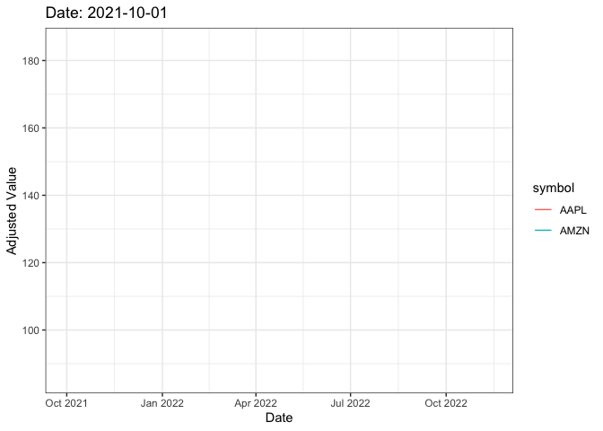

```r
library(tidyverse)
library(gapminder)
library(ggplot2)
library(gganimate)
library(gifski)
library(tidyquant)
library(lubridate)
```


```r
stocks <- tq_get(c("AMZN", "AAPL"), get = "stock.prices", from = "2021-10-01", to = today())
plot <- ggplot(stocks) +
          geom_line(aes(x = date, y = adjusted, color = symbol)) +
          labs(title = "Date: {frame_along}",
               x = "Date",
               y = "Adjusted Value") +
               theme_bw()
plot
```

<!-- -->

```r
plot + transition_reveal(date)
```

```
## geom_path: Each group consists of only one observation. Do you need to adjust
## the group aesthetic?
## geom_path: Each group consists of only one observation. Do you need to adjust
## the group aesthetic?
```

<!-- -->

```r
anim_save("Myanimation.gif")
```
