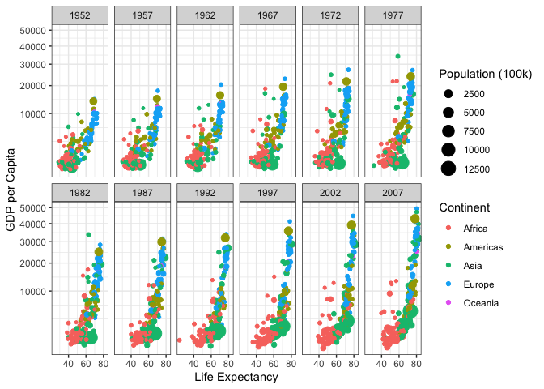

```r
library(tidyverse)
```

```
## ── Attaching packages ─────────────────────────────────────── tidyverse 1.3.2 ──
## ✔ ggplot2 3.3.5     ✔ purrr   0.3.4
## ✔ tibble  3.1.6     ✔ dplyr   1.0.8
## ✔ tidyr   1.2.0     ✔ stringr 1.4.0
## ✔ readr   2.1.2     ✔ forcats 0.5.1
## ── Conflicts ────────────────────────────────────────── tidyverse_conflicts() ──
## ✖ dplyr::filter() masks stats::filter()
## ✖ dplyr::lag()    masks stats::lag()
```

```r
library(downloader)
library(knitr)
library(gapminder)
```


```r
str(gapminder)
```

```
## tibble [1,704 × 6] (S3: tbl_df/tbl/data.frame)
##  $ country  : Factor w/ 142 levels "Afghanistan",..: 1 1 1 1 1 1 1 1 1 1 ...
##  $ continent: Factor w/ 5 levels "Africa","Americas",..: 3 3 3 3 3 3 3 3 3 3 ...
##  $ year     : int [1:1704] 1952 1957 1962 1967 1972 1977 1982 1987 1992 1997 ...
##  $ lifeExp  : num [1:1704] 28.8 30.3 32 34 36.1 ...
##  $ pop      : int [1:1704] 8425333 9240934 10267083 11537966 13079460 14880372 12881816 13867957 16317921 22227415 ...
##  $ gdpPercap: num [1:1704] 779 821 853 836 740 ...
```

```r
dat <- filter(gapminder, country != "Kuwait")
```


```r
ggplot(dat) +
  geom_point(mapping = aes(x = lifeExp, y = gdpPercap, 
                           size = (pop/100000), color = continent)) +
  facet_wrap(~year, nrow = 2) +
  scale_y_continuous(trans = 'sqrt') +
  xlab("Life Expectancy") +
  ylab("GDP per Capita") +
  labs(color = "Continent", size = "Population (100k)") +
  theme_bw()
```

<!-- -->


```r
w_mean <- dat %>%
  group_by(year, continent) %>%
  summarize(w_avg = weighted.mean(gdpPercap), population = pop/100000)
```

```
## `summarise()` has grouped output by 'year', 'continent'. You can override using
## the `.groups` argument.
```

```r
ggplot() +
  geom_point(dat, mapping = aes(x = year, y = gdpPercap, color = continent)) +
  geom_path(dat, mapping = aes(x = year, y = gdpPercap, color = continent)) +
  geom_point(w_mean, mapping = aes(x = year, y = w_avg, size = population)) +
  facet_wrap(~continent, nrow = 2)
```

<!-- -->
