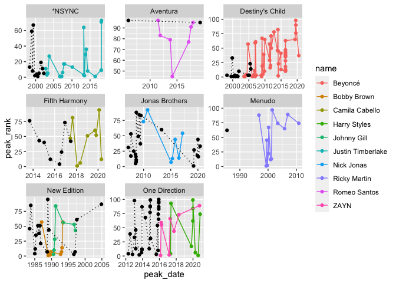

```r
library(tidyverse)
```

```
## ── Attaching packages ─────────────────────────────────────── tidyverse 1.3.2 ──
## ✓ ggplot2 3.3.5     ✓ purrr   0.3.4
## ✓ tibble  3.1.6     ✓ dplyr   1.0.8
## ✓ tidyr   1.2.0     ✓ stringr 1.4.0
## ✓ readr   2.1.2     ✓ forcats 0.5.1
## ── Conflicts ────────────────────────────────────────── tidyverse_conflicts() ──
## x dplyr::filter() masks stats::filter()
## x dplyr::lag()    masks stats::lag()
```

```r
library(downloader)
library(knitr)
```


```r
SoloData <- read_csv("solo-artist-followers.csv")
```

```
## Rows: 139 Columns: 5
## ── Column specification ────────────────────────────────────────────────────────
## Delimiter: ","
## chr (5): name, band, followers, band_followers, follower_difference
## 
## ℹ Use `spec()` to retrieve the full column specification for this data.
## ℹ Specify the column types or set `show_col_types = FALSE` to quiet this message.
```

```r
BillboardData <- read_csv("billboard-hits.csv")
```

```
## Rows: 456 Columns: 5
## ── Column specification ────────────────────────────────────────────────────────
## Delimiter: ","
## chr  (3): name, band, title
## dbl  (1): peak_rank
## date (1): peak_date
## 
## ℹ Use `spec()` to retrieve the full column specification for this data.
## ℹ Specify the column types or set `show_col_types = FALSE` to quiet this message.
```

For the SoloData, all of the data types are chrs, for the BillboardData there are 3 chr types one date type and a dbl. All of the data imported correctly.


```r
head(BillboardData)
```

```
## # A tibble: 6 × 5
##   name   band  title                     peak_date  peak_rank
##   <chr>  <chr> <chr>                     <date>         <dbl>
## 1 *NSYNC <NA>  It's Gonna Be Me          2000-07-28         1
## 2 *NSYNC <NA>  Music Of My Heart         1999-10-15         2
## 3 *NSYNC <NA>  Bye Bye Bye               2000-04-14         4
## 4 *NSYNC <NA>  This I Promise You        2000-12-01         5
## 5 *NSYNC <NA>  Girlfriend                2002-04-05         5
## 6 *NSYNC <NA>  A Little More Time On You 1999-02-26         8
```

```r
head(SoloData)
```

```
## # A tibble: 6 × 5
##   name              band   followers band_followers follower_difference
##   <chr>             <chr>  <chr>     <chr>          <chr>              
## 1 Daron Jones       112    1.28k     783k           −782k              
## 2 Slim              112    2.14k     783k           −781k              
## 3 Q Parker          112    3.51k     783k           −780k              
## 4 JC Chasez         *NSYNC 30.8k     1.44M          −1.41M             
## 5 Joey Fatone       *NSYNC 1.13k     1.44M          −1.44M             
## 6 Justin Timberlake *NSYNC 10.3M     1.44M          8.90M
```

```r
times_top_100 <- BillboardData %>%
                    filter(is.na(band) == FALSE) %>%                 
                    group_by(name, band) %>%
                    summarise(appearance = n()) %>%
                    filter(appearance > 6, na.rm = TRUE)
```

```
## `summarise()` has grouped output by 'name'. You can override using the
## `.groups` argument.
```

```r
Solo_artist <- BillboardData %>%
  filter(name %in% times_top_100$name)
  
Bands <- BillboardData %>%
  filter(is.na(band) == TRUE) %>%
  filter(name %in% times_top_100$band)%>%
  mutate(band = name)

head(Bands)
```

```
## # A tibble: 6 × 5
##   name   band   title                     peak_date  peak_rank
##   <chr>  <chr>  <chr>                     <date>         <dbl>
## 1 *NSYNC *NSYNC It's Gonna Be Me          2000-07-28         1
## 2 *NSYNC *NSYNC Music Of My Heart         1999-10-15         2
## 3 *NSYNC *NSYNC Bye Bye Bye               2000-04-14         4
## 4 *NSYNC *NSYNC This I Promise You        2000-12-01         5
## 5 *NSYNC *NSYNC Girlfriend                2002-04-05         5
## 6 *NSYNC *NSYNC A Little More Time On You 1999-02-26         8
```

```r
head(times_top_100)
```

```
## # A tibble: 6 × 3
## # Groups:   name [6]
##   name              band            appearance
##   <chr>             <chr>                <int>
## 1 Beyoncé           Destiny's Child         51
## 2 Bobby Brown       New Edition             11
## 3 Camila Cabello    Fifth Harmony            9
## 4 Harry Styles      One Direction            9
## 5 Johnny Gill       New Edition              7
## 6 Justin Timberlake *NSYNC                  22
```

```r
ggplot() +
  geom_point(Solo_artist, mapping = aes(x = peak_date, y = peak_rank, 
                                          color = name, group = name)) +
  geom_line(Solo_artist, mapping = aes(x = peak_date, y = peak_rank, 
                                          color = name, group = name)) +
  geom_point(Bands, mapping = aes(x = peak_date, y = peak_rank), color = "black") +
  geom_line(Bands, mapping = aes(x = peak_date, y = peak_rank), 
                                 color = "black", linetype = "dotted") +
  facet_wrap(~band, scales = "free")
```

```
## geom_path: Each group consists of only one observation. Do you need to adjust
## the group aesthetic?
```

<!-- -->


```r
read_csv("covid-hospital.csv")
```

```
## Rows: 30220 Columns: 4
## ── Column specification ────────────────────────────────────────────────────────
## Delimiter: ","
## chr  (2): Entity, Code
## dbl  (1): Daily hospital occupancy
## date (1): Day
## 
## ℹ Use `spec()` to retrieve the full column specification for this data.
## ℹ Specify the column types or set `show_col_types = FALSE` to quiet this message.
```

```
## # A tibble: 30,220 × 4
##    Entity    Code  Day        `Daily hospital occupancy`
##    <chr>     <chr> <date>                          <dbl>
##  1 Australia AUS   2020-03-31                        426
##  2 Australia AUS   2020-04-01                        441
##  3 Australia AUS   2020-04-02                        415
##  4 Australia AUS   2020-04-03                        457
##  5 Australia AUS   2020-04-04                        490
##  6 Australia AUS   2020-04-05                        457
##  7 Australia AUS   2020-04-06                        305
##  8 Australia AUS   2020-04-07                        263
##  9 Australia AUS   2020-04-08                        262
## 10 Australia AUS   2020-04-09                        247
## # … with 30,210 more rows
```

https://github.com/owid/covid-19-data/tree/master/public/data/hospitalizations
This source contains COVID hospital data from March 2020 to September 2022. The data shows the number of people hospitalized in different countries on given days.

```r
read_csv("covid-daily-tests.csv")
```

```
## Rows: 103965 Columns: 5
## ── Column specification ────────────────────────────────────────────────────────
## Delimiter: ","
## chr  (3): Entity, Code, 142753-annotations
## dbl  (1): new_tests_per_thousand_7day_smoothed
## date (1): Day
## 
## ℹ Use `spec()` to retrieve the full column specification for this data.
## ℹ Specify the column types or set `show_col_types = FALSE` to quiet this message.
```

```
## # A tibble: 103,965 × 5
##    Entity      Code  Day        new_tests_per_thousand_7day_sm… `142753-annota…`
##    <chr>       <chr> <date>                               <dbl> <chr>           
##  1 Afghanistan AFG   2022-02-05                           0.032 <NA>            
##  2 Afghanistan AFG   2022-02-06                           0.032 <NA>            
##  3 Afghanistan AFG   2022-02-07                           0.032 <NA>            
##  4 Afghanistan AFG   2022-02-08                           0.032 <NA>            
##  5 Afghanistan AFG   2022-02-09                           0.032 <NA>            
##  6 Afghanistan AFG   2022-02-10                           0.032 <NA>            
##  7 Afghanistan AFG   2022-02-11                           0.032 <NA>            
##  8 Afghanistan AFG   2022-02-12                           0.032 <NA>            
##  9 Afghanistan AFG   2022-02-13                           0.032 <NA>            
## 10 Afghanistan AFG   2022-02-14                           0.032 <NA>            
## # … with 103,955 more rows
```

https://ourworldindata.org/coronavirus-testing#testing-for-covid-19-background-the-our-world-in-data-covid-19-testing-dataset
This source gives covid testing information from Janurary 2020 to June 2022. The number of tests by thousand is recored on a 7 day period. 


```r
library(readxl)
read_xlsx("covid19-table1.xlsx")
```

```
## New names:
## * `` -> ...2
## * `` -> ...3
## * `` -> ...4
## * `` -> ...5
## * `` -> ...6
```

```
## # A tibble: 44 × 6
##    `Table 1. Employed persons who teleworked or …` ...2  ...3  ...4  ...5  ...6 
##    <chr>                                           <chr> <chr> <chr> <chr> <chr>
##  1 [Numbers in thousands]                          <NA>  <NA>  <NA>  <NA>  <NA> 
##  2 <NA>                                            Augu… <NA>  <NA>  <NA>  <NA> 
##  3 <NA>                                            <NA>  Pers… <NA>  Perc… <NA> 
##  4 Characteristic                                  Tota… Total Perc… Tota… Pers…
##  5 Total, 16 years and over                        1587… 10305 6.5   100   100  
##  6     16 to 24 years                              20110 532   2.6   12.7  5.2  
##  7        16 to 19 years                           6247  61    1     3.9   0.6  
##  8        20 to 24 years                           13864 472   3.4   8.69… 4.59…
##  9     25 to 54 years                              1016… 7696  7.6   64    74.7 
## 10        25 to 34 years                           35362 2983  8.4   22.3  28.9 
## # … with 34 more rows
```

https://www.bls.gov/cps/effects-of-the-coronavirus-covid-19-pandemic.htm
This data set contains information about employees who have worked at home due to covid in the last month by demographic.
