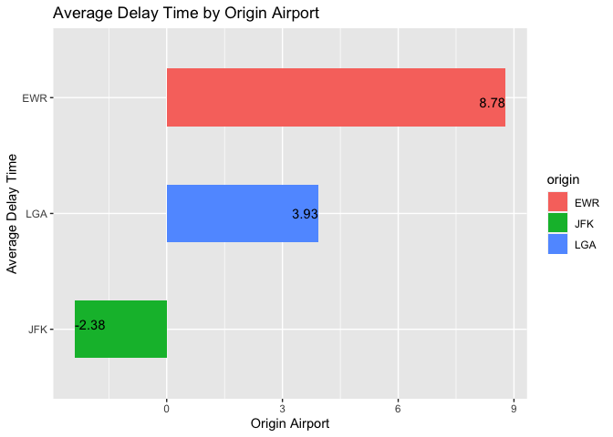
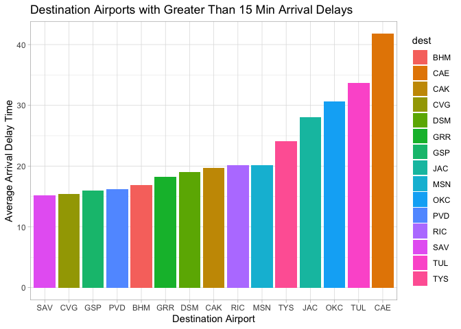

```r
library(tidyverse)
```

```
## ── Attaching packages ─────────────────────────────────────── tidyverse 1.3.2 ──
## ✓ ggplot2 3.3.5     ✓ purrr   0.3.4
## ✓ tibble  3.1.6     ✓ dplyr   1.0.8
## ✓ tidyr   1.2.0     ✓ stringr 1.4.0
## ✓ readr   2.1.2     ✓ forcats 0.5.1
## ── Conflicts ────────────────────────────────────────── tidyverse_conflicts() ──
## x dplyr::filter() masks stats::filter()
## x dplyr::lag()    masks stats::lag()
```

```r
library(knitr)
library(nycflights13)
```

Which origin airport is best to minimize my chances of a late arrival when I am using Delta Airlines?

```r
flights %>%
  count(as.factor(carrier))
```

```
## # A tibble: 16 × 2
##    `as.factor(carrier)`     n
##    <fct>                <int>
##  1 9E                   18460
##  2 AA                   32729
##  3 AS                     714
##  4 B6                   54635
##  5 DL                   48110
##  6 EV                   54173
##  7 F9                     685
##  8 FL                    3260
##  9 HA                     342
## 10 MQ                   26397
## 11 OO                      32
## 12 UA                   58665
## 13 US                   20536
## 14 VX                    5162
## 15 WN                   12275
## 16 YV                     601
```

```r
Airlineflights <- flights %>%
                  mutate(carrier = fct_recode(carrier,
                               Endeavor = "9E",
                               American = "AA",
                               Alaska = "AS",
                               JetBlue = "B6",
                               Delta = "DL",
                               ExpressJet = "EV",
                               Frontier = "F9",
                               AirTran = "FL",
                               Hawaiian = "HA",
                               Envoy = "MQ",
                               SkyWest = "OO",
                               United = "UA",
                               USAir = "US",
                               Virgin_America = "VX",
                               Southwest = "WN",
                               Mesa = "YV"))
         
delaydat <- Airlineflights %>%
              select(origin, carrier, arr_delay) %>%
                filter(carrier == "Delta") %>%
                  group_by(origin) %>%
                    summarise(Avgdelay = mean(arr_delay, na.rm = TRUE))

ggplot(delaydat, mapping = aes(x = reorder(origin, Avgdelay), y = Avgdelay, fill = origin)) +
  geom_col(position = position_dodge(0.25), width = 0.5) +
  geom_text(aes(label =round(Avgdelay, digits = 2)), hjust = "inward", vjust = "inward") +
  coord_flip() +
  labs(title = "Average Delay Time by Origin Airport",
       x = "Average Delay Time", 
       y = "Origin Airport")
```

<!-- -->
We can see that JFK is the only origin airport with a negative mean arrival delay time. On average, in 2013 flights arrived around 2 minutes early into JFK, compared to almost 4 minutes late into LGA and almost 9 minutes late into EWR.


Which destination airport is the worst airport for arrival time?

```r
flights %>%
  count(as.factor(dest))
```

```
## # A tibble: 105 × 2
##    `as.factor(dest)`     n
##    <fct>             <int>
##  1 ABQ                 254
##  2 ACK                 265
##  3 ALB                 439
##  4 ANC                   8
##  5 ATL               17215
##  6 AUS                2439
##  7 AVL                 275
##  8 BDL                 443
##  9 BGR                 375
## 10 BHM                 297
## # … with 95 more rows
```

```r
worst_dest <- flights %>%
                group_by(dest) %>%
                  summarise(dest_delay = mean(arr_delay, na.rm = TRUE)) %>%
                    filter(dest_delay >= 15)

ggplot(worst_dest) +
  geom_col(aes(x = reorder(dest, dest_delay), y = dest_delay, fill = dest), 
           position = "dodge") +
  labs(title = "Destination Airports with Greater Than 15 Min Arrival Delays",
       x = "Destination Airport", 
       y = "Average Arrival Delay Time") +
  theme_light()
```

<!-- -->
We can see that the CAE destination airport has the highest average arrival delay by a considerable amount. I wanted to filter the dataset to only include the destination airports with arrival times of greater than 15 minutes. 
