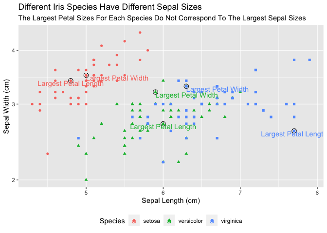

```r
library(tidyverse)
```

```
## ── Attaching packages ─────────────────────────────────────── tidyverse 1.3.2 ──
## ✔ ggplot2 3.3.5     ✔ purrr   0.3.4
## ✔ tibble  3.1.6     ✔ dplyr   1.0.8
## ✔ tidyr   1.2.0     ✔ stringr 1.4.0
## ✔ readr   2.1.2     ✔ forcats 0.5.1
## ── Conflicts ────────────────────────────────────────── tidyverse_conflicts() ──
## ✖ dplyr::filter() masks stats::filter()
## ✖ dplyr::lag()    masks stats::lag()
```

```r
library(ggrepel)
library(knitr)
library(lubridate)
```

```
## 
## Attaching package: 'lubridate'
## 
## The following objects are masked from 'package:base':
## 
##     date, intersect, setdiff, union
```

```r
?iris
```


```r
#mutate(iris, "Label")

largest_width <- iris %>%
  group_by(Species) %>%
  filter(row_number(desc(Petal.Width)) == 1) %>%
  mutate(Label = "Largest Petal Width")

largest_length <- iris %>%
  group_by(Species) %>%
  filter(row_number(desc(Petal.Length)) == 1) %>%
  mutate(Label = "Largest Petal Length")
  
ggplot(data = iris, mapping = aes(x = Sepal.Length, 
                                  y = Sepal.Width, 
                                  color = Species,
                                  shape = Species)) +
  geom_point(aes(color = Species, shape = Species)) +
  geom_point(size = 3, shape = 1, color = "black", data = largest_width) +
  geom_point(size = 3, shape = 1, color = "black", data = largest_length) +
  geom_text(aes(color = Species, label = Label), data = largest_width, 
            hjust = "left", vjust = "top") +
  geom_text(aes(color = Species, label = Label), data = largest_length, 
            hjust = "center", vjust = "top") +
  scale_y_log10() +
  labs(x = "Sepal Length (cm)",
       y = "Sepal Width (cm)",
       shape = "Species",
       color = "Species",
       title = "Different Iris Species Have Different Sepal Sizes",
       subtitle = "The Largest Petal Sizes For Each Species Do Not Correspond To The Largest Sepal Sizes") +
  theme(legend.position = "bottom")
```

<!-- -->


```r
#download.file("https://github.com/fivethirtyeight/data/raw/master/scrabble-games/scrabble_games.csv", "Scrabble")

ScrabbleData <- read_csv("Scrabble")
```

```
## Rows: 1542642 Columns: 19
## ── Column specification ────────────────────────────────────────────────────────
## Delimiter: ","
## chr   (2): winnername, losername
## dbl  (14): gameid, tourneyid, winnerid, winnerscore, winneroldrating, winner...
## lgl   (2): tie, lexicon
## date  (1): date
## 
## ℹ Use `spec()` to retrieve the full column specification for this data.
## ℹ Specify the column types or set `show_col_types = FALSE` to quiet this message.
```

```r
str(ScrabbleData)
```

```
## spec_tbl_df [1,542,642 × 19] (S3: spec_tbl_df/tbl_df/tbl/data.frame)
##  $ gameid         : num [1:1542642] 1 2 3 4 5 6 7 8 9 10 ...
##  $ tourneyid      : num [1:1542642] 1 1 1 1 1 1 1 1 1 1 ...
##  $ tie            : logi [1:1542642] FALSE FALSE FALSE FALSE FALSE FALSE ...
##  $ winnerid       : num [1:1542642] 268 268 268 268 268 268 268 268 429 429 ...
##  $ winnername     : chr [1:1542642] "Harriette Lakernick" "Harriette Lakernick" "Harriette Lakernick" "Harriette Lakernick" ...
##  $ winnerscore    : num [1:1542642] 0 0 0 0 0 0 0 0 0 0 ...
##  $ winneroldrating: num [1:1542642] 1568 1568 1568 1568 1568 ...
##  $ winnernewrating: num [1:1542642] 1684 1684 1684 1684 1684 ...
##  $ winnerpos      : num [1:1542642] 1 1 1 1 1 1 1 1 3 3 ...
##  $ loserid        : num [1:1542642] 429 435 441 456 1334 ...
##  $ losername      : chr [1:1542642] "Patricia Barrett" "Chris Cree" "Caesar Jaramillo" "Mike Chitwood" ...
##  $ loserscore     : num [1:1542642] 0 0 0 0 0 0 0 0 0 0 ...
##  $ loseroldrating : num [1:1542642] 1915 1840 1622 1612 1537 ...
##  $ losernewrating : num [1:1542642] 1872 1798 1606 1600 1590 ...
##  $ loserpos       : num [1:1542642] 3 6 10 9 4 8 7 2 9 4 ...
##  $ round          : num [1:1542642] 1 2 3 4 6 8 9 10 3 5 ...
##  $ division       : num [1:1542642] 1 1 1 1 1 1 1 1 1 1 ...
##  $ date           : Date[1:1542642], format: "1998-12-06" "1998-12-06" ...
##  $ lexicon        : logi [1:1542642] FALSE FALSE FALSE FALSE FALSE FALSE ...
##  - attr(*, "spec")=
##   .. cols(
##   ..   gameid = col_double(),
##   ..   tourneyid = col_double(),
##   ..   tie = col_logical(),
##   ..   winnerid = col_double(),
##   ..   winnername = col_character(),
##   ..   winnerscore = col_double(),
##   ..   winneroldrating = col_double(),
##   ..   winnernewrating = col_double(),
##   ..   winnerpos = col_double(),
##   ..   loserid = col_double(),
##   ..   losername = col_character(),
##   ..   loserscore = col_double(),
##   ..   loseroldrating = col_double(),
##   ..   losernewrating = col_double(),
##   ..   loserpos = col_double(),
##   ..   round = col_double(),
##   ..   division = col_double(),
##   ..   date = col_date(format = ""),
##   ..   lexicon = col_logical()
##   .. )
##  - attr(*, "problems")=<externalptr>
```

```r
ScrabbleAll <- ScrabbleData %>%
  select(date, winnerscore, loserscore) %>%
  pivot_longer(c("winnerscore","loserscore"), names_to = "win-loss", values_to = "score") %>%
  filter(score > 0) %>%
  mutate(year = year(date),
         week = week(date))

Scrabble_avg <- ScrabbleAll %>%
  group_by(year, week) %>%
  summarise(avgscore = mean(score), Date = min(date))
```

```
## `summarise()` has grouped output by 'year'. You can override using the
## `.groups` argument.
```

```r
average_05 <- Scrabble_avg %>%
  filter(year == "2005")

average_06 <- Scrabble_avg %>%
  filter(year == "2006")

ggplot(data = Scrabble_avg, mapping = aes(x = Date, y = avgscore)) +
  geom_point(data = average_05) +
  geom_point(data = average_06) +
  geom_smooth(data = average_05, method = 'lm', color = "orange") +
  geom_smooth(data = average_06, method = 'lm', color = "blue") +
  geom_vline(xintercept = as.Date("2006-03-01"), linetype = "dotted") + 
  annotate ("text", x = as.Date("2005-07-05"), y = 380, label = "Trend Before", 
            size = 3, color = "orange") +
  annotate ("text", x = as.Date("2006-06-05"), y = 380, label = "Trend After", 
            size = 3, color = "blue") +
  annotate("text", x = as.Date("2006-03-05"), y = 390, label = "Dictionary\nUpdated", 
           size = 3.5) +
  labs(y = "Average Score",
       title = "Scrabble Scores in the age of 'QI' and 'ZA'",
       subtitle = "Weekly average scores before and after the addition 
                   of around 11,000 words to the Scrabble dictionary",
       caption = "Source: FiveThirtyEight") +
  theme_bw()
```

```
## `geom_smooth()` using formula 'y ~ x'
## `geom_smooth()` using formula 'y ~ x'
```

<!-- -->
