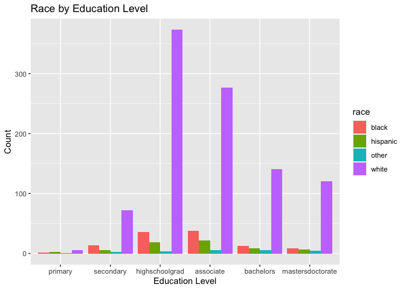
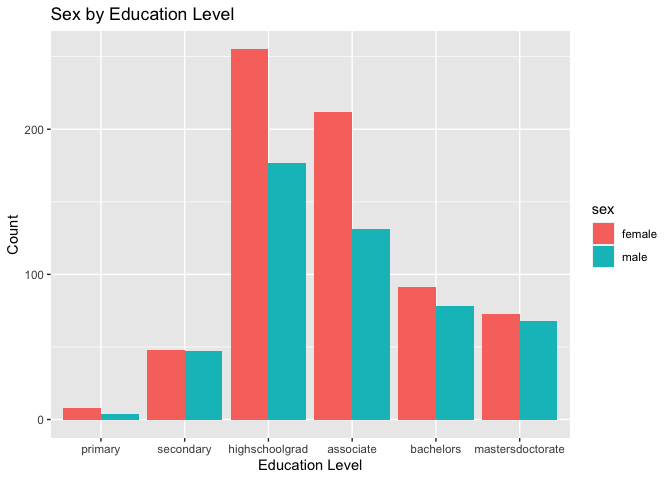
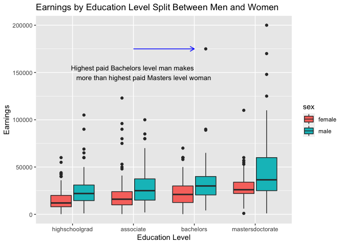

```r
library(tidyverse)
```

```
## ── Attaching packages ─────────────────────────────────────── tidyverse 1.3.2 ──
## ✓ ggplot2 3.3.5     ✓ purrr   0.3.4
## ✓ tibble  3.1.6     ✓ dplyr   1.0.8
## ✓ tidyr   1.2.0     ✓ stringr 1.4.0
## ✓ readr   2.1.2     ✓ forcats 0.5.1
## ── Conflicts ────────────────────────────────────────── tidyverse_conflicts() ──
## x dplyr::filter() masks stats::filter()
## x dplyr::lag()    masks stats::lag()
```

```r
library(knitr)
download.file("https://raw.githubusercontent.com/hadley/r4ds/master/data/heights.csv", "Height")
HeightData <- read_csv("Height")
```

```
## Rows: 1192 Columns: 6
## ── Column specification ────────────────────────────────────────────────────────
## Delimiter: ","
## chr (2): sex, race
## dbl (4): earn, height, ed, age
## 
## ℹ Use `spec()` to retrieve the full column specification for this data.
## ℹ Specify the column types or set `show_col_types = FALSE` to quiet this message.
```

```r
str(HeightData)
```

```
## spec_tbl_df [1,192 × 6] (S3: spec_tbl_df/tbl_df/tbl/data.frame)
##  $ earn  : num [1:1192] 50000 60000 30000 50000 51000 9000 29000 32000 2000 27000 ...
##  $ height: num [1:1192] 74.4 65.5 63.6 63.1 63.4 ...
##  $ sex   : chr [1:1192] "male" "female" "female" "female" ...
##  $ ed    : num [1:1192] 16 16 16 16 17 15 12 17 15 12 ...
##  $ age   : num [1:1192] 45 58 29 91 39 26 49 46 21 26 ...
##  $ race  : chr [1:1192] "white" "white" "white" "other" ...
##  - attr(*, "spec")=
##   .. cols(
##   ..   earn = col_double(),
##   ..   height = col_double(),
##   ..   sex = col_character(),
##   ..   ed = col_double(),
##   ..   age = col_double(),
##   ..   race = col_character()
##   .. )
##  - attr(*, "problems")=<externalptr>
```


```r
HeightEd <- HeightData %>%
              mutate(ed = fct_collapse(as.factor(ed),
                            primary = c("3","4","5","6"),
                            secondary = c("7","8","9","10","11"),
                            highschoolgrad = ("12"),
                            associate = c("13","14","15"),
                            bachelors = ("16"),
                            mastersdoctorate = c("17","18"))) 
```


```r
ggplot(HeightEd) +
  geom_bar(aes(x = ed, fill = race), position = "dodge") +
  labs(title = "Race by Education Level",
       x = "Education Level",
       y = "Count")
```

<!-- -->

```r
ggplot(HeightEd) +
  geom_bar(aes(x = ed, fill = sex), position = "dodge") +
  labs(title = "Sex by Education Level",
       x = "Education Level",
       y = "Count")
```

<!-- -->

```r
Earning_Edu <- filter(HeightEd, ed %in% c("highschoolgrad", "associate", "bachelors", "mastersdoctorate")) 

arrow_data1 <- data.frame(x1 = "associate", y1 = 175000, x2 = "bachelors", y2 = 175000)

ggplot(Earning_Edu) +
  geom_boxplot(aes(x = ed, y = earn, fill = sex)) +
  geom_segment(aes(x = x1, y = y1, xend = x2, yend = y2), color = "blue", data = arrow_data1,
               arrow = arrow(length = unit(0.1, "in"))) +
  labs(title = "Earnings by Education Level Split Between Men and Women ",
       x = "Education Level",
       y = "Earnings") +
  annotate("text", x = "associate", y = 150000, label = "Highest paid Bachelors level man makes 
           more than highest paid Masters level woman", size = 3.5)
```

<!-- -->

Looking at the data, we can see that women do not get paid as much as men even though they have the same education levels. In some cases, a man with a lower education level than a woman could get paid more even though she went further in school. Using a boxplot allowed me to see the gender discrepencies a bit better because it includes the average range of pay for each gender. A few of the male boxes have a wider range which shows that men have a wider pay range than women in some cases.
