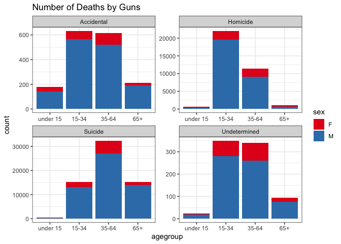
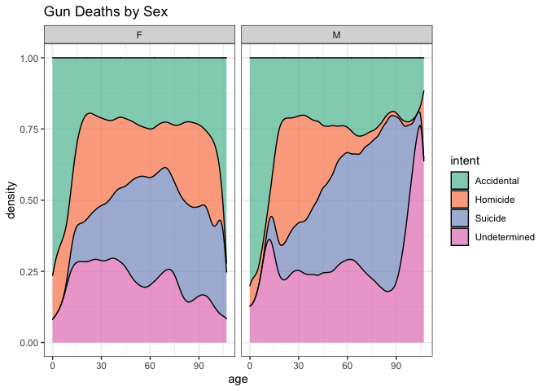
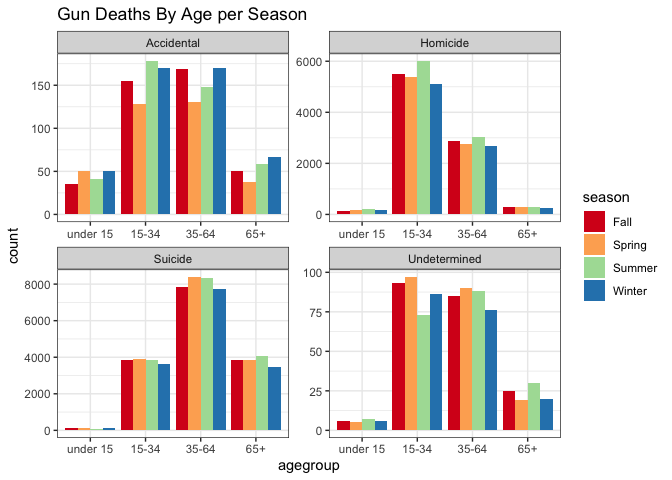
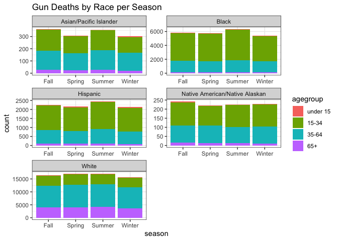

```r
library(tidyverse)
```

```
## ── Attaching packages ─────────────────────────────────────── tidyverse 1.3.2 ──
## ✔ ggplot2 3.3.5     ✔ purrr   0.3.4
## ✔ tibble  3.1.6     ✔ dplyr   1.0.8
## ✔ tidyr   1.2.0     ✔ stringr 1.4.0
## ✔ readr   2.1.2     ✔ forcats 0.5.1
## ── Conflicts ────────────────────────────────────────── tidyverse_conflicts() ──
## ✖ dplyr::filter() masks stats::filter()
## ✖ dplyr::lag()    masks stats::lag()
```

```r
library(readr)
library(knitr)

#download.file("https://raw.githubusercontent.com/fivethirtyeight/guns-data/master/full_data.csv", "GunData")

GunData <- read_csv("GunData")
```

```
## New names:
## * `` -> ...1
## Rows: 100798 Columns: 11── Column specification ────────────────────────────────────────────────────────
## Delimiter: ","
## chr (6): month, intent, sex, race, place, education
## dbl (5): ...1, year, police, age, hispanic
## ℹ Use `spec()` to retrieve the full column specification for this data.
## ℹ Specify the column types or set `show_col_types = FALSE` to quiet this message.
```
The article covers the data about gun deaths from 2012-2014. It uses an interactive graph to prove how devastating these deaths are, what they are caused by, and to who they are acted upon. The purpose of this article seems to be to inform people about the different causes of gun deaths in America.  


```r
GunData2 <- GunData %>%
              filter(age != "", intent != "")

Plot1 <- GunData2 %>% 
            mutate(agegroup = 
             case_when(
             age >= 0 & age <= 14 ~ "under 15",
             age >= 15 & age <= 34 ~ "15-34",
             age >= 35 & age <= 64 ~ "35-64",
             age >= 65 ~ "65+"),
         agegroup = fct_relevel(agegroup, "under 15", "15-34", "35-64", "65+"))

ggplot(Plot1, aes(x = agegroup, fill = sex)) +
  geom_bar() +
  facet_wrap(~intent, scale = "free") +
  labs(title = "Number of Deaths by Guns") +
  scale_fill_brewer(palette = "Set1") +
  theme_bw()
```

<!-- -->
This graph is showing the number of deaths split up by intent. By looking at the graphs, suicide and homicide are the most common causes of death by guns. Since this is a stacked bar chart, we can see that more males have been killed by guns than females have in all four categories. 


```r
ggplot(GunData, aes(x = age)) +
  geom_density(aes(fill = intent), alpha = 0.75, position = "fill") +
  facet_wrap(~sex) +
  labs(title = "Gun Deaths by Sex") +
  scale_fill_brewer(palette = "Set2") +
  theme_bw()
```

```
## Warning: Removed 18 rows containing non-finite values (stat_density).
```

```
## Warning: Groups with fewer than two data points have been dropped.
```

```
## Warning: Removed 1 rows containing missing values (position_stack).
```

<!-- -->
This graph is a density plot that shows the trends of causes of death separated by sex. Each peak shows us which values are at its highest concentration. We can see that the homicide peak is highest before the age of 30 for both men and women and the suicide peak is highest after the age of 60 for both men and women as well.


```r
Plot1$month <- as.integer(Plot1$month)
SeasonData <- Plot1 %>%
  mutate(season =
           case_when(
             month <= 2 | month == 12 ~ "Winter",
             month >= 3 & month <= 5 ~ "Spring",
             month >= 6 & month <= 8 ~ "Summer",
             month >= 9 & month <= 11 ~ "Fall"))

ggplot(SeasonData, aes(x = agegroup)) +
  geom_bar(aes(fill = season), position = "dodge") +
  facet_wrap(~intent, scale = "free") +
  labs(title = "Gun Deaths By Age per Season") +
  scale_fill_brewer(palette = "Spectral") +
  theme_bw()
```

<!-- -->
I chose to do the graph in this way because I wanted to see if the seasons had a different impact on gun deaths when it comes to a person's age. Around winter you usually hear about seasonal depression which may lead to a jump in suicides, but this data does not seem to support that theory too much. In fact, the suicide deaths by gun are actually lowest in the winter months according to this data. A client might use this information to market their commercials towards younger people during the summer months and middle aged people during the spring months. 


```r
ggplot(SeasonData) +
  geom_bar(aes(x = season, fill = agegroup)) +
  facet_wrap(~race, nrow = 3, scale = "free") +
  labs(title = "Gun Deaths by Race per Season") +
  theme_bw()
```

<!-- -->
I chose to show this graph because I wanted to see the breakdown of the ages of death by each race. The most obvious trends we see are that white people are more likely to be harmed between the ages of 35-64 and black people are more likely to be harmed between the ages of 15-34. We can also see that for the most part, gun deaths are more common during the summer months. So a client can market their commercials during the summer months more towards middle aged white people and younger black people.
