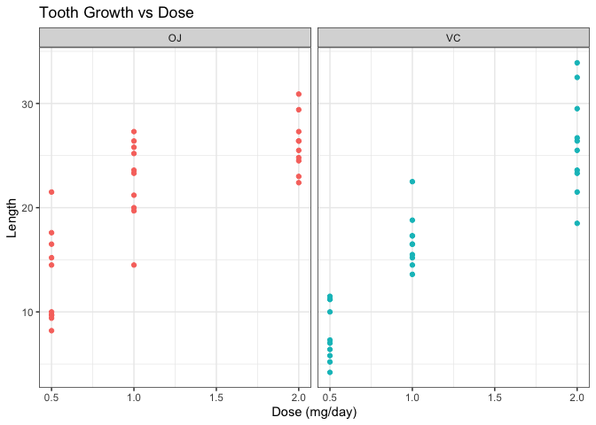
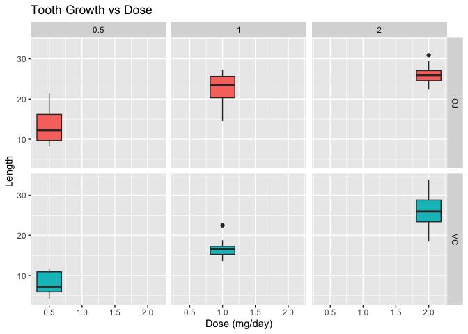
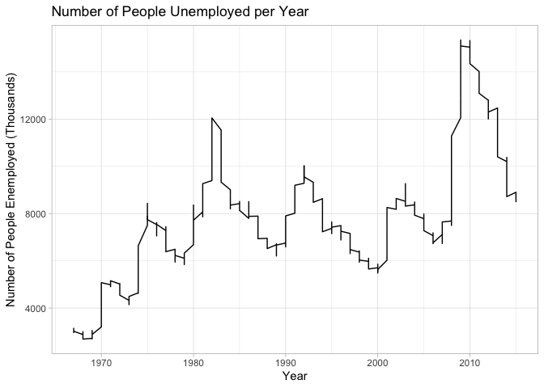
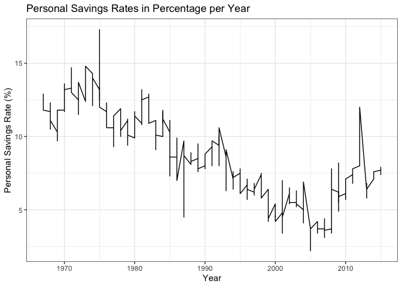

```r
library(tidyverse)
```

```
## ── Attaching packages ─────────────────────────────────────── tidyverse 1.3.2 ──
## ✓ ggplot2 3.3.5     ✓ purrr   0.3.4
## ✓ tibble  3.1.6     ✓ dplyr   1.0.8
## ✓ tidyr   1.2.0     ✓ stringr 1.4.0
## ✓ readr   2.1.2     ✓ forcats 0.5.1
## ── Conflicts ────────────────────────────────────────── tidyverse_conflicts() ──
## x dplyr::filter() masks stats::filter()
## x dplyr::lag()    masks stats::lag()
```

```r
library(lubridate)
```

```
## 
## Attaching package: 'lubridate'
## 
## The following objects are masked from 'package:base':
## 
##     date, intersect, setdiff, union
```

```r
library(knitr)
?ToothGrowth
head(ToothGrowth)
```

```
##    len supp dose
## 1  4.2   VC  0.5
## 2 11.5   VC  0.5
## 3  7.3   VC  0.5
## 4  5.8   VC  0.5
## 5  6.4   VC  0.5
## 6 10.0   VC  0.5
```


```r
ggplot(ToothGrowth, aes(x = dose, y = len, color = supp)) +
  geom_point() +
  facet_grid(~supp) +
  labs(title = "Tooth Growth vs Dose",
       x = "Dose (mg/day)",
       y = "Length") +
  theme_bw() +
  theme(legend.position = "none")
```

<!-- -->
I chose to use a scatter plot for this because I thought it would be able to clearly show the trends in tooth growth based on the dosage. I faceted them by the two different supplements to show the difference between the two supplements. 


```r
ggplot(ToothGrowth) +
  geom_boxplot(aes(x = dose, y = len, fill = supp)) +
  facet_grid(supp~dose) +
    labs(title = "Tooth Growth vs Dose",
       x = "Dose (mg/day)",
       y = "Length") +
  theme(legend.position = "none")
```

<!-- -->
I chose to use a box plot for this information because I thought it would be easiest to compare the mean lengths for each supplement by the dosage. Box plots also make it easier to see the ranges of lengths which could be helpful. 


```r
?economics
str(economics)
```

```
## spec_tbl_df [574 × 6] (S3: spec_tbl_df/tbl_df/tbl/data.frame)
##  $ date    : Date[1:574], format: "1967-07-01" "1967-08-01" ...
##  $ pce     : num [1:574] 507 510 516 512 517 ...
##  $ pop     : num [1:574] 198712 198911 199113 199311 199498 ...
##  $ psavert : num [1:574] 12.6 12.6 11.9 12.9 12.8 11.8 11.7 12.3 11.7 12.3 ...
##  $ uempmed : num [1:574] 4.5 4.7 4.6 4.9 4.7 4.8 5.1 4.5 4.1 4.6 ...
##  $ unemploy: num [1:574] 2944 2945 2958 3143 3066 ...
```

```r
econ <- economics %>%
          mutate(year = year(date)) 

ggplot(econ, aes(x = year, y = unemploy)) +
  geom_line() +
  labs(title = "Number of People Unemployed per Year",
       x = "Year",
       y = "Number of People Enemployed (Thousands)") +
  theme_light()
```

<!-- -->
I wanted to use a line plot to be able to see change over time. In this case, I wanted to see how the unemployment numbers have changed, and you can clearly see which years had issues. It is obvious that the 2008 recession effected many jobs because it looks like the highest number of people were unemployed then.


```r
ggplot(econ) +
  geom_line(aes(x = year, y = psavert)) +
  labs(title = "Personal Savings Rates in Percentage per Year",
       x = "Year",
       y = "Personal Savings Rate (%)")+
  theme_bw()
```

<!-- -->
A line plot is also the best plot for this information to show how personal savings rates have changed over time. We can see that this graphs trends are similar to the unemployment graph where the lower the personal savings rates, the higher the number of unemployed. 
