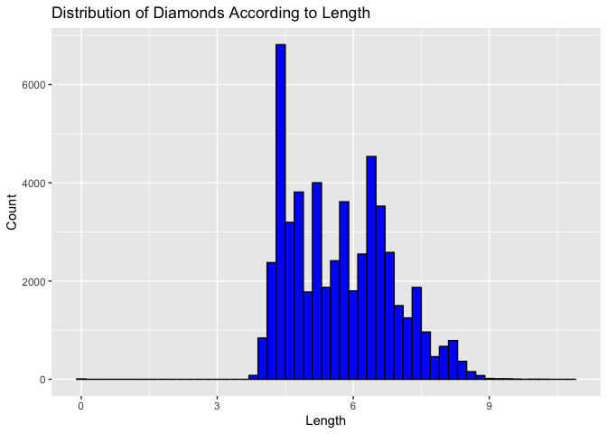
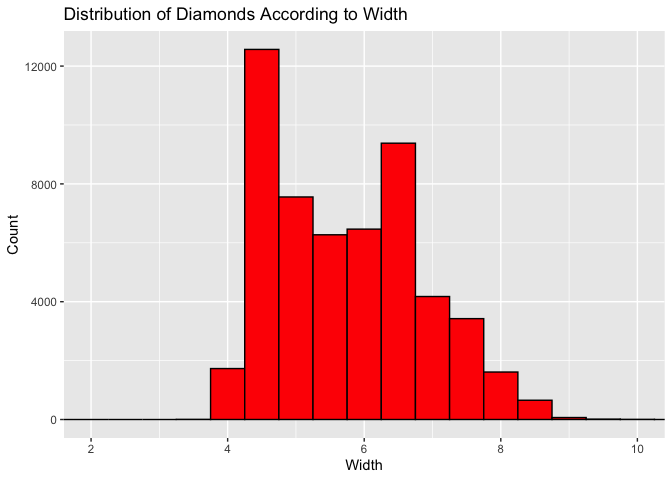
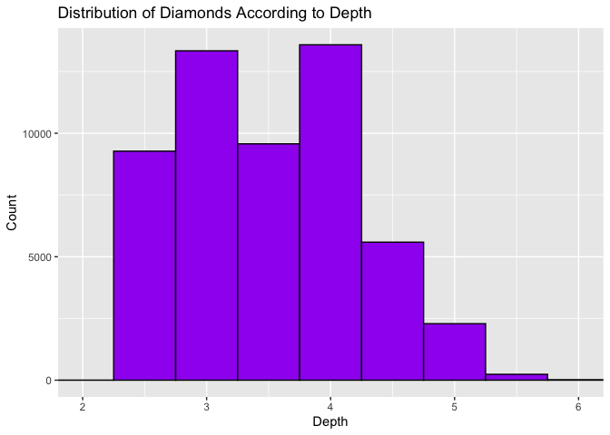
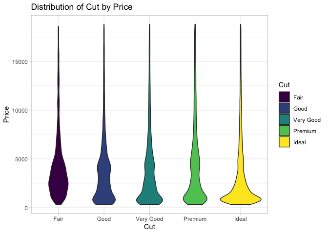
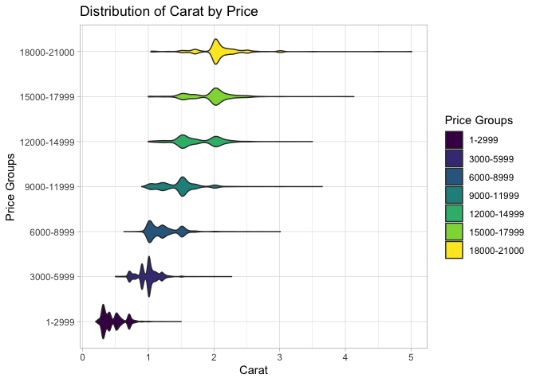
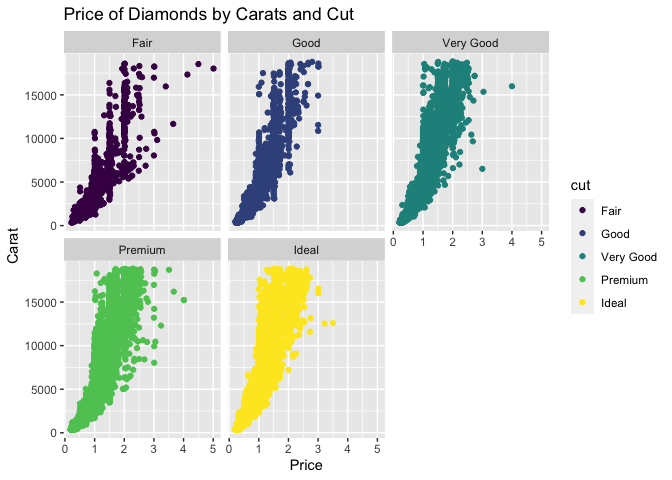

```r
library(tidyverse)
library(knitr)
library(dplyr)
library(viridis)
?diamonds
```


```r
ggplot(diamonds) +
  geom_histogram(aes(x = x), binwidth = 0.2, fill = "blue", color = "black") +
  labs(title = "Distribution of Diamonds According to Length",
       x = "Length", 
       y = "Count")
```

<!-- -->

```r
ggplot(diamonds) +
  geom_histogram(aes(x = y), binwidth = 0.5, fill = "red", color = "black") +
  coord_cartesian(c(2,10)) + 
  labs(title = "Distribution of Diamonds According to Width",
       x = "Width", 
       y = "Count")
```

<!-- -->

```r
ggplot(diamonds) +
  geom_histogram(aes(x = z), binwidth = 0.5, fill = "purple", color = "black") +
  coord_cartesian(c(2,6)) + 
  labs(title = "Distribution of Diamonds According to Depth",
       x = "Depth", 
       y = "Count")
```

<!-- -->


```r
price_levels <- c("1-2999", "3000-5999", "6000-8999", 
                  "9000-11999", "12000-14999", "15000-17999", "18000-21000")

diamondsprice <- diamonds %>%
  mutate(price_groups = 
           case_when(
             price >= 0 & price <= 2999 ~ "1-2999",
             price >= 3000 & price <= 5999 ~ "3000-5999",
             price >= 6000 & price <= 8999 ~ "6000-8999",
             price >= 9000 & price <= 11999 ~ "9000-11999",
             price >= 12000 & price <= 14999 ~ "12000-14999",
             price >= 15000 & price <= 17999 ~ "15000-17999",
             price >= 18000 & price <= 21000 ~ "18000-21000"),
         price_groups = factor(price_groups, levels = price_levels))
```


```r
ggplot(diamonds) +
  geom_histogram(aes(x = price), bins = 30, fill = "darkgreen", color = "black") +
  labs(title = "Distribution of Diamonds According to Price",
       x = "Price", 
       y = "Count") +
  theme_bw()
```

<!-- -->

```r
ggplot(diamondsprice) +
  geom_bar(aes(x = price_groups, fill = clarity), position = "dodge") +
  labs(title = "Distribution of Clarity by Price Groups",
       x = "Price Groups",
       y = "Count",
       fill = "Clarity") +
  theme_light()
```

<!-- -->

```r
ggplot(diamonds) +
  geom_violin(aes(x = price, y = cut, fill = cut)) +
  scale_fill_viridis(discrete = TRUE) +
  scale_color_viridis(discrete = TRUE) +
  theme(legend.position = "none")  +
  coord_flip() +
  labs(title = "Distribution of Cut by Price",
       x = "Price",
       y = "Cut",
       fill = "Cut") +
  theme_light()
```

<!-- -->


```r
ggplot(diamondsprice) +
  geom_violin(aes(x = price_groups, y = carat, fill = price_groups)) +
  scale_fill_viridis(discrete = TRUE) +
  scale_color_viridis(discrete = TRUE) +
  theme(legend.position = "none") +
  coord_flip() +
  labs(title = "Distribution of Carat by Price",
       x = "Price Groups",
       y = "Carat",
       fill = "Price Groups") +
  theme_light()
```

<!-- -->
We can see that most of the diamonds are actually being sold for under or around $5000. It seems like carat is the most important variable when it comes to the price of a diamond because I noticed that some of the best quality diamonds are not actually sold for the highest prices. When it comes to the cut of a diamond, the best cuts for them are also not necessarily the most expensive diamonds. It also seems like the diamonds with bigger carats tend to be more expensive with diamonds with smaller carats which aligns with what I was thinking. We can also see that the distribution between the carat sizes grows with the price of the diamond.


```r
ggplot(diamonds) +
  geom_point(aes(x = carat, y = price, color = cut)) +
  facet_wrap(~cut) +
   labs(title = "Price of Diamonds by Carats and Cut",
        x = "Price",
        y = "Carat",
        fill = "Cut")
```

<!-- -->
