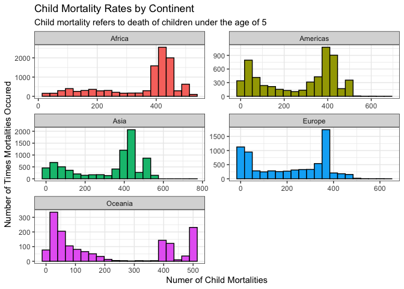

```r
library(tidyverse)
```

```
## ── Attaching packages ─────────────────────────────────────── tidyverse 1.3.2 ──
## ✔ ggplot2 3.3.5     ✔ purrr   0.3.4
## ✔ tibble  3.1.6     ✔ dplyr   1.0.8
## ✔ tidyr   1.2.0     ✔ stringr 1.4.0
## ✔ readr   2.1.2     ✔ forcats 0.5.1
## ── Conflicts ────────────────────────────────────────── tidyverse_conflicts() ──
## ✖ dplyr::filter() masks stats::filter()
## ✖ dplyr::lag()    masks stats::lag()
```

```r
library(knitr)
```


```r
ChildData <- Healthcare %>%
              select(year, country, continent, child_mort) %>%
              drop_na(continent, child_mort)

ggplot(ChildData) +
  geom_histogram(aes(x = child_mort, fill = continent), bins = 20, col = I("black")) +
  facet_wrap(~continent, nrow = 3, scale = "free") +
  labs(title = "Child Mortality Rates by Continent",
       subtitle = "Child mortality refers to death of children under the age of 5",
       x = "Numer of Child Mortalities",
       y = "Number of Times Mortalities Occured") +
  theme_bw() +
  theme(legend.position = "none") 
```

<!-- -->
I chose to make a histogram to show the frequency of child mortality rates. Using a histogram allows us to compare the frequency of a certain range of events happening. I wanted to facet the graph by continent, and by doing this, we can see that the continent of Africa has the overall highest quantity of child mortalities, with around 400 child mortalities happening over 2000 times over the last 200 plus years. We can also see that the continent of Oceania has by far the lowest occurrences of child mortalities. These numbers can say a lot about a continent's economic status, and it is clear which continents are doing better than others.
