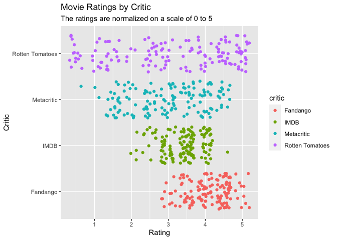

```r
library(tidyverse)
library(knitr)
```


```r
FandangoFix <- Fandango %>%
                select(FILM, RT_norm_round, Fandango_Stars, IMDB_norm_round, Metacritic_norm_round) %>%
                pivot_longer(2:5, names_to = "critic", values_to = "rating") %>%
                mutate(critic = fct_recode(critic,
                                           "Rotten Tomatoes" = "RT_norm_round",
                                           "Fandango" = "Fandango_Stars",
                                           "IMDB" = "IMDB_norm_round",
                                           "Metacritic" = "Metacritic_norm_round"))
kable(head(FandangoFix, n = 20))
```


|FILM                           |critic          | rating|
|:------------------------------|:---------------|------:|
|Avengers: Age of Ultron (2015) |Rotten Tomatoes |    3.5|
|Avengers: Age of Ultron (2015) |Fandango        |    5.0|
|Avengers: Age of Ultron (2015) |IMDB            |    4.0|
|Avengers: Age of Ultron (2015) |Metacritic      |    3.5|
|Cinderella (2015)              |Rotten Tomatoes |    4.5|
|Cinderella (2015)              |Fandango        |    5.0|
|Cinderella (2015)              |IMDB            |    3.5|
|Cinderella (2015)              |Metacritic      |    3.5|
|Ant-Man (2015)                 |Rotten Tomatoes |    4.0|
|Ant-Man (2015)                 |Fandango        |    5.0|
|Ant-Man (2015)                 |IMDB            |    4.0|
|Ant-Man (2015)                 |Metacritic      |    3.0|
|Do You Believe? (2015)         |Rotten Tomatoes |    1.0|
|Do You Believe? (2015)         |Fandango        |    5.0|
|Do You Believe? (2015)         |IMDB            |    2.5|
|Do You Believe? (2015)         |Metacritic      |    1.0|
|Hot Tub Time Machine 2 (2015)  |Rotten Tomatoes |    0.5|
|Hot Tub Time Machine 2 (2015)  |Fandango        |    3.5|
|Hot Tub Time Machine 2 (2015)  |IMDB            |    2.5|
|Hot Tub Time Machine 2 (2015)  |Metacritic      |    1.5|


```r
ggplot(FandangoFix) +
  geom_jitter(aes(x = rating, y = critic, color = critic)) +
  labs(title = "Movie Ratings by Critic",
       subtitle = "The ratings are normalized on a scale of 0 to 5",
       x = "Rating",
       y = "Critic")
```

<!-- -->
I chose to use the geom jitter because I wanted to show the spread of each critics scores. I could have used a box plot, but I wanted to show each individual score movies received. We can see that Fandango tends to rate movies higher, and Rotten Tomatoes tends to be all over the board with their ratings. 
