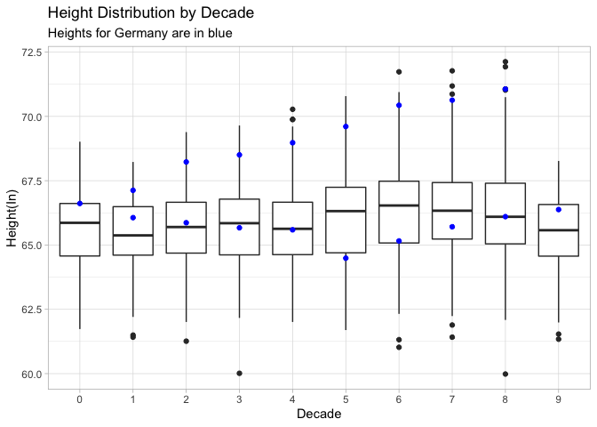
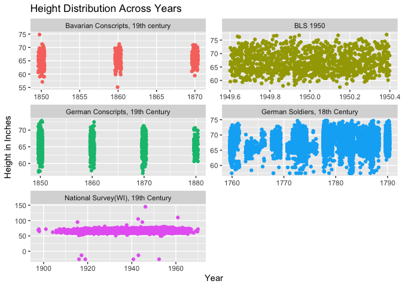

```r
library(tidyverse)
library(haven)
library(foreign)
library(readxl)
```


```r
dat1 <- tempfile()
download.file("https://github.com/WJC-Data-Science/DTS350/raw/master/CaseStudy7Data/heights.csv", "dat1")
Heightcsv <- read_csv("dat1", skip = 2)
```

```
## Rows: 1191 Columns: 6
## ── Column specification ────────────────────────────────────────────────────────
## Delimiter: ","
## chr (2): male, white
## dbl (4): 50000, 74.4244387818035, 16, 45
## 
## ℹ Use `spec()` to retrieve the full column specification for this data.
## ℹ Specify the column types or set `show_col_types = FALSE` to quiet this message.
```

```r
colnames(Heightcsv) <- c("Earnings", "Height", "Sex", "Edu", "Age", "Race")

dat2 <- tempfile()
download.file("https://github.com/WJC-Data-Science/DTS350/raw/master/Height.xlsx", "dat2")
Heightxlsx <- read_xlsx("dat2", skip = 2)

dat3 <- tempfile()
download.file("https://github.com/WJC-Data-Science/DTS350/raw/master/CaseStudy7Data/B6090.DBF", "dat3")
Heightdbf <- read.dbf("dat3")

dat4 <- tempfile()
download.file("https://github.com/WJC-Data-Science/DTS350/raw/master/germanconscr.dta", "dat4")
German <- read_stata("dat4")

dat5 <- tempfile()
download.file("https://github.com/WJC-Data-Science/DTS350/raw/master/germanprison.dta", "dat5")
BavarianHeights <- read_stata("dat5")

dat6 <- tempfile()
download.file("http://www.ssc.wisc.edu/nsfh/wave3/NSFH3%20Apr%202005%20release/main05022005.sav", "dat6", mode = "wb")
NationalHeight <- read_sav("dat6")
```


```r
WorldEstimates <- Heightxlsx %>%  
  pivot_longer(3:203, names_to = "years", values_to = "heights.cm", values_drop_na = TRUE) %>%
  mutate(year_decade = years, height.in = heights.cm / 2.54) %>%
  separate(years, into = c("century", "decade"), sep = -2) %>%
  separate(decade, into = c("decade", "year"), sep = -1)

Tidycsv <- Heightcsv %>%
  mutate(birth_year = 1950,
         height.in = Height,
         height.cm = height.in * 2.54,
         study_id = 'BLS 1950') %>%  
  select(birth_year, height.cm, height.in, study_id)

Tidydbf <- Heightdbf %>%  
            mutate(height.in = CMETER / 2.54,
                   height.cm = CMETER,
                   birth_year = SJ,
                   study_id = 'German Soldiers, 18th Century') %>%  
            select(height.in, height.cm, birth_year, study_id)

ConscriptTidy <- German %>%
  mutate(birth_year = bdec, 
         height.cm = height, 
         height.in = height.cm / 2.54,
         study_id = 'German Conscripts, 19th Century') %>%  
  select(birth_year, height.cm, height.in, study_id)

BavarianTidy <- BavarianHeights %>%
  mutate(birth_year = bdec,
         height.cm = height,
         height.in = height.cm / 2.54,
         study_id = 'Bavarian Conscripts, 19th century') %>%
  select(birth_year, height.in, height.cm, study_id)

NationalTidy <- NationalHeight %>%
  mutate(birth_year = DOBY + 1900, height.in = RT216F*12 + RT216I, 
         height.cm = height.in * 2.54, study_id = 'National Survey(WI), 19th Century') %>%  
  select(birth_year, height.in, height.cm, study_id)

ComboData <- bind_rows(Tidycsv, Tidydbf, ConscriptTidy, BavarianTidy, NationalTidy)

write_csv(ComboData, "HeightsFinal.csv")
write_csv(WorldEstimates, "WorldEstimates.csv")
```


```r
Germany <- WorldEstimates %>%
  filter(`Continent, Region, Country` == "Germany")

ggplot() +
  geom_boxplot(data = WorldEstimates, aes(x = decade, y = height.in)) +
  geom_point(data = Germany, aes(x = decade, y = height.in), color = "blue") +
  labs(title = "Height Distribution by Decade",
       subtitle = "Heights for Germany are in blue",
       x = "Decade",
       y = "Height(In)") +
  theme_light()
```

<!-- -->
The box plot shows all of the height data for every decade, and the data for Germany is highlighted in blue. The box plots make it easier to see the ranges of data points while also including the average heights per decade nationally. We can see that the Germany heights are almost all above the national heights. 


```r
ggplot() +
  geom_jitter(data = ComboData, aes(x = birth_year, y = height.in, color = study_id)) +
  facet_wrap(~study_id, scales = "free", nrow = 3) +
  labs(title = "Height Distribution Across Years",
       x = "Year",
       y = "Height in Inches") +
  theme(legend.position = "none")
```

```
## Warning: Removed 21 rows containing missing values (geom_point).
```

<!-- -->
Looking at the distribution of heights for all study ids, we can see that because of the way the data was recorded, it is difficult to tell what the trends are for heights. We can see the range of heights recorded, but we can not see an obvious trend over the years.
