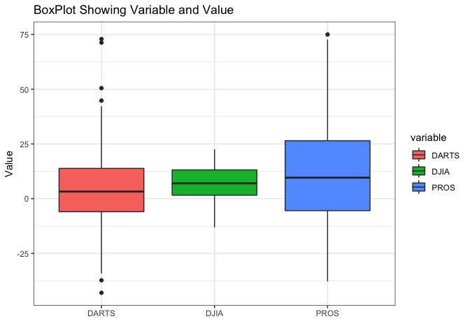
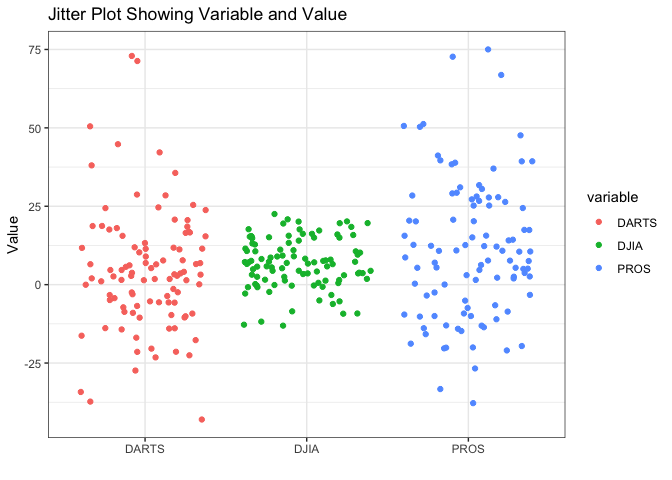
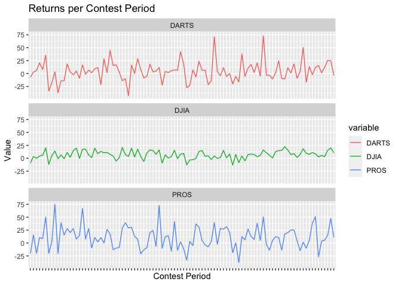

```r
library(tidyverse)
library(downloader)
library(haven)
library(readxl)
library(stringr)
library(knitr)
```


```r
dat1 <- tempfile()
download.file("https://raw.githubusercontent.com/WJC-Data-Science/DTS350/master/Dart_Expert_Dow_6month_anova/Dart_Expert_Dow_6month_anova.csv", "dat1")
Dart1 <- read_csv("dat1")
```

```
## Rows: 300 Columns: 3
## ── Column specification ────────────────────────────────────────────────────────
## Delimiter: ","
## chr (2): contest_period, variable
## dbl (1): value
## 
## ℹ Use `spec()` to retrieve the full column specification for this data.
## ℹ Specify the column types or set `show_col_types = FALSE` to quiet this message.
```

```r
dat2 <- tempfile()
download.file("https://github.com/WJC-Data-Science/DTS350/raw/master/Dart_Expert_Dow_6month_anova/Dart_Expert_Dow_6month_anova.RDS", "dat2")
Dart2 <- read_rds("dat2")

dat3 <- tempfile()
download.file("https://github.com/WJC-Data-Science/DTS350/raw/master/Dart_Expert_Dow_6month_anova/Dart_Expert_Dow_6month_anova.dta", "dat3")
Dart3 <- read_dta("dat3")

dat4 <- tempfile()
download.file("https://github.com/WJC-Data-Science/DTS350/raw/master/Dart_Expert_Dow_6month_anova/Dart_Expert_Dow_6month_anova.sav", "dat4")
Dart4 <- read_sav("dat4")

dat5 <- tempfile()
download.file("https://github.com/WJC-Data-Science/DTS350/raw/master/Dart_Expert_Dow_6month_anova/Dart_Expert_Dow_6month_anova.xlsx", "dat5")
Dart5 <- read_xlsx("dat5")

all_equal(Dart1, Dart2, convert = TRUE)
```

```
## [1] TRUE
```


```r
ggplot(Dart1) +
  geom_boxplot(aes(x = variable, y = value, fill = variable)) +
  labs(title = "BoxPlot Showing Variable and Value",
       x = " ",
       y = "Value") +
  theme(legend.position = "none") +
  theme_bw()
```

<!-- -->

```r
ggplot(Dart1) +
  geom_jitter(aes(x = variable, y = value, color = variable)) +
  labs(title = "Jitter Plot Showing Variable and Value",
       x = " ",
       y = "Value") +
  theme(legend.position = "none") +
  theme_bw()
```

<!-- -->
The boxplot shows the spread of the values with any outliers. We can see that the DARTS and PROS spreads are much larger and contain outliers. THE DJIA values are much more compressed and consistent. The jitter plot shows us very similar information the the boxplot, but we can see each individual value. 


```r
TidyDart1 <- Dart1 %>%
              mutate(contest_period = str_replace_all(contest_period, '19', '_19'),
                     contest_period = str_replace(contest_period, 'Febuary', 'February'),
                     contest_period = str_replace(contest_period, 'Dec._1993', 'December_1993')) %>%
              separate(contest_period, into = c("month", "year_end"), sep = "-") %>%
              separate(year_end, into = c("month", "year"), sep = "_") %>%
              arrange(factor(month, levels = month.name))

saveRDS(TidyDart1, "TidyDart1.rds")
```


```r
ggplot(Dart1) +
  geom_line(aes(x = contest_period, y = value, group = variable, color = variable)) +
  facet_wrap(~variable, nrow = 3) +
  labs(title = "Returns per Contest Period",
       x = "Contest Period",
       y = "Value") +
  theme(axis.text.x = element_blank())
```

<!-- -->
This graph shows the return for each contest period. We can see that the DJIA plot is the most compressed so there is less variability than the other two plots. The DARTS and PROS plots seem to be harder to predict because of the wide spread of values. 


```r
FinalTable <- TidyDart1 %>%
              filter(variable == "DJIA") %>%
              pivot_wider(names_from = "year", values_from = "value") %>%
              arrange(factor(month, levels = month.name)) %>%
              select(month, "1990", everything(), -variable)
kable(FinalTable)  
```


|month     |  1990| 1991| 1992| 1993| 1994| 1995| 1996| 1997|  1998|
|:---------|-----:|----:|----:|----:|----:|----:|----:|----:|-----:|
|January   |    NA| -0.8|  6.5| -0.8| 11.2|  1.8| 15.0| 19.6|  -0.3|
|February  |    NA| 11.0|  8.6|  2.5|  5.5|  3.2| 15.6| 20.1|  10.7|
|March     |    NA| 15.8|  7.2|  9.0|  1.6|  7.3| 18.4|  9.6|   7.6|
|April     |    NA| 16.2| 10.6|  5.8|  0.5| 12.8| 14.8| 15.3|  22.5|
|May       |    NA| 17.3| 17.6|  6.7|  1.3| 19.5|  9.0| 13.3|  10.6|
|June      |   2.5| 17.7|  3.6|  7.7| -6.2| 16.0| 10.2| 16.2|  15.0|
|July      |  11.5|  7.6|  4.2|  3.7| -5.3| 19.6|  1.3| 20.8|   7.1|
|August    |  -2.3|  4.4| -0.3|  7.3|  1.5| 15.3|  0.6|  8.3| -13.1|
|September |  -9.2|  3.4| -0.1|  5.2|  4.4| 14.0|  5.8| 20.2| -11.8|
|October   |  -8.5|  4.4| -5.0|  5.7|  6.9|  8.2|  7.2|  3.0|    NA|
|November  | -12.8| -3.3| -2.8|  4.9| -0.3| 13.1| 15.1|  3.8|    NA|
|December  |  -9.3|  6.6|  0.2|  8.0|  3.6|  9.3| 15.5| -0.7|    NA|
