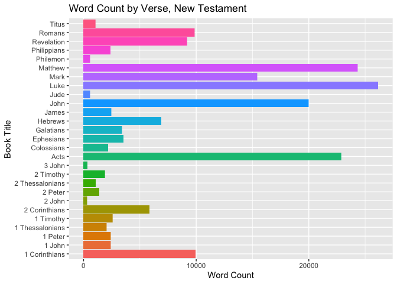

```r
library(tidyverse)
library(stringi)
library(knitr)
```


```r
dat <- tempfile()
download.file("https://github.com/WJC-Data-Science/DTS350/raw/master/bible.csv", "dat")
bible <- read_csv("dat")
```


```r
Old_Testament <- bible %>%
        filter(volume_title == "Old Testament") %>%
          select(scripture_text)

New_Testament <- bible %>%
        filter(volume_title == "New Testament") %>%
          select(scripture_text)

length_function <- function(df) {
  verse_length <- vector("integer", 0)
  for (row in df) {verse_length <- append(verse_length, str_length(row))}
  verse_length
}
  
mean(length_function(Old_Testament))
```

```
## [1] 136.7845
```

```r
mean(length_function(New_Testament))
```

```
## [1] 118.3265
```


```r
str_length(str_extract_all(Old_Testament, "(?i)lord"))
```

```
## Warning in stri_extract_all_regex(string, pattern, simplify = simplify, :
## argument is not an atomic vector; coercing
```

```
## Warning in stri_length(string): argument is not an atomic vector; coercing
```

```
## [1] 58300
```

```r
str_length(str_extract_all(New_Testament, "(?i)lord"))
```

```
## Warning in stri_extract_all_regex(string, pattern, simplify = simplify, :
## argument is not an atomic vector; coercing

## Warning in stri_extract_all_regex(string, pattern, simplify = simplify, :
## argument is not an atomic vector; coercing
```

```
## [1] 5900
```


```r
NT_word_count <- bible %>%
  filter(volume_title == "New Testament") %>%
  select(book_title, verse_id, scripture_text) %>%
  group_by(book_title) %>%
  mutate(word_count = str_count(scripture_text, '\\W+'))
  
ggplot(NT_word_count, aes(x = book_title, y = mean(word_count))) +
  geom_col(aes(fill = book_title)) +
  coord_flip() +
  labs(title = "Word Count by Verse, New Testament",
       x = "Book Title",
       y = "Word Count") +
  theme(legend.position = "none")
```

<!-- -->
When we split up the bible by the 2 main sections, we can see that the Old Testament has on average more words than the New Testament. The word "lord" no matter how it is written appears more in the Old Testament by a considerable margin. Finally we can see that in the New Testament Matthew, Luke, John, and Acts have on average more words than all of the other books in the New Testament. 
