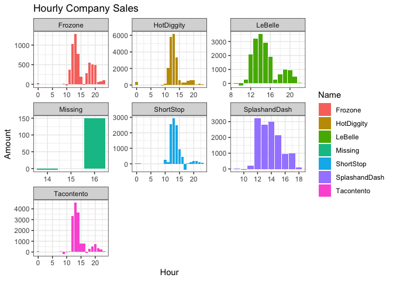
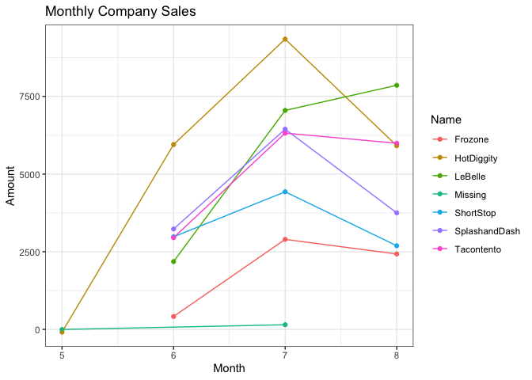
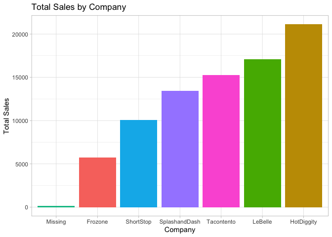

```r
library(tidyverse)
library(knitr)
library(lubridate)
```


```r
dat <- tempfile()
download.file("https://github.com/WJC-Data-Science/DTS350/raw/master/sales.csv", "dat")
sales <- read_csv("dat")
```

```
## Rows: 15656 Columns: 4
## ── Column specification ────────────────────────────────────────────────────────
## Delimiter: ","
## chr  (2): Name, Type
## dbl  (1): Amount
## dttm (1): Time
## 
## ℹ Use `spec()` to retrieve the full column specification for this data.
## ℹ Specify the column types or set `show_col_types = FALSE` to quiet this message.
```


```r
aggregate_data <- sales %>%
  with_tz(tzone = "Us/Mountain") %>%
  mutate(hour = ceiling_date(Time, "hour"),
         day = ceiling_date(Time, "day"),
         week = ceiling_date(Time, "week"),
         month = ceiling_date(Time, "month"))
```


```r
hours_op <- aggregate_data %>%
  mutate(hour = hour(hour)) %>%
  group_by(Name, hour) %>%
  summarize(across(Amount,sum))
```

```
## `summarise()` has grouped output by 'Name'. You can override using the
## `.groups` argument.
```

```r
ggplot(hours_op, aes(x = hour, y = Amount, fill = Name)) +
  geom_col() +
  facet_wrap(~Name, scales = "free") +
  labs(x = "Hour",
       y = "Amount",
       title = "Hourly Company Sales") +
  theme_bw()
```

<!-- -->
We can see that across the board, the hours between 10am and 3pm are the most active times for sales. This can help companies decide when their hours of operations should be in order to have the most amount of sales. 


```r
monthly_op <- aggregate_data %>%
  mutate(month = month(month)) %>%
  group_by(Name, month) %>%
  summarize(across(Amount,sum))
```

```
## `summarise()` has grouped output by 'Name'. You can override using the
## `.groups` argument.
```

```r
ggplot(monthly_op, aes(x = month, y = Amount, color = Name)) +
  geom_point() +
  geom_line() +
  labs(x = "Month",
       y = "Amount",
       title = "Monthly Company Sales") +
  theme_bw()
```

<!-- -->


```r
final_sales <- sales %>%
  group_by(Name) %>%
  summarise(across(Amount, sum))

ggplot(final_sales) +
  geom_col(aes(x = fct_reorder(Name, Amount), y = Amount, fill = Name)) +
  labs(title = 'Total Sales by Company',
       x = 'Company', 
       y = 'Total Sales') +
  theme_light() +
  theme(legend.position = 'none')
```

<!-- -->
We can see that overall, HotDiggity has the best sale numbers. They also have an extra month of sales that the other companies did not have. However, looking at the monthly data, we can see that HotDiggity received the majority of their sales in the first 3 months of operation, before the numbers dipped during the most recent month. We can also see that LeBelle has the second most sales, and their sales seem to be on the rise pretty consistently. There was no dip in sales, rather an almost steady increase since the first month of operation. 
