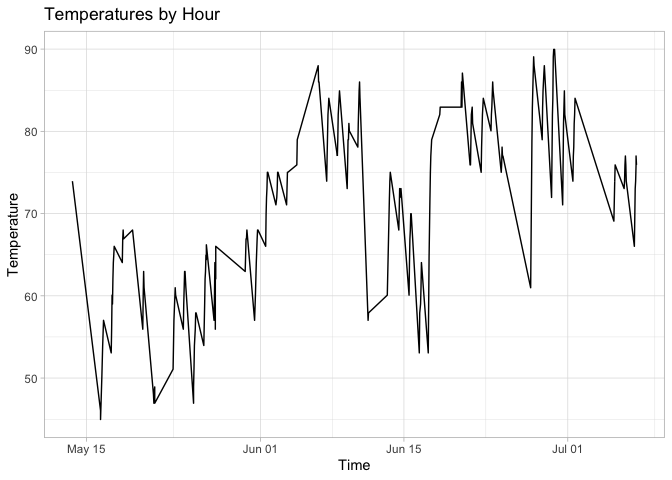

```r
library(tidyverse)
library(knitr)
library(lubridate)
library(riem)
```


```r
dat <- tempfile()
download.file("https://github.com/WJC-Data-Science/DTS350/raw/master/carwash.csv", "dat")
carwash <- read_csv("dat")
```

```
## Rows: 533 Columns: 4
## ── Column specification ────────────────────────────────────────────────────────
## Delimiter: ","
## chr  (2): name, type
## dbl  (1): amount
## dttm (1): time
## 
## ℹ Use `spec()` to retrieve the full column specification for this data.
## ℹ Specify the column types or set `show_col_types = FALSE` to quiet this message.
```

```r
head(carwash)
```

```
## # A tibble: 6 × 4
##   name          type     time                amount
##   <chr>         <chr>    <dttm>               <dbl>
## 1 SplashandDash Services 2016-05-13 20:27:00    1  
## 2 SplashandDash Services 2016-05-13 20:27:00    0  
## 3 SplashandDash Services 2016-05-16 19:31:00   23.6
## 4 SplashandDash Services 2016-05-16 17:09:00   18.9
## 5 SplashandDash Services 2016-05-16 17:47:00   23.6
## 6 SplashandDash Services 2016-05-16 17:50:00   23.6
```


```r
new_carwash <- carwash %>%
  mutate(time = with_tz(carwash$time, tz = "US/Mountain"))

head(new_carwash)
```

```
## # A tibble: 6 × 4
##   name          type     time                amount
##   <chr>         <chr>    <dttm>               <dbl>
## 1 SplashandDash Services 2016-05-13 14:27:00    1  
## 2 SplashandDash Services 2016-05-13 14:27:00    0  
## 3 SplashandDash Services 2016-05-16 13:31:00   23.6
## 4 SplashandDash Services 2016-05-16 11:09:00   18.9
## 5 SplashandDash Services 2016-05-16 11:47:00   23.6
## 6 SplashandDash Services 2016-05-16 11:50:00   23.6
```


```r
group_carwash <- new_carwash %>%
                  mutate(hour = ceiling_date(new_carwash$time, unit = "hourly"))

hour_sales <- group_carwash %>%
  group_by(hour) %>%
  summarise(across(amount, sum))
```


```r
temp <- riem_measures(station = "RXE",  date_start  = "2016-05-3",  date_end  = "2016-07-08" )
head(temp)
```

```
## # A tibble: 6 × 32
##   station valid                 lon   lat  tmpf  dwpf  relh  drct  sknt  p01i
##   <chr>   <dttm>              <dbl> <dbl> <dbl> <dbl> <dbl> <dbl> <dbl> <dbl>
## 1 RXE     2016-05-03 00:00:00 -112.  43.8    NA    NA    NA   260     5    NA
## 2 RXE     2016-05-03 00:05:00 -112.  43.8    NA    NA    NA   280     5    NA
## 3 RXE     2016-05-03 00:10:00 -112.  43.8    NA    NA    NA   260     6    NA
## 4 RXE     2016-05-03 00:15:00 -112.  43.8    NA    NA    NA   230     7    NA
## 5 RXE     2016-05-03 00:20:00 -112.  43.8    NA    NA    NA   230     7    NA
## 6 RXE     2016-05-03 00:25:00 -112.  43.8    NA    NA    NA   240     6    NA
## # … with 22 more variables: alti <dbl>, mslp <dbl>, vsby <dbl>, gust <dbl>,
## #   skyc1 <chr>, skyc2 <chr>, skyc3 <chr>, skyc4 <lgl>, skyl1 <dbl>,
## #   skyl2 <dbl>, skyl3 <dbl>, skyl4 <lgl>, wxcodes <chr>,
## #   ice_accretion_1hr <lgl>, ice_accretion_3hr <lgl>, ice_accretion_6hr <lgl>,
## #   peak_wind_gust <dbl>, peak_wind_drct <dbl>, peak_wind_time <chr>,
## #   feel <dbl>, metar <chr>, snowdepth <lgl>
```

```r
Mountain_temp <- temp %>%
                  mutate(time = with_tz(temp$valid, tz = "US/Mountain"))

final_temp <- Mountain_temp %>%
                mutate(hour = ceiling_date(Mountain_temp$valid, unit = "hourly")) %>%
                select(valid, tmpf, hour) %>%
                drop_na(tmpf)
```


```r
Merged_dat <- merge(hour_sales, final_temp, by = "hour")

ggplot(Merged_dat, aes(x = hour, y = tmpf)) +
  geom_line() +
  labs(title = "Temperatures by Hour",
       x = "Time",
       y = "Temperature") +
  theme_light()
```

<!-- -->
